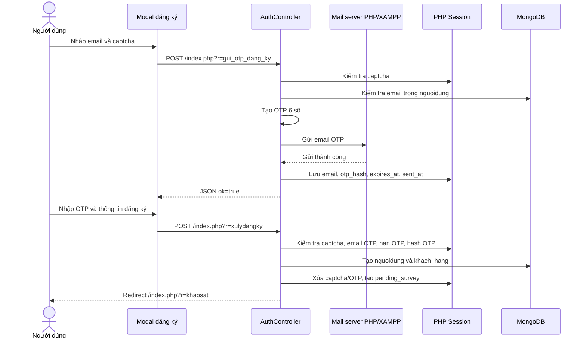
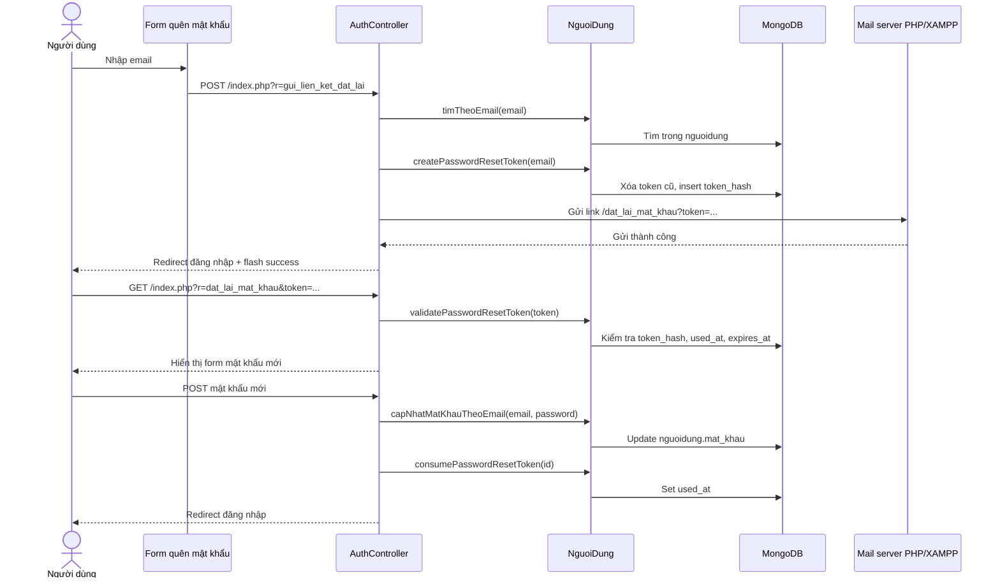

# Luồng hoạt động gửi OTP và quên mật khẩu trong SkinSyntaxVN

Tài liệu này mô tả cơ chế xác thực OTP khi đăng ký và cơ chế quên mật khẩu đang có trong source code SkinSyntaxVN.

## 1. Phạm vi phân tích

Các luồng được phân tích gồm:

- Gửi captcha đăng ký.
- Gửi mã OTP qua email khi người dùng đăng ký tài khoản.
- Xác thực OTP khi submit form đăng ký.
- Gửi liên kết đặt lại mật khẩu khi người dùng quên mật khẩu.
- Kiểm tra token đặt lại mật khẩu.
- Cập nhật mật khẩu mới.

Lưu ý quan trọng: trong code hiện tại, OTP được dùng cho luồng đăng ký tài khoản. Luồng quên mật khẩu không dùng OTP mà dùng liên kết đặt lại mật khẩu có token bảo mật gửi qua email.

## 2. File và thành phần liên quan

| Thành phần | File | Vai trò |
|---|---|---|
| Route chính | `backend/public/index.php` | Điều hướng request theo tham số `r`. |
| Controller xác thực | `backend/app/controllers/AuthController.php` | Xử lý đăng ký, gửi OTP, captcha, quên mật khẩu và đặt lại mật khẩu. |
| Model người dùng | `backend/app/models/NguoiDung.php` | Tìm tài khoản theo email, tạo tài khoản, tạo/kiểm tra/consume reset token, cập nhật mật khẩu. |
| Popup đăng ký/quên mật khẩu | `backend/app/views/layouts/header.php` | Hiển thị modal đăng ký, đăng nhập, quên mật khẩu và JavaScript gọi API OTP/captcha. |
| View đặt lại mật khẩu | `backend/app/views/auth/quenmatkhau.php` | Hiển thị form yêu cầu reset hoặc form nhập mật khẩu mới theo token. |
| Hướng dẫn OTP | `backend/app/views/info/otp-guide.php` | Trang hướng dẫn người dùng nhận và nhập OTP. |
| Cấu hình mail | `backend/app/config/config.php` | Khai báo `APP_URL`, `MAIL_FROM_ADDRESS`, `MAIL_FROM_NAME`. |

## 3. Route liên quan

| Route | Method | Controller/action | Chức năng |
|---|---:|---|---|
| `index.php?r=gui_captcha_dang_ky` | GET | `AuthController::guiCaptchaDangKy()` | Tạo captcha mới và trả JSON. |
| `index.php?r=gui_otp_dang_ky` | POST | `AuthController::guiOtpDangKy()` | Gửi OTP đăng ký qua email. |
| `index.php?r=xulydangky` | POST | `AuthController::xulydangky()` | Xác thực captcha, OTP, mật khẩu và tạo tài khoản. |
| `index.php?r=huong_dan_nhan_otp` | GET | `HomeController::otpGuide()` | Hiển thị trang hướng dẫn OTP. |
| `index.php?r=quen_mat_khau` | GET | `AuthController::quenMatKhau()` | Chuyển người dùng sang popup quên mật khẩu bằng `auth=forgot`. |
| `index.php?r=gui_lien_ket_dat_lai` | POST | `AuthController::guiLienKetDatLai()` | Tạo token và gửi email đặt lại mật khẩu. |
| `index.php?r=dat_lai_mat_khau&token=...` | GET | `AuthController::datLaiMatKhau()` | Kiểm tra token và hiển thị form nhập mật khẩu mới. |
| `index.php?r=dat_lai_mat_khau` | POST | `AuthController::datLaiMatKhau()` | Cập nhật mật khẩu mới và đánh dấu token đã dùng. |

## 4. Cơ chế gửi email dùng chung

Hàm gửi email dùng chung nằm trong `AuthController::sendHtmlEmail($to, $subject, $html)`.

Luồng gửi mail:

1. Lấy tên người gửi từ `MAIL_FROM_NAME`, mặc định là `SkinSyntax`.
2. Lấy địa chỉ gửi từ `MAIL_FROM_ADDRESS`, mặc định theo cấu hình trong `config.php`.
3. Tạo email HTML với header `Content-type: text/html; charset=UTF-8`.
4. Nếu chạy trên Windows và tồn tại `D:\xampp\sendmail\sendmail.exe`, hệ thống ưu tiên gọi `sendmail.exe`.
5. Nếu không dùng được `sendmail.exe`, hệ thống fallback sang hàm `mail()` của PHP.
6. Nếu `sendmail.exe` lỗi, controller ghi chi tiết lỗi vào `error_log`.

Điều này có nghĩa là chức năng OTP và quên mật khẩu phụ thuộc vào cấu hình mail của PHP/XAMPP. Nếu mail chưa cấu hình đúng, API OTP hoặc gửi link reset sẽ trả lỗi thân thiện cho người dùng.

## 5. Luồng captcha đăng ký

### 5.1. Mục tiêu

Captcha được dùng như bước kiểm tra đơn giản trước khi cho phép gửi OTP đăng ký. Mục tiêu là giảm thao tác gửi OTP tự động hoặc spam.

### 5.2. Cách hệ thống tạo captcha

Hàm liên quan:

- `AuthController::issueSignupCaptcha()`
- `AuthController::validateSignupCaptcha($captcha)`
- `AuthController::guiCaptchaDangKy()`

Luồng xử lý:

1. Hệ thống tạo captcha bằng `bin2hex(random_bytes(4))`, lấy 4 ký tự đầu và chuyển về chữ thường.
2. Captcha được lưu vào session tại `$_SESSION['signup_captcha']`.
3. API `gui_captcha_dang_ky` trả JSON:

```json
{
  "ok": true,
  "captcha": "abcd"
}
```

4. Khi người dùng gửi OTP hoặc submit đăng ký, server so sánh captcha nhập vào với captcha trong session bằng `hash_equals`.

## 6. Luồng gửi OTP đăng ký

### 6.1. Giao diện người dùng

Trong modal đăng ký tại `backend/app/views/layouts/header.php`, người dùng nhập:

- Email.
- Captcha.
- OTP 6 số.
- Mật khẩu.
- Xác nhận mật khẩu.
- Họ tên.
- Một số thông tin bổ sung và checkbox đồng ý điều khoản/chính sách.

Khi bấm nút `Lấy mã`, JavaScript gửi request `fetch()` tới:

```text
POST index.php?r=gui_otp_dang_ky
Content-Type: application/json
```

Payload gửi đi:

```json
{
  "email": "user@example.com",
  "captcha": "abcd"
}
```

### 6.2. Validate trước khi gửi OTP

Action `AuthController::guiOtpDangKy()` xử lý các bước:

1. Chỉ chấp nhận request `POST`.
2. Đọc JSON body từ `php://input`; nếu không phải JSON thì fallback sang `$_POST`.
3. Kiểm tra email không rỗng và đúng định dạng bằng `filter_var(..., FILTER_VALIDATE_EMAIL)`.
4. Kiểm tra captcha bằng `validateSignupCaptcha`.
5. Kiểm tra email đã tồn tại trong collection `nguoidung` bằng `NguoiDung::timTheoEmail($email)`.
6. Kiểm tra chống gửi lại quá nhanh: nếu cùng email vừa gửi OTP trong 60 giây thì trả HTTP `429`.

### 6.3. Tạo và gửi OTP

Nếu các điều kiện hợp lệ:

1. Hệ thống tạo mã OTP 6 số bằng `random_int(100000, 999999)`.
2. Gọi `sendSignupOtpEmail($email, $otpCode)` để gửi email HTML.
3. Email có tiêu đề `SkinSyntax - Ma OTP dang ky`.
4. Nội dung email hiển thị mã OTP và thông báo mã có hiệu lực trong 10 phút.

Nếu gửi mail thất bại, API trả lỗi:

```json
{
  "ok": false,
  "message": "Không gửi được email OTP. Hãy kiểm tra cấu hình mail của PHP/XAMPP rồi thử lại."
}
```

### 6.4. Lưu OTP trong session

Sau khi gửi mail thành công, hệ thống lưu OTP vào session dưới dạng hash:

```php
$_SESSION['signup_email_otp'] = [
    'email' => $email,
    'otp_hash' => hash('sha256', $otpCode),
    'expires_at' => time() + (10 * 60),
    'sent_at' => time(),
    'verified' => false,
];
```

Điểm đáng chú ý:

- OTP thật không lưu dạng plain text.
- OTP được hash bằng SHA-256.
- OTP có hạn dùng 10 phút.
- Session có `sent_at` để kiểm soát cooldown 60 giây.
- Trường `verified` hiện được lưu nhưng luồng đăng ký đang xác thực OTP trực tiếp khi submit form, không có bước verify OTP riêng.

### 6.5. Response thành công

API trả JSON:

```json
{
  "ok": true,
  "message": "OTP đã được gửi tới email của bạn. Mã có hiệu lực trong 10 phút."
}
```

Sau đó JavaScript:

1. Hiển thị thông báo thành công.
2. Khóa nút lấy OTP trong 60 giây.
3. Focus vào ô nhập OTP.
4. Lưu draft form đăng ký vào `sessionStorage`, trừ password, captcha và otp.

## 7. Luồng xác thực OTP khi đăng ký

### 7.1. Route xử lý

Khi người dùng submit form đăng ký, request được gửi tới:

```text
POST index.php?r=xulydangky
```

Action xử lý:

```text
AuthController::xulydangky()
```

### 7.2. Dữ liệu đầu vào

Các field chính:

- `ho_ten`
- `email`
- `mat_khau`
- `mat_khau2`
- `otp`
- `captcha`
- `gioi_tinh`
- `ngay_sinh`, `thang_sinh`, `nam_sinh`
- `terms_agree`
- `privacy_consent`
- `email_opt_in`

### 7.3. Các bước validate

`xulydangky()` kiểm tra theo thứ tự:

1. Họ tên, email, mật khẩu và xác nhận mật khẩu không được rỗng.
2. Captcha phải khớp với session.
3. Session `signup_email_otp` phải tồn tại và người dùng phải nhập OTP.
4. Email trong session OTP phải trùng với email đăng ký.
5. OTP chưa hết hạn.
6. Hash của OTP nhập vào phải khớp với `otp_hash` trong session.
7. Mật khẩu phải đủ mạnh theo regex:

```text
8-32 ký tự, có chữ thường, chữ hoa, số và ký tự đặc biệt.
```

8. Mật khẩu nhập lại phải khớp.
9. Người dùng phải đồng ý điều kiện giao dịch và chính sách dữ liệu.
10. Email chưa tồn tại trong collection `nguoidung`.

### 7.4. Tạo tài khoản

Nếu hợp lệ, controller gọi:

```text
NguoiDung::taoMoi($hoTen, $email, $matkhau, $consents)
```

Model thực hiện:

1. Hash mật khẩu bằng `password_hash(..., PASSWORD_BCRYPT)`.
2. Insert tài khoản vào collection `nguoidung`.
3. Lưu các cờ đồng ý:
   - `terms_agree`
   - `privacy_consent`
   - `recommendation_consent`
4. Gọi `ensureKhachHang($hoTen, $email)` để tạo hoặc cập nhật hồ sơ trong collection `khach_hang`.

Sau khi đăng ký thành công:

1. Xóa `signup_old`.
2. Xóa `signup_captcha`.
3. Xóa `signup_email_otp`.
4. Tạo `$_SESSION['pending_survey']`.
5. Redirect sang route khảo sát:

```text
index.php?r=khaosat
```

## 8. Luồng quên mật khẩu

### 8.1. Đặc điểm hiện tại

Luồng quên mật khẩu hiện tại không dùng OTP. Hệ thống sử dụng reset token ngẫu nhiên, lưu hash token vào MongoDB và gửi liên kết đặt lại mật khẩu qua email.

### 8.2. Giao diện yêu cầu đặt lại mật khẩu

Người dùng có thể mở phần quên mật khẩu qua:

- Link `Quên mật khẩu` trong modal đăng nhập.
- Route `index.php?r=quen_mat_khau`, sau đó controller redirect sang `index.php?auth=forgot`.

Form quên mật khẩu nằm trong:

```text
backend/app/views/layouts/header.php
backend/app/views/auth/quenmatkhau.php
```

Form gửi request:

```text
POST index.php?r=gui_lien_ket_dat_lai
```

Field gửi lên:

- `email`

## 9. Luồng gửi liên kết đặt lại mật khẩu

Action xử lý:

```text
AuthController::guiLienKetDatLai()
```

Các bước xử lý:

1. Chỉ chấp nhận `POST`.
2. Lấy email từ `$_POST['email']`.
3. Validate email không rỗng và đúng định dạng.
4. Tìm tài khoản bằng `NguoiDung::timTheoEmail($email)`.
5. Nếu email không tồn tại, hệ thống vẫn hiển thị thông báo thành công dạng chung để tránh lộ email có tồn tại hay không.
6. Nếu email tồn tại, gọi `NguoiDung::createPasswordResetToken($email)`.
7. Tạo URL:

```text
index.php?r=dat_lai_mat_khau&token=<token>
```

8. Gửi email HTML chứa nút và liên kết đặt lại mật khẩu.
9. Nếu gửi mail thành công, redirect về đăng nhập với flash success.

Thông báo khi email không tồn tại:

```text
Nếu email tồn tại trong hệ thống, liên kết đặt lại mật khẩu sẽ được gửi tới hộp thư của bạn.
```

Thông báo này giúp giảm rủi ro dò tài khoản qua chức năng quên mật khẩu.

## 10. Cơ chế tạo reset token

Model xử lý:

```text
NguoiDung::createPasswordResetToken($email, $ttlMinutes = 30)
```

Các bước:

1. Kiểm tra tài khoản theo email.
2. Tạo token bằng `bin2hex(random_bytes(32))`.
3. Hash token bằng SHA-256.
4. Tạo thời hạn hết hạn:

```text
time hiện tại + 30 phút
```

5. Xóa token cũ theo email, token đã hết hạn hoặc token đã dùng.
6. Lấy `id` lớn nhất trong collection `password_reset_tokens` để tạo `id` tự tăng.
7. Insert document vào collection `password_reset_tokens`.

Document lưu vào MongoDB có dạng:

```json
{
  "id": 1,
  "email": "user@example.com",
  "token_hash": "sha256_hash",
  "expires_at": "MongoDB UTCDateTime",
  "used_at": null,
  "created_at": "MongoDB UTCDateTime"
}
```

Điểm đáng chú ý:

- Token thật chỉ gửi qua email, không lưu plain text trong MongoDB.
- MongoDB chỉ lưu `token_hash`.
- Token có hiệu lực 30 phút.
- Token chỉ dùng được một lần nhờ trường `used_at`.

## 11. Luồng mở link đặt lại mật khẩu

Khi người dùng bấm link trong email:

```text
GET index.php?r=dat_lai_mat_khau&token=<token>
```

Controller gọi:

```text
NguoiDung::validatePasswordResetToken($token)
```

Model kiểm tra:

1. Hash token người dùng gửi lên.
2. Tìm document trong `password_reset_tokens` có:
   - `token_hash` khớp.
   - `used_at = null`.
   - `expires_at >= thời điểm hiện tại`.
3. Nếu hợp lệ, view hiển thị form nhập mật khẩu mới.
4. Nếu không hợp lệ hoặc hết hạn, view hiển thị lỗi và nút yêu cầu link mới.

## 12. Luồng cập nhật mật khẩu mới

Khi người dùng nhập mật khẩu mới, form gửi:

```text
POST index.php?r=dat_lai_mat_khau
```

Dữ liệu gửi lên:

- `token`
- `mat_khau_moi`
- `xac_nhan_mat_khau`

Controller xử lý:

1. Validate token bằng `validatePasswordResetToken`.
2. Kiểm tra mật khẩu mới tối thiểu 6 ký tự.
3. Kiểm tra xác nhận mật khẩu khớp.
4. Gọi `NguoiDung::capNhatMatKhauTheoEmail($email, $matKhauMoi)`.
5. Nếu cập nhật thành công, gọi `consumePasswordResetToken($id)`.
6. Redirect về đăng nhập.

Model cập nhật mật khẩu:

1. Hash mật khẩu mới bằng `password_hash(..., PASSWORD_BCRYPT)`.
2. Tìm user trong collection `nguoidung` theo email không phân biệt hoa thường.
3. Cập nhật field `mat_khau`.

Sau khi token được dùng, model cập nhật:

```json
{
  "used_at": "MongoDB UTCDateTime"
}
```

## 13. Collection MongoDB liên quan

| Collection | Mục đích | Field chính |
|---|---|---|
| `nguoidung` | Lưu tài khoản đăng nhập | `email`, `mat_khau`, `ho_ten`, `terms_agree`, `privacy_consent`, `recommendation_consent`, `created_at` |
| `khach_hang` | Lưu hồ sơ khách hàng | `ma_kh`, `ho_ten`, `email`, consent fields, `updated_at` |
| `password_reset_tokens` | Lưu token đặt lại mật khẩu | `id`, `email`, `token_hash`, `expires_at`, `used_at`, `created_at` |

OTP đăng ký hiện không lưu vào MongoDB. OTP được lưu trong PHP session `signup_email_otp`.

## 14. Bảo mật hiện có

Các điểm bảo mật đã có trong code:

- Captcha bắt buộc trước khi gửi OTP.
- OTP được tạo bằng `random_int`.
- OTP không lưu plain text, chỉ lưu hash SHA-256 trong session.
- OTP có hạn 10 phút.
- Chống gửi OTP liên tục bằng cooldown 60 giây.
- Email đăng ký được kiểm tra trùng trước khi gửi OTP và trước khi tạo tài khoản.
- Mật khẩu đăng ký yêu cầu đủ mạnh: chữ hoa, chữ thường, số, ký tự đặc biệt, dài 8-32 ký tự.
- Mật khẩu được hash bằng `PASSWORD_BCRYPT`.
- Reset token được tạo bằng `random_bytes(32)`.
- Reset token không lưu plain text, chỉ lưu hash SHA-256 trong MongoDB.
- Reset token có hạn 30 phút.
- Reset token chỉ dùng một lần nhờ `used_at`.
- Quên mật khẩu không thông báo trực tiếp email có tồn tại hay không.

## 15. Các trường hợp lỗi chính

### 15.1. Gửi OTP đăng ký

| Tình huống | Kết quả |
|---|---|
| Request không phải POST | Trả JSON lỗi `Method not allowed`. |
| Email rỗng hoặc sai định dạng | Trả JSON lỗi yêu cầu nhập email hợp lệ. |
| Captcha sai | Trả JSON lỗi và cấp captcha mới. |
| Email đã tồn tại | Trả JSON lỗi email đã tồn tại. |
| Gửi OTP trong vòng 60 giây | Trả HTTP `429` và `retry_after`. |
| Mail server lỗi | Trả JSON lỗi cấu hình mail PHP/XAMPP. |

### 15.2. Submit đăng ký

| Tình huống | Kết quả |
|---|---|
| Thiếu thông tin bắt buộc | Redirect về popup đăng ký với flash error. |
| Captcha sai | Redirect về popup đăng ký. |
| Chưa có OTP trong session | Báo cần nhập OTP đã gửi về email. |
| Email không khớp với email nhận OTP | Báo OTP không khớp email đăng ký. |
| OTP hết hạn | Xóa OTP session và yêu cầu lấy mã mới. |
| OTP sai | Báo OTP không đúng. |
| Mật khẩu yếu | Báo yêu cầu mật khẩu mạnh. |
| Mật khẩu nhập lại không khớp | Báo lỗi xác nhận mật khẩu. |
| Chưa đồng ý điều khoản/chính sách | Báo cần đồng ý điều khoản. |
| Email đã tồn tại | Báo email đã tồn tại. |

### 15.3. Quên mật khẩu

| Tình huống | Kết quả |
|---|---|
| Request gửi link không phải POST | Redirect về form quên mật khẩu. |
| Email rỗng hoặc sai định dạng | Báo nhập email hợp lệ. |
| Email không tồn tại | Hiển thị thông báo chung để tránh lộ tài khoản. |
| Không tạo được token | Báo không thể tạo yêu cầu đặt lại mật khẩu. |
| Mail server lỗi | Báo cần cấu hình mail server PHP/XAMPP. |
| Token hết hạn/đã dùng/sai | Báo liên kết không hợp lệ hoặc đã hết hạn. |
| Mật khẩu mới dưới 6 ký tự | Báo mật khẩu phải có ít nhất 6 ký tự. |
| Xác nhận mật khẩu không khớp | Báo xác nhận mật khẩu không khớp. |

## 16. Sơ đồ luồng OTP đăng ký



## 17. Sơ đồ luồng quên mật khẩu



## 18. Cấu hình cần kiểm tra khi vận hành

| Cấu hình | Vị trí | Ghi chú |
|---|---|---|
| `APP_URL` | `backend/app/config/config.php` hoặc `.env` | Dùng để build link đặt lại mật khẩu tuyệt đối. Nếu rỗng, hệ thống tự lấy scheme/host hiện tại. |
| `MAIL_FROM_ADDRESS` | `backend/app/config/config.php` hoặc `.env` | Email người gửi. |
| `MAIL_FROM_NAME` | `backend/app/config/config.php` hoặc `.env` | Tên người gửi. |
| `D:\xampp\sendmail\sendmail.exe` | XAMPP Windows | Nếu tồn tại, hệ thống ưu tiên dùng sendmail. |
| PHP `mail()` | PHP/XAMPP | Fallback khi không dùng được sendmail. |
| MongoDB | Database `skinsyntax` | Cần chạy để tìm tài khoản và lưu reset token. |

## 19. Checklist test thủ công

### 19.1. Test gửi OTP đăng ký

1. Mở website và mở popup đăng ký.
2. Nhập email hợp lệ chưa tồn tại.
3. Nhập captcha đúng.
4. Bấm `Lấy mã`.
5. Kiểm tra thông báo OTP đã gửi.
6. Kiểm tra nút lấy mã bị cooldown 60 giây.
7. Kiểm tra email nhận được mã OTP.
8. Nhập OTP đúng và hoàn tất form đăng ký.
9. Kiểm tra tài khoản được tạo trong `nguoidung`.
10. Kiểm tra hồ sơ khách hàng được tạo/cập nhật trong `khach_hang`.

### 19.2. Test lỗi OTP

1. Nhập captcha sai khi lấy OTP: hệ thống báo captcha không đúng và cấp captcha mới.
2. Nhập email đã tồn tại: hệ thống báo email đã tồn tại.
3. Bấm lấy OTP liên tục trong 60 giây: hệ thống trả cooldown.
4. Nhập OTP sai khi đăng ký: hệ thống báo OTP không đúng.
5. Lấy OTP bằng email A nhưng submit đăng ký email B: hệ thống báo OTP không khớp email.
6. Chờ quá 10 phút rồi submit OTP: hệ thống báo OTP hết hạn.

### 19.3. Test quên mật khẩu

1. Mở popup đăng nhập.
2. Bấm `Quên mật khẩu`.
3. Nhập email đã tồn tại.
4. Bấm gửi liên kết đặt lại.
5. Kiểm tra email nhận được link reset.
6. Kiểm tra collection `password_reset_tokens` có token mới.
7. Mở link reset.
8. Nhập mật khẩu mới và xác nhận mật khẩu.
9. Kiểm tra mật khẩu trong `nguoidung` đã được hash mới.
10. Kiểm tra token có `used_at`.
11. Đăng nhập bằng mật khẩu mới.

### 19.4. Test lỗi quên mật khẩu

1. Nhập email sai định dạng: hệ thống báo nhập email hợp lệ.
2. Nhập email không tồn tại: hệ thống hiển thị thông báo chung, không lộ tài khoản.
3. Mở token sai hoặc token đã hết hạn: hệ thống báo liên kết không hợp lệ hoặc đã hết hạn.
4. Nhập mật khẩu mới dưới 6 ký tự: hệ thống báo lỗi.
5. Nhập xác nhận mật khẩu không khớp: hệ thống báo lỗi.
6. Dùng lại link reset sau khi đổi mật khẩu: hệ thống báo token không hợp lệ hoặc đã hết hạn.

## 20. Ghi chú mức độ hoàn thiện

- Luồng OTP đăng ký đã có xử lý backend thật, gửi mail thật qua cấu hình PHP/XAMPP và lưu OTP hash trong session.
- Luồng captcha đăng ký đã có API riêng và validate ở cả bước gửi OTP lẫn bước submit đăng ký.
- Luồng quên mật khẩu đã có token reset thật, lưu token hash trong MongoDB và có cơ chế hết hạn/dùng một lần.
- Luồng quên mật khẩu hiện không dùng OTP. Nếu muốn quên mật khẩu bằng OTP, cần thiết kế thêm route gửi OTP reset, storage OTP reset và bước xác thực OTP riêng.
- Một số chuỗi tiếng Việt trong source đang bị mojibake ở một vài file, nhưng tài liệu này mô tả theo ý nghĩa chức năng thực tế của code.
