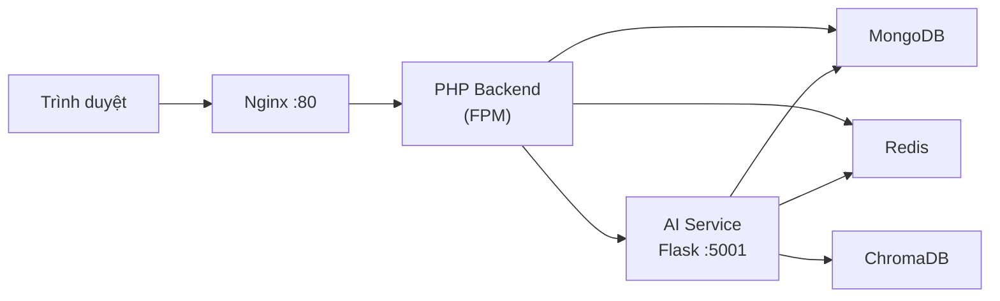

# SkinSyntaxVN — Decoding Your Skin Language

Nền tảng thương mại điện tử mỹ phẩm chăm sóc da kết hợp chatbot AI tư vấn cá nhân hóa, gợi ý sản phẩm và phân tích giỏ hàng theo loại da, thành phần và routine.

**SkinSyntaxVN** is a skincare e-commerce platform with an AI assistant powered by RAG (Retrieval-Augmented Generation), hybrid semantic search, and multi-model LLM fallback.

---

## Tính năng chính

- Cửa hàng trực tuyến: danh mục sản phẩm, tìm kiếm thông minh, giỏ hàng, thanh toán
- Chatbot AI tư vấn da liễu, gợi ý sản phẩm theo profile khách hàng
- Hybrid search: semantic search + metadata filter + reranker trên ChromaDB
- Phân tích giỏ hàng: phát hiện xung đột thành phần, gợi ý routine
- Quản trị: dashboard admin/staff, đơn hàng, voucher, báo cáo
- Đăng nhập xã hội (Google, Facebook) và xác thực OTP qua email

---

## Kiến trúc hệ thống



| Thành phần | Công nghệ | Vai trò |
|---|---|---|
| Frontend | PHP views + HTML/CSS/JS | Giao diện người dùng, widget chat |
| Backend | PHP 8.2 MVC | Routing, auth, BFF gọi AI service |
| AI Service | Python 3.11, Flask, LangChain | RAG, agent, streaming SSE |
| Database | MongoDB 7 | Sản phẩm, người dùng, đơn hàng |
| Vector DB | ChromaDB 0.5 | Embedding ~6.000 sản phẩm |
| Cache | Redis 7 | Session/response cache cho chat |
| Proxy | Nginx 1.27 | Phục vụ web, chặn `/api/` AI ra ngoài |

Luồng chat: **Browser widget → PHP (`AiChatService`) → AI service (Docker network) → MongoDB + ChromaDB**

---

## Cấu trúc thư mục

```
.
├── ai-service-flask/     # Dịch vụ AI (Flask, LangChain, agent, RAG)
├── backend/              # PHP backend (controllers, models, services)
├── frontend/             # PHP views + static assets (CSS/JS)
├── database/             # Script import MongoDB/ChromaDB, schema, CSV
├── nginx/                # Cấu hình reverse proxy
├── spiders/              # Pipeline thu thập & làm sạch dữ liệu sản phẩm
├── docker-compose.yml
├── Dockerfile.ai
├── Dockerfile.php
└── .env.example
```

---

## Yêu cầu

- [Docker](https://docs.docker.com/get-docker/) & Docker Compose v2
- [OpenAI API key](https://platform.openai.com/) (model mặc định: `gpt-4o-mini`)
- File dữ liệu `database/data_clean_final.csv` (không commit lên Git)

---

## Chạy nhanh với Docker

### 1. Clone & cấu hình môi trường

```bash
git clone https://github.com/phamthixuanhien280994-debug/SKin.git
cd SKin
cp .env.example .env
python scripts/sync_env.py  
```

Repo này **track luôn `.env`** (dự án cá nhân). Clone xong có thể chạy ngay; chỉnh secret trực tiếp trong `.env` nếu cần.

### 2. Chuẩn bị dữ liệu

Đặt file CSV sản phẩm vào:

```
database/data_clean_final.csv
```

### 3. Khởi động stack

```bash
docker compose up -d --build
```

| Dịch vụ | URL / Port |
|---|---|
| Website | http://localhost |
| AI health check | http://localhost:5001/api/health *(chỉ nội bộ Docker)* |
| MongoDB | `localhost:27018` |
| ChromaDB | `localhost:8000` |
| Redis | `localhost:6380` |

### 4. Import dữ liệu (lần đầu)

```bash
# Import sản phẩm vào MongoDB
docker compose exec ai-service python /app/database/import_mongodb.py

# Import embedding vào ChromaDB
docker compose exec ai-service python /app/database/import_chromadb.py

# (Tuỳ chọn) Tạo tài khoản demo
docker compose exec mongodb mongosh skinsyntax /var/www/database/seed_demo_user.js
```

> Script seed cần mount file `database/seed_demo_user.js` vào container MongoDB, hoặc chạy trực tiếp:
> ```bash
> mongosh "mongodb://localhost:27018/skinsyntax" < database/seed_demo_user.js
> ```

### 5. Kiểm tra

```bash
docker compose ps
curl http://localhost:5001/api/health
```

Mở trình duyệt tại **http://localhost** — widget chat AI nằm góc phải màn hình.

---

## Biến môi trường

Mẫu đầy đủ: [`.env.example`](.env.example). Đồng bộ key thiếu: `python scripts/sync_env.py`.

| Nhóm | Biến chính |
|---|---|
| **App** | `APP_URL`, `FRONTEND_ROOT`, `SOCIAL_LOCAL_FALLBACK` |
| **Database** | `MONGO_URI`, `MONGO_DB`, `CSV_FILE_PATH`, `CHROMA_DB_PATH` |
| **Cache** | `REDIS_URL`, `REDIS_CACHE_TTL`, `SESSION_CACHE_TTL` |
| **AI** | `OPENAI_API_KEY`, `OPENAI_CHAT_MODEL`, `TAVILY_API_KEY`, `CHATBOT_PORT` |
| **AI BFF** | `AI_CHAT_*`, `AI_RECOMMENDATION_*`, `AI_HYBRID_*`, `*_TIMEOUT` |
| **Auth** | `GOOGLE_CLIENT_*`, `FACEBOOK_APP_*`, `*_OAUTH_REDIRECT_URI` |
| **Mail** | `MAIL_DEMO_MODE`, `SMTP_*` |
| **Payment** | `BANK_TRANSFER_*`, `SEPAY_*` |

Docker override một số biến (Mongo/Redis/AI endpoints) — xem `docker-compose.yml`.

---

## API AI Service

AI service **không expose trực tiếp** ra internet — Nginx chặn `/api/`; PHP backend gọi nội bộ qua Docker network.

| Method | Endpoint | Mô tả |
|---|---|---|
| `GET` | `/api/health` | Trạng thái service, ChromaDB, cache |
| `POST` | `/api/chat/auto` | Chat tự route (pipeline / agent / cart) |
| `POST` | `/api/chat/stream` | Chat streaming SSE |
| `POST` | `/api/recommend/explain` | Gợi ý sản phẩm có giải thích |
| `POST` | `/api/recommend/langchain-rag` | Gợi ý qua LangChain RAG |
| `POST` | `/api/eval/score` | Chấm điểm chất lượng câu trả lời |

Test trực tiếp (dev):

```bash
curl -X POST http://localhost:5001/api/chat/auto \
  -H "Content-Type: application/json" \
  -d '{"message": "Da dầu nên dùng serum gì?"}'
```

---

## Chạy local không dùng Docker (dev)

### AI Service

```bash
cd ai-service-flask
python3 -m venv venv && source venv/bin/activate
pip install -r requirements.txt
cp ../.env.example ../.env   # điền OPENAI_API_KEY
python chatbot_flask.py      # port 5001
```

### PHP Backend

Cần PHP 8.2+, extension `mongodb`, Composer, MongoDB và Redis đang chạy local.

```bash
cd backend
composer install
# Cấu hình MONGO_URI, FRONTEND_ROOT trong .env
php -S localhost:8080 -t public
```

---

## Pipeline dữ liệu (spiders)

Scripts thu thập và xử lý dữ liệu sản phẩm nằm trong `spiders/`:

| Script | Mục đích |
|---|---|
| `spiders/skinSyntaxVN/step1_cleaning.py` | Làm sạch CSV thô |
| `spiders/skinSyntaxVN/step2_import_dbPostgresQL.py` | Import DB (legacy) |
| `spiders/skinSyntaxVN/step3_eda_analysis.py` | Phân tích EDA |
| `spiders/merge_csvs.py` | Gộp nhiều nguồn CSV |
| `database/import_mongodb.py` | Import MongoDB (hiện tại) |
| `database/import_chromadb.py` | Vector hóa sản phẩm |

---

## Lệnh Docker hữu ích

```bash
docker compose logs -f ai-service    # Xem log AI
docker compose restart ai-service    # Restart AI sau khi đổi code
docker compose down                  # Dừng toàn bộ
docker compose down -v               # Dừng + xóa volumes (mất data)
```

---

## Ghi chú bảo mật

- Không commit file `.env` — chỉ dùng `.env.example` làm mẫu
- API AI chỉ accessible trong Docker network; không mở port 5001 ra production nếu không cần
- Thư mục `chroma_db/` và dữ liệu lớn được gitignore

---

## License

Dự án học thuật / demo — liên hệ tác giả trước khi sử dụng thương mại.
