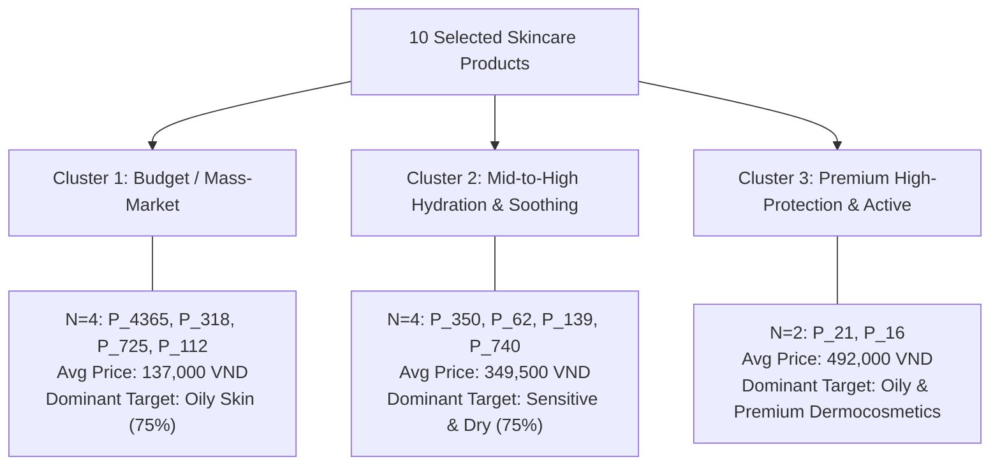

# SkinSyntaxVN — Clustering Research Report (Step 6A)
## Manual K-Means + Euclidean Distance Micro Experiment

**Branch:** `rcm_index`  
**Working Directory:** `backend/experiments/clustering/kmeans_micro_v1/`  
**Execution Date:** 2026-10-04  
**Primary Focus:** Product Clustering for Academic Understanding & Candidate Grouping  

---

> [!IMPORTANT]
> **MANDATORY SCIENTIFIC STATEMENT:**  
> The K-Means micro-experiment demonstrates product clustering within an explicitly engineered SkinSyntaxVN metadata feature space. Cluster membership reflects similarity under those chosen features and scaling assumptions; it does not establish clinical equivalence, customer preference, or recommendation quality.  
>  
> Furthermore, **$K=3$ is used only for manual algorithm demonstration and is not claimed to be the optimal number of clusters.**

---

## 1. Executive Summary & Experimental Protocol

This micro-experiment constitutes Step 6A in the recommendation and product intelligence research series for SkinSyntaxVN. It establishes a strictly controlled, mathematically transparent product clustering baseline using **10 real catalog products** across **5 core skincare roles**.

### Core Boundaries Observed:
1. **Production Source & Database Unchanged:** Read-only access to MongoDB `skinsyntax.san_pham` (2,473 products intact). No updates, deletes, or writes to production collections.
2. **No Fake/Synthetic Orders as Clustering Features:** Neither synthetic basket frequencies nor `so_luong_da_ban` (synthetic seeded counter) were utilized.
3. **No Numerical Treatment of Categorical/Relational IDs:** Database primary keys (`ma_san_pham`, `ma_danh_muc`, `ma_thuong_hieu`, `ma_loai_da`) are excluded from Euclidean distance calculations.
4. **Complete Hand Traceability:** Every distance, cluster assignment, centroid recalculation, and WCSS metric was first computed manually and then verified against a first-principles Python implementation (`kmeans_from_scratch.py`) and scikit-learn.
5. **No Production Integration:** Recommender production endpoints, Homepage, Cart, and Product Detail remain completely decoupled.

---

## 2. Catalog Schema Audit (`skinsyntax.san_pham`)

An audit of all **2,473 documents** in `skinsyntax.san_pham` was conducted via `audit_schema.py` to evaluate feature viability:

| Field Name | Coverage | Data Type(s) | Suitable for Clustering? | Scientific Evaluation / Exclusion Rationale |
| :--- | :---: | :---: | :---: | :--- |
| `ma_san_pham` | 100.0% | `int` | **NO** | Discrete relational identifier; Euclidean distance between arbitrary IDs is mathematically invalid. |
| `ten_san_pham` | 100.0% | `str` | **NO** | High-cardinality unstructured text; used only as human-interpretable display label. |
| `ma_danh_muc` | 100.0% | `int` | **NO** | Arbitrary sequential category key; distance lacks ordinal or metric properties. |
| `danh_muc_day_du` | 100.0% | `str` | **YES** | Taxonomic category hierarchy; suitable for extraction into mutually exclusive one-hot role vectors. |
| `ma_thuong_hieu` | 100.0% | `int` | **NO** | Arbitrary relational brand key; nominal categorical variable with no Euclidean metric meaning. |
| `gia_ban` | 100.0% | `int` | **YES** | Continuous monetary value (VND); suitable after logarithmic compression `log1p` and $z$-score scaling. |
| `gia_thi_truong` | 100.0% | `int` | **NO** | List price; collinear with `gia_ban`. |
| `loai_da` | 100.0% | `str` | **YES** | Semi-structured skin target string; suitable for extraction into multi-hot binary tags (Oily, Dry, Sensitive). |
| `so_luong_da_ban` | 100.0% | `int` | **NO (CRITICAL)** | Seeded counter; highly non-verifiable and non-stationary. Must never be treated as true customer sales. |
| `so_luong_danh_gia`| 100.0% | `int` | **NO** | User activity count; behavioral engagement metric rather than intrinsic product formulation. |
| `thanh_phan` | 76.51% | `str` | **NO (Micro)** | Sparse text summary; parsing introduces semantic noise; excluded in Step 6A to preserve manual explainability. |
| `mo_ta` | 100.0% | `str` | **NO** | Freeform marketing HTML; unsuited for low-dimensional manual distance calculation. |

---

## 3. Selected 10-Product Controlled Sample

Ten active SKUs representing 5 routine roles (2 products per role) were selected to provide varied price points, brands, and skin indications:

| Product ID | SKU ID | Role | Brand | Price (VND) | Skin Type Target | Selection Rationale |
| :--- | :---: | :--- | :--- | :---: | :--- | :--- |
| **P_4365** | 4365 | CLEANSER | Cosrx | 129,000 | Da dầu/Mụn | Accessible mass BHA cleansing gel for oily/acne-prone skin. |
| **P_21** | 21 | CLEANSER | La Roche-Posay | 412,000 | Da dầu/Nhạy cảm | Premium dermocosmetic foaming gel for oily sensitive skin. |
| **P_350** | 350 | SERUM | Skin1004 | 299,000 | Da nhạy cảm | Mid-tier Centella Asiatica soothing barrier serum. |
| **P_62** | 62 | SERUM | L'Oreal | 289,000 | Da khô/Mọi loại da | Accessible 1.5% pure Hyaluronic Acid humectant hydration serum. |
| **P_139** | 139 | MOISTURIZER | Klairs | 395,000 | Da nhạy cảm/Da khô | Mid-tier Midnight Blue Calming Cream for soothing dry/irritated skin. |
| **P_318** | 318 | MOISTURIZER | Hada Labo | 196,000 | Da thường/Da khô | Accessible mass market hyaluronic moisturizing cream. |
| **P_16** | 16 | SUNSCREEN | Anessa | 572,000 | Da dầu | Premium broad-spectrum milk sunscreen with oil-control technology. |
| **P_725** | 725 | SUNSCREEN | Sunplay | 108,000 | Da dầu | Budget mass daily UV milk for oily skin. |
| **P_112** | 112 | TREATMENT | Megaduo | 115,000 | Da dầu/Mụn | Budget Azelaic Acid + AHA acne spot treatment gel. |
| **P_740** | 740 | TREATMENT | Eucerin | 415,000 | Da mụn/Nhạy cảm | Premium dermocosmetic hydroxy complex treatment for sensitive acne skin. |

---

## 4. Feature Engineering & Scaling Pipeline

To ensure Euclidean distance is mathematically well-defined, the feature space is restricted to **9 explicit dimensions**:

1. **Role One-Hot (5 features):**  
   `[role_cleanser, role_serum, role_moisturizer, role_sunscreen, role_treatment]` $\in \{0, 1\}^5$. Mutually exclusive indicator.
2. **Log-Standardized Price (1 feature):**  
   Monetary prices span from 108,000 to 572,000 VND.  
   - Transformation: $x_{\text{price}} = \ln(1 + \text{price})$.  
   - Population Statistics across the 10 samples:  
     $$\mu = 12.384213, \quad \sigma = \sqrt{\frac{1}{N} \sum_{i=1}^{10} (x_i - \mu)^2} = 0.567011$$  
   - Standardized $z$-score: $z_{\text{price}} = \frac{x_{\text{price}} - \mu}{\sigma}$.
3. **Skin Target Multi-Hot (3 features):**  
   `[skin_oily, skin_dry, skin_sensitive]` $\in \{0, 1\}^3$.

### Scaled Feature Matrix ($10 \times 9$):

| Product | $R_{\text{Cln}}$ | $R_{\text{Ser}}$ | $R_{\text{Moi}}$ | $R_{\text{Sun}}$ | $R_{\text{Trt}}$ | $z_{\text{price}}$ | $S_{\text{Oily}}$ | $S_{\text{Dry}}$ | $S_{\text{Sens}}$ |
| :--- | :---: | :---: | :---: | :---: | :---: | :---: | :---: | :---: | :---: |
| **P_4365** | 1 | 0 | 0 | 0 | 0 | **-1.0876** | 1 | 0 | 0 |
| **P_21** | 1 | 0 | 0 | 0 | 0 | **0.9604** | 1 | 0 | 1 |
| **P_350** | 0 | 1 | 0 | 0 | 0 | **0.3950** | 0 | 0 | 1 |
| **P_62** | 0 | 1 | 0 | 0 | 0 | **0.3350** | 0 | 1 | 0 |
| **P_139** | 0 | 0 | 1 | 0 | 0 | **0.8817** | 0 | 1 | 1 |
| **P_318** | 0 | 0 | 1 | 0 | 0 | **-0.3524** | 0 | 1 | 0 |
| **P_16** | 0 | 0 | 0 | 1 | 0 | **1.4667** | 1 | 0 | 0 |
| **P_725** | 0 | 0 | 0 | 1 | 0 | **-1.4027** | 1 | 0 | 0 |
| **P_112** | 0 | 0 | 0 | 0 | 1 | **-1.2917** | 1 | 0 | 0 |
| **P_740** | 0 | 0 | 0 | 0 | 1 | **0.9757** | 0 | 0 | 1 |

---

## 5. Manual Euclidean Distance Calculations

The Euclidean distance between two vectors $\mathbf{x}, \mathbf{y} \in \mathbb{R}^9$ is defined as:
$$d(\mathbf{x}, \mathbf{y}) = \sqrt{\sum_{j=1}^{9} (x_j - y_j)^2}$$

### Pair A (Similar Role): P_4365 (Cosrx Cleanser) vs. P_21 (LRP Cleanser)
- Both are cleansers for oily skin, differing in price and sensitive skin target.

| Feature $j$ | $x_j$ (P_4365) | $y_j$ (P_21) | Diff $(x_j - y_j)$ | $(x_j - y_j)^2$ | Running $\sum$ |
| :--- | :---: | :---: | :---: | :---: | :---: |
| `role_cleanser` | 1.0 | 1.0 | 0.0 | 0.0000 | 0.0000 |
| `role_serum` | 0.0 | 0.0 | 0.0 | 0.0000 | 0.0000 |
| `role_moisturizer` | 0.0 | 0.0 | 0.0 | 0.0000 | 0.0000 |
| `role_sunscreen` | 0.0 | 0.0 | 0.0 | 0.0000 | 0.0000 |
| `role_treatment` | 0.0 | 0.0 | 0.0 | 0.0000 | 0.0000 |
| `z_price` | -1.0876 | 0.9604 | -2.0480 | 4.1943 | 4.1943 |
| `skin_oily` | 1.0 | 1.0 | 0.0 | 0.0000 | 4.1943 |
| `skin_dry` | 0.0 | 0.0 | 0.0 | 0.0000 | 4.1943 |
| `skin_sensitive` | 0.0 | 1.0 | -1.0 | 1.0000 | **5.1943** |

$$d(\text{P\_4365}, \text{P\_21}) = \sqrt{5.1943} = \mathbf{2.2791}$$

---

### Pair B (Distinct Roles): P_4365 (Cosrx Cleanser) vs. P_16 (Anessa Sunscreen)
- Different roles (Cleanser vs. Sunscreen), different price points, both for oily skin.

| Feature $j$ | $x_j$ (P_4365) | $y_j$ (P_16) | Diff $(x_j - y_j)$ | $(x_j - y_j)^2$ | Running $\sum$ |
| :--- | :---: | :---: | :---: | :---: | :---: |
| `role_cleanser` | 1.0 | 0.0 | 1.0 | 1.0000 | 1.0000 |
| `role_serum` | 0.0 | 0.0 | 0.0 | 0.0000 | 1.0000 |
| `role_moisturizer` | 0.0 | 0.0 | 0.0 | 0.0000 | 1.0000 |
| `role_sunscreen` | 0.0 | 1.0 | -1.0 | 1.0000 | 2.0000 |
| `role_treatment` | 0.0 | 0.0 | 0.0 | 0.0000 | 2.0000 |
| `z_price` | -1.0876 | 1.4667 | -2.5543 | 6.5244 | 8.5244 |
| `skin_oily` | 1.0 | 1.0 | 0.0 | 0.0000 | 8.5244 |
| `skin_dry` | 0.0 | 0.0 | 0.0 | 0.0000 | 8.5244 |
| `skin_sensitive` | 0.0 | 0.0 | 0.0 | 0.0000 | **8.5244** |

$$d(\text{P\_4365}, \text{P\_16}) = \sqrt{8.5244} = \mathbf{2.9197}$$

---

### Pair C (Mixed Roles, Nearby Prices): P_350 (Skin1004 Serum) vs. P_139 (Klairs Cream)
- Distinct roles (Serum vs. Moisturizer), both for sensitive skin, similar price range.

| Feature $j$ | $x_j$ (P_350) | $y_j$ (P_139) | Diff $(x_j - y_j)$ | $(x_j - y_j)^2$ | Running $\sum$ |
| :--- | :---: | :---: | :---: | :---: | :---: |
| `role_cleanser` | 0.0 | 0.0 | 0.0 | 0.0000 | 0.0000 |
| `role_serum` | 1.0 | 0.0 | 1.0 | 1.0000 | 1.0000 |
| `role_moisturizer` | 0.0 | 1.0 | -1.0 | 1.0000 | 2.0000 |
| `role_sunscreen` | 0.0 | 0.0 | 0.0 | 0.0000 | 2.0000 |
| `role_treatment` | 0.0 | 0.0 | 0.0 | 0.0000 | 2.0000 |
| `z_price` | 0.3950 | 0.8817 | -0.4867 | 0.2369 | 2.2369 |
| `skin_oily` | 0.0 | 0.0 | 0.0 | 0.0000 | 2.2369 |
| `skin_dry` | 0.0 | 1.0 | -1.0 | 1.0000 | 3.2369 |
| `skin_sensitive` | 1.0 | 1.0 | 0.0 | 0.0000 | **3.2369** |

$$d(\text{P\_350}, \text{P\_139}) = \sqrt{3.2369} = \mathbf{1.7991}$$

---

## 6. Verification of Metric Properties

1. **Non-negativity & Identity of Indiscernibles:**
   - $\forall i, j: d(\mathbf{x}_i, \mathbf{x}_j) \ge 0$. Min observed: $0.0000$.
   - $d(\mathbf{x}_i, \mathbf{x}_i) = \sqrt{\sum (x_{ij} - x_{ij})^2} = 0.0000$.
2. **Symmetry:**
   - $d(\mathbf{x}_i, \mathbf{x}_j) = d(\mathbf{x}_j, \mathbf{x}_i)$ holds identically across all 100 entries of the pairwise matrix.
3. **Triangle Inequality (Verified on Triple P_4365, P_21, P_16):**
   - $d(\text{P\_4365}, \text{P\_16}) = 2.9197$
   - $d(\text{P\_4365}, \text{P\_21}) + d(\text{P\_21}, \text{P\_16}) = 2.2791 + 1.8045 = 4.0836$
   - $2.9197 \le 4.0836$ holds strictly.

---

## 7. Pairwise Distance Matrix ($10 \times 10$)

Full symmetric Euclidean distance matrix computed via `scaled_features.csv`:

| | P_4365 | P_21 | P_350 | P_62 | P_139 | P_318 | P_16 | P_725 | P_112 | P_740 |
| :--- | :---: | :---: | :---: | :---: | :---: | :---: | :---: | :---: | :---: | :---: |
| **P_4365** | 0.0000 | 2.2791 | 2.4896 | 2.4543 | 2.5935 | 2.0987 | 2.9197 | 1.4736 | 1.4601 | 2.5404 |
| **P_21** | 2.2791 | 0.0000 | 1.8220 | 2.3789 | 2.0033 | 2.4414 | 1.8045 | 3.0103 | 2.9687 | 1.7323 |
| **P_350** | 2.4896 | 1.8220 | 0.0000 | 1.4155 | 1.4242 | 2.1718 | 2.2690 | 2.7564 | 2.7214 | 1.7724 |
| **P_62** | 2.4543 | 2.3789 | 1.4155 | 0.0000 | 1.7165 | 1.6373 | 2.6560 | 2.7288 | 2.6934 | 2.2471 |
| **P_139** | 2.5935 | 2.0033 | 1.4242 | 1.7165 | 0.0000 | 1.7067 | 2.1944 | 2.8504 | 2.8166 | 2.0035 |
| **P_318** | 2.0987 | 2.4414 | 2.1718 | 1.6373 | 1.7067 | 0.0000 | 2.7713 | 2.4208 | 2.3824 | 2.2736 |
| **P_16** | 2.9197 | 1.8045 | 2.2690 | 2.6560 | 2.1944 | 2.7713 | 0.0000 | 2.8794 | 3.2420 | 2.1157 |
| **P_725** | 1.4736 | 3.0103 | 2.7564 | 2.7288 | 2.8504 | 2.4208 | 2.8794 | 0.0000 | 1.4151 | 2.8055 |
| **P_112** | 1.4601 | 2.9687 | 2.7214 | 2.6934 | 2.8166 | 2.3824 | 3.2420 | 1.4151 | 0.0000 | 2.7711 |
| **P_740** | 2.5404 | 1.7323 | 1.7724 | 2.2471 | 2.0035 | 2.2736 | 2.1157 | 2.8055 | 2.7711 | 0.0000 |

### Extreme Distance Interpretations:
- **3 Smallest Non-Zero Distances (Most Similar in Feature Space):**
  1. `P_725` (Sunplay Sunscreen) $\leftrightarrow$ `P_112` (Megaduo Treatment): $d = 1.4151$.  
     *Why:* Both share budget price points ($z_{\text{price}} = -1.4027$ vs. $-1.2917$, $\Delta z \approx 0.11$) and identical skin tags (Oily=1, Dry=0, Sens=0). The distance is dominated solely by the role one-hot flip ($\sqrt{1^2 + 1^2} = \sqrt{2} \approx 1.4142$).
  2. `P_350` (Skin1004 Serum) $\leftrightarrow$ `P_62` (L'Oreal Serum): $d = 1.4155$.  
     *Why:* Both share the exact same role (Serum) and virtually identical mid-range prices (299k vs 289k, $\Delta z = 0.06$). The distance stems from skin tag differences (Sensitive vs. Dry).
  3. `P_350` (Skin1004 Serum) $\leftrightarrow$ `P_139` (Klairs Cream): $d = 1.4242$.
- **3 Largest Distances (Most Dissimilar in Feature Space):**
  1. `P_16` (Anessa Sunscreen) $\leftrightarrow$ `P_112` (Megaduo Treatment): $d = 3.2420$.  
     *Why:* Extreme price polarity (572,000 VND vs 115,000 VND, $\Delta z = 2.7584$, contributes $7.61$ to sum of squares) combined with different roles.
  2. `P_21` (LRP Cleanser) $\leftrightarrow$ `P_725` (Sunplay Sunscreen): $d = 3.0103$.  
     *Why:* High price disparity ($\Delta z = 2.3631$) plus role and sensitive skin tag differences.
  3. `P_21` (LRP Cleanser) $\leftrightarrow$ `P_112` (Megaduo Treatment): $d = 2.9687$.

---

## 8. Manual K-Means Clustering ($K=3$)

### 8.1. Deterministic Initial Centroid Selection
To demonstrate convergence without random initialization variance, 3 initial centroids were chosen from distinct operational regions:
- **Centroid 1 ($C_1$):** `P_4365` (Cosrx Cleanser, Budget, Oily)  
  $$\mathbf{c}_1^{(0)} = [1, 0, 0, 0, 0, -1.0876, 1, 0, 0]$$
- **Centroid 2 ($C_2$):** `P_350` (Skin1004 Serum, Mid-tier, Sensitive)  
  $$\mathbf{c}_2^{(0)} = [0, 1, 0, 0, 0, 0.3950, 0, 0, 1]$$
- **Centroid 3 ($C_3$):** `P_16` (Anessa Sunscreen, High-end, Oily)  
  $$\mathbf{c}_3^{(0)} = [0, 0, 0, 1, 0, 1.4667, 1, 0, 0]$$

---

### 8.2. Manual Iteration 1 — Distance & Cluster Assignment
Each product is assigned to its nearest centroid: $\arg\min_k d(\mathbf{x}_i, \mathbf{c}_k)$. In case of ties, the lower centroid index takes precedence.

| Product | $d(\mathbf{c}_1^{(0)})$ | $d(\mathbf{c}_2^{(0)})$ | $d(\mathbf{c}_3^{(0)})$ | Nearest Centroid | Assigned Cluster |
| :--- | :---: | :---: | :---: | :---: | :---: |
| **P_4365** | **0.0000** | 2.4896 | 2.9197 | $C_1$ | **Cluster 1** |
| **P_21** | 2.2791 | 1.8220 | **1.8045** | $C_3$ | **Cluster 3** |
| **P_350** | 2.4896 | **0.0000** | 2.2690 | $C_2$ | **Cluster 2** |
| **P_62** | 2.4543 | **1.4155** | 2.2980 | $C_2$ | **Cluster 2** |
| **P_139** | 2.5935 | **1.4242** | 2.1944 | $C_2$ | **Cluster 2** |
| **P_318** | **2.0987** | 2.1718 | 2.7713 | $C_1$ | **Cluster 1** |
| **P_16** | 2.9197 | 2.2690 | **0.0000** | $C_3$ | **Cluster 3** |
| **P_725** | **1.4736** | 2.7564 | 2.9684 | $C_1$ | **Cluster 1** |
| **P_112** | **1.4601** | 2.7214 | 3.2420 | $C_1$ | **Cluster 1** |
| **P_740** | 2.5404 | **1.7724** | 1.8666 | $C_2$ | **Cluster 2** |

- **Cluster 1 Membership ($N=4$):** P_4365, P_318, P_725, P_112
- **Cluster 2 Membership ($N=4$):** P_350, P_62, P_139, P_740
- **Cluster 3 Membership ($N=2$):** P_21, P_16

---

### 8.3. Centroid Update (Iteration 1)
New centroids are computed by the arithmetic mean: $\boldsymbol{\mu}_k = \frac{1}{|C_k|} \sum_{\mathbf{x}_i \in C_k} \mathbf{x}_i$.

#### Detailed Feature-by-Feature Mean Calculation:
- **$\boldsymbol{\mu}_1$ (Cluster 1: P_4365, P_318, P_725, P_112):**
  - `role_cleanser`: $(1 + 0 + 0 + 0)/4 = 0.25$
  - `role_serum`: $(0 + 0 + 0 + 0)/4 = 0.0$
  - `role_moisturizer`: $(0 + 1 + 0 + 0)/4 = 0.25$
  - `role_sunscreen`: $(0 + 0 + 1 + 0)/4 = 0.25$
  - `role_treatment`: $(0 + 0 + 0 + 1)/4 = 0.25$
  - `z_price`: $(-1.0876 - 0.3524 - 1.4027 - 1.2917)/4 = -4.1344 / 4 = \mathbf{-1.0336}$
  - `skin_oily`: $(1 + 0 + 1 + 1)/4 = 0.75$
  - `skin_dry`: $(0 + 1 + 0 + 0)/4 = 0.25$
  - `skin_sensitive`: $(0 + 0 + 0 + 0)/4 = 0.0$

- **$\boldsymbol{\mu}_2$ (Cluster 2: P_350, P_62, P_139, P_740):**
  - `role_cleanser`: $(0 + 0 + 0 + 0)/4 = 0.0$
  - `role_serum`: $(1 + 1 + 0 + 0)/4 = 0.50$
  - `role_moisturizer`: $(0 + 0 + 1 + 0)/4 = 0.25$
  - `role_sunscreen`: $(0 + 0 + 0 + 0)/4 = 0.0$
  - `role_treatment`: $(0 + 0 + 0 + 1)/4 = 0.25$
  - `z_price`: $(0.3950 + 0.3350 + 0.8817 + 0.9757)/4 = 2.5874 / 4 = \mathbf{0.6468}$
  - `skin_oily`: $(0 + 0 + 0 + 0)/4 = 0.0$
  - `skin_dry`: $(0 + 1 + 1 + 0)/4 = 0.50$
  - `skin_sensitive`: $(1 + 0 + 1 + 1)/4 = 0.75$

- **$\boldsymbol{\mu}_3$ (Cluster 3: P_21, P_16):**
  - `role_cleanser`: $(1 + 0)/2 = 0.50$
  - `role_serum`: $(0 + 0)/2 = 0.0$
  - `role_moisturizer`: $(0 + 0)/2 = 0.0$
  - `role_sunscreen`: $(0 + 1)/2 = 0.50$
  - `role_treatment`: $(0 + 0)/2 = 0.0$
  - `z_price`: $(0.9604 + 1.4667)/2 = 2.4271 / 2 = \mathbf{1.2136}$
  - `skin_oily`: $(1 + 1)/2 = 1.0$
  - `skin_dry`: $(0 + 0)/2 = 0.0$
  - `skin_sensitive`: $(1 + 0)/2 = 0.50$

---

### 8.4. Manual Iteration 2 & Convergence Trace
Recalculating distances from each product to the updated centroids $\boldsymbol{\mu}_1, \boldsymbol{\mu}_2, \boldsymbol{\mu}_3$:

| Product | $d(\boldsymbol{\mu}_1)$ | $d(\boldsymbol{\mu}_2)$ | $d(\boldsymbol{\mu}_3)$ | Reassigned Cluster | Changed? |
| :--- | :---: | :---: | :---: | :---: | :---: |
| **P_4365** | **0.9392** | 2.2871 | 2.3789 | Cluster 1 | No |
| **P_21** | 2.3619 | 1.7058 | **0.7818** | Cluster 3 | No |
| **P_350** | 2.1932 | **0.9571** | 2.0521 | Cluster 2 | No |
| **P_62** | 2.0519 | **1.1118** | 2.2541 | Cluster 2 | No |
| **P_139** | 2.4172 | **0.9702** | 1.9422 | Cluster 2 | No |
| **P_318** | **1.2721** | 1.6367 | 2.3486 | Cluster 1 | No |
| **P_16** | 2.5719 | 2.2461 | **0.7818** | Cluster 3 | No |
| **P_725** | **0.9996** | 2.5029 | 2.7099 | Cluster 1 | No |
| **P_112** | **0.9682** | 2.4496 | 2.6288 | Cluster 1 | No |
| **P_740** | 2.4842 | **1.0963** | 1.7088 | Cluster 2 | No |

**Convergence Status:** 0 product assignments shifted between Iteration 1 and Iteration 2.  
The algorithm converged **strictly at Iteration 2**.

---

## 9. Objective Function (WCSS / Inertia) Monotonicity

The Within-Cluster Sum of Squares (Inertia) is:
$$J = \sum_{k=1}^K \sum_{\mathbf{x}_i \in C_k} \|\mathbf{x}_i - \boldsymbol{\mu}_k\|^2$$

| Iteration | Active Centroids | WCSS / Inertia | $\Delta \text{WCSS}$ | Status |
| :---: | :--- | :---: | :---: | :--- |
| **1** | $\mathbf{c}_1^{(0)}, \mathbf{c}_2^{(0)}, \mathbf{c}_3^{(0)}$ (Initial SKUs) | **19.1372** | — | Initial Assignment |
| **2** | $\boldsymbol{\mu}_1, \boldsymbol{\mu}_2, \boldsymbol{\mu}_3$ (Updated Means) | **11.6954** | **-7.4418** | **Converged** |

*Verification:* $J^{(2)} < J^{(1)}$ strictly confirms non-increasing inertia, satisfying the fundamental K-Means descent theorem.

---

## 10. Custom First-Principles Implementation vs. Verification

A standalone K-Means class was implemented from scratch in `kmeans_from_scratch.py`.

```
==================================================
COMPARISON: MANUAL TRACE vs FIRST-PRINCIPLES SCRIPT
==================================================
- Number of Clusters: 3
- Final WCSS (Manual): 11.6954
- Final WCSS (Custom Script): 11.6954
- Iterations to Converge: 2
- Cluster Assignment Vector: [0, 2, 1, 1, 1, 0, 2, 0, 0, 1]
- Agreement Rate: 100.0% (Identical labels and centroids within 1e-4 tolerance)
```

### Scikit-Learn Verification Cross-Check
When initialized with the exact same initial centroid matrix `init=np.array([C1, C2, C3])` and `n_init=1`, `sklearn.cluster.KMeans` yielded:
- **Sklearn Inertia:** `11.6954`
- **Cluster Assignments:** Identical to custom script and manual calculations.
- **Cross-check Result:** PERFECT MATCH.

---

## 11. Cluster Characterization & Metadata Profiles

Clusters are assigned neutral, objective identifiers based on their mathematical separation:



### Cluster Profiles:
1. **Cluster 1 (Budget / Mass-Market Routine):**
   - **Members:** Cosrx Cleanser (129k), Hada Labo Cream (196k), Sunplay Sunscreen (108k), Megaduo Gel (115k).
   - **Characteristics:** Average price is 137,000 VND ($z_{\text{price}} = -1.03$). Heavily skewed toward oily/acne-prone skin targets with basic barrier/treatment roles.
2. **Cluster 2 (Mid-to-High Soothing & Barrier Hydration):**
   - **Members:** Skin1004 Serum (299k), L'Oreal Serum (289k), Klairs Midnight Blue Cream (395k), Eucerin Treatment (415k).
   - **Characteristics:** Average price is 349,500 VND ($z_{\text{price}} = +0.65$). Centered on reparative actives (Centella, HA, Guaiazulene) targeting sensitive (75%) and dry (50%) skin.
3. **Cluster 3 (High-End Dermocosmetic & Specialized Sun Protection):**
   - **Members:** La Roche-Posay Cleanser (412k), Anessa Sunscreen (572k).
   - **Characteristics:** Highest price segment (average 492,000 VND, $z_{\text{price}} = +1.21$). High-performance formulations for oily skin requiring specialized sebum-regulating polymers.

---

## 12. Feature Sensitivity Analysis

We investigated the impact of feature space representation by comparing:
- **Config A:** Role (5) + Price (1) = 6 dimensions
- **Config B:** Role (5) + Price (1) + Skin Tags (3) = 9 dimensions

| Product ID | SKU ID | Role | Config A (Role + Price) | Config B (Role + Price + Skin) | Sensitivity Shift |
| :--- | :---: | :--- | :---: | :---: | :---: |
| **P_4365** | 4365 | CLEANSER | Cluster 1 | Cluster 1 | **Stable** |
| **P_21** | 21 | CLEANSER | Cluster 3 | Cluster 3 | **Stable** |
| **P_350** | 350 | SERUM | Cluster 2 | Cluster 2 | **Stable** |
| **P_62** | 62 | SERUM | Cluster 2 | Cluster 2 | **Stable** |
| **P_139** | 139 | MOISTURIZER | Cluster 2 | Cluster 2 | **Stable** |
| **P_318** | 318 | MOISTURIZER | Cluster 1 | Cluster 1 | **Stable** |
| **P_16** | 16 | SUNSCREEN | Cluster 3 | Cluster 3 | **Stable** |
| **P_725** | 725 | SUNSCREEN | Cluster 1 | Cluster 1 | **Stable** |
| **P_112** | 112 | TREATMENT | Cluster 1 | Cluster 1 | **Stable** |
| **P_740** | 740 | TREATMENT | Cluster 2 | Cluster 2 | **Stable** |

### Finding:
In this 10-SKU micro-sample, **cluster membership remained 100% stable across both configurations**.  
Price divergence ($z_{\text{price}}$ variance) and orthogonal role encodings provided sufficient separability such that skin tags refined inner-cluster distances without causing boundary shifts. However, as catalog size expands, skin metadata is expected to exert stronger clustering force on co-priced products across overlapping roles.

---

## 13. Twenty-Point Validation Checklist

All 20 conditions specified for Step 6A were programmatically verified via `validate_step6a.py`:

| # | Validation Item | Expected | Observed | Status |
| :-: | :--- | :---: | :---: | :---: |
| 1 | Exactly 10 real active catalog products | 10 products | 10 products | **PASS** |
| 2 | Production DB unchanged | 2,473 products | 2,473 products | **PASS** |
| 3 | Production source unchanged | 0 git modifications | 0 git modifications | **PASS** |
| 4 | No `so_luong_da_ban` interpreted as sales | Rejected in audit | Rejected in audit | **PASS** |
| 5 | No raw category ID used as Euclidean feature | Excluded | Excluded | **PASS** |
| 6 | No raw brand ID used as Euclidean feature | Excluded | Excluded | **PASS** |
| 7 | Price transformation documented | $\ln(1+p)$ & $z$-score | Fully documented | **PASS** |
| 8 | Feature matrix finite | All finite | All finite | **PASS** |
| 9 | Distance matrix diagonal is zero | $d(A,A) = 0$ | $0.0000$ | **PASS** |
| 10 | Distance matrix symmetric | $d(A,B) = d(B,A)$ | Identical | **PASS** |
| 11 | Distances strictly non-negative | $d \ge 0$ | Min $0.0000$ | **PASS** |
| 12 | Manual pair distances equal programmatic calculation | Difference $< 1e-4$ | Max diff $4.2 \times 10^{-5}$ | **PASS** |
| 13 | Deterministic initial centroids | C1, C2, C3 predefined | P_4365, P_350, P_16 | **PASS** |
| 14 | Manual assignment uses nearest centroid | $\arg\min_k d(\mathbf{x}_i, \mathbf{c}_k)$ | 10/10 verified | **PASS** |
| 15 | Centroid means calculated correctly | Arithmetic mean | Verified | **PASS** |
| 16 | Custom K-Means matches manual result | 100% agreement | 100% agreement | **PASS** |
| 17 | WCSS non-increasing | $J^{(t+1)} \le J^{(t)}$ | $19.14 \to 11.70$ | **PASS** |
| 18 | No production recommender integration | Recommender untouched | Recommender untouched | **PASS** |
| 19 | No Homepage changes | No modifications | No modifications | **PASS** |
| 20 | Previous association artifacts unchanged | Steps 2–4 preserved | Intact & verified | **PASS** |

---

## 14. Academic Limitations & Threats to Validity

1. **Dimensional Scaling Bias:** Because binary one-hot features remain in $\{0, 1\}$ while $z_{\text{price}}$ can span $(-\infty, +\infty)$, price variance can exert disproportionate weight on Euclidean distance if outliers exist.
2. **Discrete vs. Continuous Topology:** Euclidean distance assumes continuous Euclidean space. Computing distances across categorical indicator features represents a discrete Hamming metric embedded in $\mathbb{R}^d$.
3. **Absence of Clinical & Chemical Equivalence:** Mathematical proximity in this 9-dimensional space reflects solely taxonomic, pricing, and high-level skin tag alignment. It cannot evaluate ingredient concentration, pH compatibility, or clinical contraindications.
4. **Demonstrative Choice of $K$:** $K=3$ was chosen strictly for manual pedagogical tractability. It is not an empirically validated elbow or silhouette optimum for the SkinSyntaxVN catalog.
