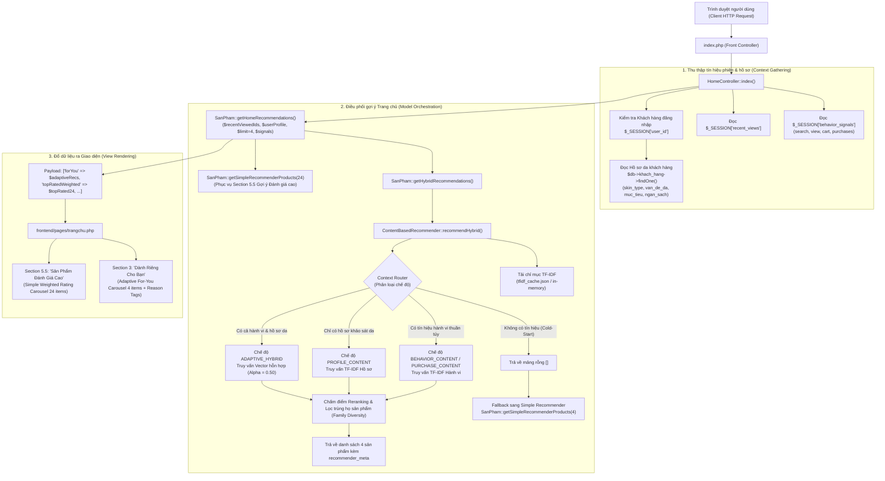
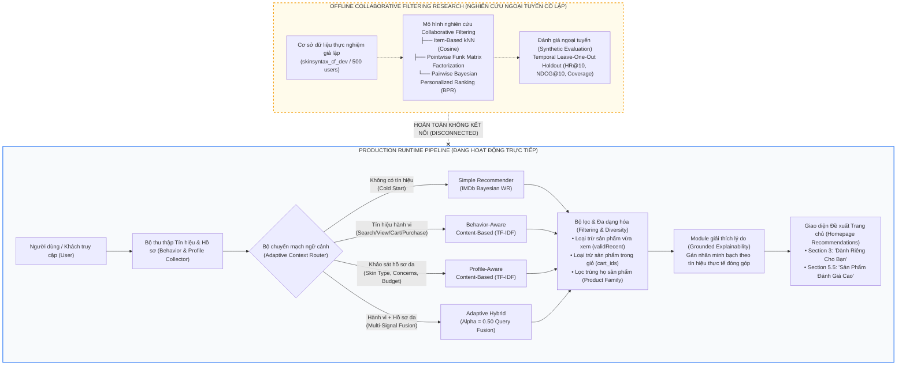
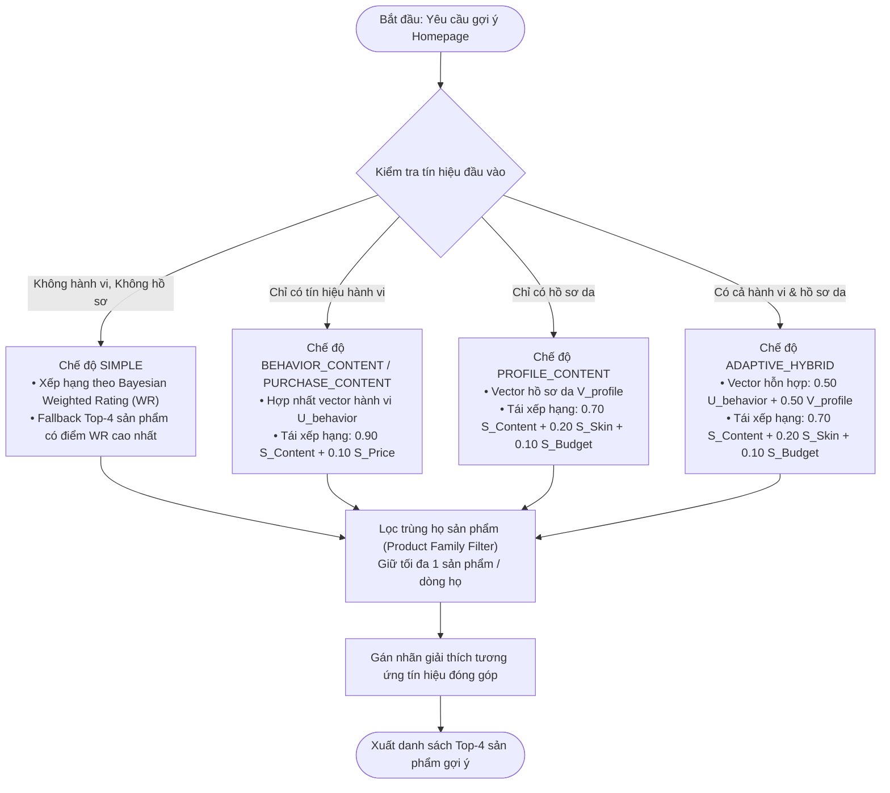

# KIẾN TRÚC VẬN HÀNH PRODUCTION RECOMMENDER (PRODUCTION RUNTIME ARCHITECTURE)

> **Phạm vi kiểm toán:** Mã nguồn PHP đang trực tiếp phục vụ website SkinSyntaxVN tại các file:  
> - `backend/app/controllers/HomeController.php`  
> - `backend/app/models/SanPham.php`  
> - `backend/app/services/ContentBasedRecommender.php`  
> - `frontend/pages/trangchu.php`

---

## 1. CALL GRAPH THỰC TẾ TRÊN TRANG CHỦ (EXACT HOMEPAGE CALL GRAPH)

Khi người dùng truy cập trang chủ (`GET /index.php` hoặc `GET /`), quy trình thực thi mã nguồn diễn ra tuần tự như sau:

---

## 2. CÁC THUẬT TOÁN THỰC TẾ ĐƯỢC THỰC THI TRÊN HOMEPAGE

Qua kiểm toán luồng thực thi tĩnh và động, trang chủ SkinSyntaxVN chỉ thực thi **hai lớp thuật toán chính**:

1. **Lớp 1 — Simple Recommender (IMDb Bayesian Weighted Rating):**
   - **Mục đích:** Giải quyết bài toán Cold-Start cho khách vãng lai mới theo phương pháp thống kê Bayes mượt và phục vụ mục "Sản phẩm đánh giá cao" (Section 5.5).
   - **Vị trí gọi:** `SanPham::getSimpleRecommenderProducts($limit)`.
   - **Trạng thái:** `PRODUCTION`.

2. **Lớp 2 — Adaptive Recommender V1 (Multi-Signal Content-Based & Hybrid):**
   - **Mục đích:** Cá nhân hóa động theo ngữ cảnh phiên duyệt web và hồ sơ da người dùng.
   - **Bốn chế độ nhánh con phụ thuộc tín hiệu đầu vào:**
     - **COLD-START:** Chuyển hướng an toàn về Simple Top-4.
     - **BEHAVIOR-AWARE:** Khi có tìm kiếm, click, xem, giỏ hàng, hoặc mua hàng mà chưa có hồ sơ da $\rightarrow$ chế độ `BEHAVIOR_CONTENT` hoặc `PURCHASE_CONTENT`.
     - **PROFILE-AWARE:** Khi người dùng đã làm khảo sát hồ sơ da nhưng phiên mới chưa có hành vi $\rightarrow$ chế độ `PROFILE_CONTENT`.
     - **ADAPTIVE HYBRID:** Khi có đồng thời cả hành vi tương tác và hồ sơ da $\rightarrow$ chế độ `ADAPTIVE_HYBRID`.
   - **Vị trí gọi:** `SanPham::getHybridRecommendations()`.
   - **Trạng thái:** `PRODUCTION`.

---

## 3. KIỂM TOÁN TÍNH CÔ LẬP CỦA COLLABORATIVE FILTERING (CF ABSENCE AUDIT)

Kết quả kiểm tra toàn diện mã nguồn production khẳng định:
- **KHÔNG** có bất kỳ lời gọi nào tới `CollaborativeFilteringEvaluator`, `trainItemKnn`, `trainFunkMf`, hay `trainBpr` bên trong `HomeController.php`, `SanPham.php`, `chitiet.php`, `cart.php`, `checkout.php`.
- **KHÔNG** có bất kỳ kết nối nào từ production runtime tới cơ sở dữ liệu thực nghiệm `skinsyntax_cf_dev`.
- **Collaborative Filtering hoàn toàn là mô hình nghiên cứu ngoại tuyến (Offline Research Only)**, phục vụ mục đích phân tích học thuật và đánh giá tiềm năng trên dữ liệu giả lập.

---

## 4. KIẾN TRÚC BỘ NHỚ ĐỆM (CACHE ARCHITECTURE & INVALIDATION)

Hệ thống production sử dụng chiến lược bộ nhớ đệm hai lớp để đảm bảo thời gian phản hồi trang dưới 100ms:

| Loại bộ nhớ đệm | Đường dẫn lưu trữ / Vị trí | Dữ liệu lưu trữ | Thời gian sống (TTL) | Cơ chế hủy đệm (Invalidation) |
| :--- | :--- | :--- | :---: | :--- |
| **Simple Recommender File Cache** | `backend/app/content/simple_recommender_cache.json` | Danh sách Top-24 sản phẩm tính sẵn kèm điểm WR | 600 giây (10 phút) | Tự động hủy khi quá TTL hoặc khi gọi `SanPham::clearSimpleRecommenderCache()` lúc có đánh giá mới |
| **Simple Recommender Memory Cache** | Biến tĩnh `SanPham::$simpleRecommenderMemoryCache` | Dữ liệu Top-24 trong cùng vòng đời request PHP | Vòng đời 1 request | Giải phóng khi kết thúc request HTTP |
| **TF-IDF Index File Cache** | `backend/app/content/tfidf_cache.json` | Vector TF-IDF, Norms, Từ điển terms (2,977 terms), Giá, Tên | Bền vững (File-based) | Tạo lại bằng script `build_tfidf_cache.php` khi danh mục sản phẩm thay đổi lớn |
| **TF-IDF In-Memory Cache** | Biến tĩnh `ContentBasedRecommender::$cachedIndex` | Chỉ mục TF-IDF được nạp vào RAM | Vòng đời 1 request | Giải phóng khi kết thúc request HTTP |
| **Product Lookup Static Cache** | Biến tĩnh trong `SanPham` (`$brandLookupMap`, `$categoryLookupMap`) | Bảng ánh xạ mã danh mục, thương hiệu | Vòng đời 1 request | Hàm `SanPham::clearLookupCache()` |

---

## 5. SƠ ĐỒ KIẾN TRÚC TỔNG THỂ PHỤC VỤ LUẬN VĂN (THESIS ARCHITECTURE DIAGRAM)

---

## 6. SƠ ĐỒ LUỒNG QUYẾT ĐỊNH THUẬT TOÁN (THESIS ALGORITHM DECISION FLOWCHART)

