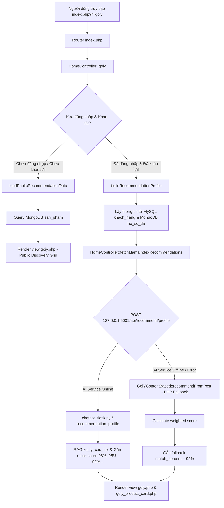

# Audit Report: Trang Gợi Ý Sản Phẩm & Routine (`index.php?r=goiy`)

**Ngày audit:** 24/08/2026  
**Trạng thái:** Hoàn thành kiểm tra & trace dữ liệu (Chưa sửa code logic / algorithm theo yêu cầu).

---

## 1. Data Flow Hiện Tại

Luồng di chuyển dữ liệu của trang `r=goiy` từ Frontend tới Backend và AI Service như sau:



### Chi tiết các thành phần:
1. **PHP Router / Controller**: 
   - Route `index.php?r=goiy` -> `HomeController::goiy()`
   - Route `index.php?r=goiy_api` -> `HomeController::goiyApi()` -> `xulygoiy()`
2. **View PHP**:
   - `frontend/views/goiy.php`: View chính hiển thị thông tin hồ sơ da, gợi ý cá nhân hóa và các danh mục khám phá.
   - `frontend/views/partials/goiy_product_card.php`: Component card sản phẩm (dùng chung cho cả trang gợi ý cá nhân hóa và bộ lọc/danh mục công khai).
3. **JavaScript**:
   - `frontend/views/goiy.php` (inline script): Bắt sự kiện submit form `#aiConsultForm` ("Nhu cầu của bạn là gì?"), gửi AJAX POST đến `index.php?r=ai_chat_api`.
4. **API / AJAX Requests**:
   - `index.php?r=ai_chat_api`: Gọi `HomeController::aiChatAssistant()` -> POST HTTP request tới Flask Chatbot `http://127.0.0.1:5001/api/chat`.
   - `fetchLlamaIndexRecommendations()`: POST HTTP request tới `http://127.0.0.1:5001/api/recommend/profile`.
5. **Python / Flask AI Services**:
   - **Service 1 (`ai-service-flask/chatbot_flask.py` - Port 5001)**: Chatbot RAG chính. Endpoint `/api/recommend/profile` đang nhận profile và chuyển sang câu hỏi RAG `xu_ly_cau_hoi()`.
   - **Service 2 (`ai-service-flask/rcm_flask.py` - Port 5002)**: Service LlamaIndex Recommendation độc lập (`services/llamaindex_recommend_service.py`). Dùng VectorStoreIndex + BM25 search rerank candidate sản phẩm từ MongoDB và LLM (Gemini/OpenAI).
6. **Database Query**:
   - **MySQL**: Bảng `khach_hang` (hồ sơ khảo sát: `loai_da`, `van_de_da`, `thanh_phan_tranh`, `ngan_sach`, `muc_do_nhay_cam`), `hoa_don`/`chi_tiet_hoa_don` (lịch sử mua hàng).
   - **MongoDB**: Collection `san_pham` (`ma_san_pham`, `ten_san_pham`, `danh_muc`, `thuong_hieu`, `gia_ban`, `link_hinh_anh`, `thanh_phan_chinh`, `thanh_phan_day_du`, `loai_da`, `diem_danh_gia`), collection `ho_so_da`.

---

## 2. Nguồn Gốc Của Con Số 92%

Con số **92%** xuất hiện trên các thẻ sản phẩm do **3 nguyên nhân chính**:

1. **PHP Fallback (`backend/app/controllers/HomeController.php` - Line 2338)**:
   ```php
   $p['match_percent'] = (int)($p['diem_phu_hop'] ?? $p['match_percent'] ?? 92);
   $p['match_label'] = 'PHÙ HỢP HỒ SƠ DA';
   ```
   - Model `GoiYContentBased.php` trả về mảng kết quả với key `'score'` (ví dụ `78.5`), KHÔNG có key `'diem_phu_hop'` hay `'match_percent'`.
   - Vì thế, khi AI Service không hoạt động hoặc không khả dụng, PHP fallback sang `GoiYContentBased` nhưng không đọc được key `'score'`, dẫn đến việc gán giá trị mặc định là **`92`** cho **tất cả sản phẩm**.

2. **Python Chatbot RAG Mock Score (`ai-service-flask/chatbot_flask.py` - Lines 2216–2219)**:
   ```python
   for idx, p in enumerate(products):
       if "match_percent" not in p:
           p["match_percent"] = max(72, 98 - (idx * 3))
   ```
   - Khi `HomeController` gọi endpoint `/api/recommend/profile` trên port 5001 (`chatbot_flask.py`), RAG pipeline không có thuật toán tính % thực tế mà tự động gán tỉ lệ giảm dần giả lập: `98%`, `95%`, `92%`, `89%`...

3. **LlamaIndex Rerank Normalized Percentage (`services/llamaindex_recommend_service.py` - Lines 401–424)**:
   - Service trên port 5002 tính `match_percent` dựa trên `(_rank_score / max_score) * 100`, nhưng PHP hiện tại mặc định gọi port 5001 thay vì 5002.

**Kết luận:** Con số 92% hiện tại hoàn toàn là **hard-coded / mock fallback**, KHÔNG phản ánh đúng độ tương thích thực tế của sản phẩm với hồ sơ da.

---

## 3. Recommendation Hiện Được Tính Như Thế Nào

Hiện tại dự án có **3 cơ chế recommendation** độc lập nhưng chưa kết nối đồng nhất:

1. **Cơ chế 1: Python RAG (`chatbot_flask.py` - Port 5001)**
   - Ghép profile người dùng thành câu query natural language (ví dụ: *"Gợi ý chu trình chăm sóc da cho da hỗn hợp..."*).
   - Đưa qua `xu_ly_cau_hoi()` để tìm sản phẩm qua RAG chatbot.
   - Gán % phù hợp giả định (`98 - idx * 3`).

2. **Cơ chế 2: Python LlamaIndex Hybrid Engine (`services/llamaindex_recommend_service.py` - Port 5002)**
   - Kết hợp `VectorStoreIndex` (semantic search) + `BM25Retriever` (lexical search) trên MongoDB.
   - Chấm điểm rerank: `0.58 * semantic + 0.32 * lexical + quality_score` (đánh giá, lượt bán).
   - Lọc theo metadata: `skin_type`, `concerns`, `avoid_ingredients`, `budget`.
   - Dùng Gemini/OpenAI tạo đoạn văn `answer_text`.

3. **Cơ chế 3: PHP Content-Based Fallback (`backend/app/models/GoiYContentBased.php`)**
   - Chấm điểm dựa trên hệ thống trọng số: `skin_type` (35), `concerns` (28), `budget` (18), `rating` (10), `query_intent` (42), `brand_origin` (5).
   - Trừ điểm penalty nếu dính thành phần cần tránh (-25) hoặc sai loại sản phẩm (-38).
   - Tuy nhiên kết quả trả về bị mất score khi truyền sang view do sai tên biến (`score` vs `diem_phu_hop`).

---

## 4. Nút “Vì sao phù hợp?” Lấy Nội Dung Ở Đâu

Nút "Vì sao phù hợp?" kích hoạt Bootstrap Modal trong `frontend/views/partials/goiy_product_card.php` (Lines 104-147 và 219-260).

Nội dung modal hiện lấy từ các nguồn sau:
- **Loại da tương thích**: `$product['loai_da'] ?? 'Phù hợp đa số loại da'` (Fallback cứng).
- **Hoạt chất chính**: `$product['thanh_phan_chinh'] ?? $product['thanh_phan'] ?? 'Hoạt chất phục hồi và chăm sóc chuyên sâu'` (Fallback cứng).
- **Độ an toàn**: **HARD-CODED 100%**: `"Không phát hiện thành phần cồn khô hay kích ứng theo hồ sơ da của bạn."` (Không hề chạy hàm đối soát thành phần thực tế!).
- **Phân tích chi tiết**: 
  ```php
  $explanation = trim((string)($product['llm_explanation'] ?? $product['mo_ta'] ?? 'Sản phẩm được thuật toán RAG và LangChain phân tích trùng khớp với loại da...'));
  ```
  - Khi không có `$product['llm_explanation']`, hệ thống lấy nguyên văn toàn bộ `$product['mo_ta']` (mô tả sản phẩm dài hàng trăm từ hoặc văn bản quảng cáo) để hiển thị vào khung phân tích.
  - Đây chính là lý do vì sao modal hiển thị nội dung quá dài, không đúng định dạng lý do súc tích.

---

## 5. Liên Kết Giữa Trang `goiy` Và Chatbot/AI Service

1. **Khởi tạo trang**:
   - `HomeController::goiy()` gọi `fetchLlamaIndexRecommendations()` -> POST JSON sang `http://127.0.0.1:5001/api/recommend/profile`.
2. **Khung "Nhu cầu của bạn là gì?" (Hỏi AI tư vấn ngay trên trang gợi ý)**:
   - Form `#aiConsultForm` trong `goiy.php` khi submit sẽ gửi message đến route PHP `index.php?r=ai_chat_api`.
   - `HomeController::aiChatAssistant()` chuyển tiếp prompt tới `http://127.0.0.1:5001/api/chat` (Endpoint của Conversational Chatbot).
   - Nhận câu trả lời câu chữ tự nhiên từ LLM và thay thế trực tiếp vào khối `.advice-text` trên trang.
3. **Vấn đề kiến trúc hiện tại**:
   - Trang gợi ý (`goiy`) chưa phân định rõ ràng giữa **Recommendation Engine** (trả về dữ liệu sản phẩm + lý do structured) và **Conversational Chatbot** (trả về văn bản hội thoại tự do).
   - Việc nhúng chatbot hội thoại trực tiếp để đè nội dung lời khuyên làm phân tán trải nghiệm khám phá sản phẩm (Product Discovery).

---

## 6. Các Bug & Data Inconsistency Tìm Được

| STT | Vấn đề / Bug | Vị trí code | Ảnh hưởng |
|---|---|---|---|
| 1 | **Key Name Mismatch trong PHP Fallback** | `HomeController.php` L2338 vs `GoiYContentBased.php` L463 | Tất cả sản phẩm fallback bị ép về **92%** do `GoiYContentBased` trả về key `score` nhưng `HomeController` tìm `diem_phu_hop`. |
| 2 | **Fake Match Percent trong RAG Flask** | `chatbot_flask.py` L2216–2219 | Tự động gán 98%, 95%, 92% theo thứ tự mảng index mà không qua công thức scoring. |
| 3 | **Cảnh báo độ an toàn bị Hard-code** | `goiy_product_card.php` L133, L247 | Luôn hiển thị "Không phát hiện cồn khô/kích ứng" mặc dù chưa kiểm tra thành phần thực tế với `avoid_ingredients` của user. |
| 4 | **Lấy `mo_ta` làm lý do phù hợp** | `goiy_product_card.php` L34 | Modal "Vì sao phù hợp?" bị tràn ngập bởi đoạn mô tả sản phẩm gốc rất dài thay vì lý do súc tích. |
| 5 | **Endpoint Config sai Port giữa PHP & Python** | `HomeController.php` L1327 | PHP gọi port `5001` (Chatbot RAG) thay vì port `5002` (`rcm_flask.py` - LlamaIndex recommendation engine thực sự). |

---

## 7. Dữ Liệu Đang Thiếu

1. **Dữ liệu cấu trúc lý do (Structured Reasons)**:
   - Backend AI Service chưa trả về mảng lý do phân rã: `fit_status`, `score` (nullable), `reasons[]`, `warnings[]`, `matched_concerns[]`, `matched_ingredients[]`, `data_confidence`.
2. **Dữ liệu thành phần trên một số sản phẩm**:
   - Một số sản phẩm trong MongoDB/MySQL thiếu trường `thanh_phan_chinh` hoặc `thanh_phan_day_du` (hoặc là chuỗi rỗng `""`).
   - Giao diện hiện tại dùng fallback chuỗi có sẵn thay vì báo rõ *"Chưa có đủ dữ liệu thành phần"*.
3. **Dữ liệu kiểm tra xung đột thành phần (Conflict Matrix)**:
   - Chưa có logic so sánh mảng `avoid_ingredients` của user với `thanh_phan_day_du` của sản phẩm để trả về danh sách thành phần vi phạm thực tế.

---

## 8. Chi Tiết Các Phần Đang Hard-code / Mock / Fallback

1. **Con số 92%**: Hardcoded mặc định tại `HomeController.php` line 2338.
2. **Tỉ lệ phần trăm 98%, 95%, 92%...**: Mock loop tại `chatbot_flask.py` lines 2216-2219.
3. **Chuỗi đánh giá độ an toàn**: Hardcoded `"Không phát hiện thành phần cồn khô hay kích ứng theo hồ sơ da của bạn."` tại `goiy_product_card.php` lines 133 & 247.
4. **Chuỗi fallback hoạt chất chính**: Hardcoded `"Hoạt chất phục hồi và chăm sóc chuyên sâu"` tại `goiy_product_card.php` lines 129 & 244.
5. **Chuỗi fallback loại da**: Hardcoded `"Phù hợp đa số loại da"` tại `goiy_product_card.php` lines 125 & 240.
6. **Văn bản giải thích mặc định**: Hardcoded `"Sản phẩm được thuật toán RAG và LangChain phân tích..."` tại `goiy_product_card.php` line 34.

---

## Kế Hoạch Đề Xuất Cho Bước Tiếp Theo (Chờ User Phê Duyệt)

1. **Loại bỏ hiển thị con số % giả lập (92%, 98%...)**:
   - Chuyển sang hiển thị trạng thái trung thực (State-based): `"Phù hợp"`, `"Có thể cân nhắc"`, hoặc `"Chưa đủ dữ liệu để tính độ phù hợp"`. Chỉ hiển thị % khi thực sự có score từ scoring algorithm.
2. **Chuẩn hóa API Recommendation Output (Structured Data)**:
   - Cấu hình lại AI Recommendation Service (hoặc PHP Fallback Engine) để trả về payload dạng:
     ```json
     {
       "product_id": "SP001",
       "fit_status": "phu_hop",
       "score": null,
       "reasons": ["Hỗ trợ cấp ẩm cho tình trạng da khô", "Có chứa Glycerin & B5"],
       "warnings": ["Chưa có đủ dữ liệu thành phần đầy đủ"],
       "matched_concerns": ["Da khô căng", "Cần phục hồi"],
       "matched_ingredients": ["Glycerin", "Panthenol"],
       "data_confidence": "medium"
     }
     ```
3. **Redesign Modal "Vì sao phù hợp?" theo Progressive Disclosure**:
   - Hiển thị 2–3 lý do chính (bullet points tích xanh), 1 cảnh báo (nếu có), hoạt chất liên quan.
   - Ẩn phần phân tích chi tiết đằng sau nút collapsible *"Xem phân tích chi tiết"*.
4. **Tách biệt Recommendation & Chatbot**:
   - Giữ Recommendation UI gọn gàng, tập trung vào Product Discovery.
   - Đảm bảo Recommendation UI không bị phụ thuộc cứng vào một LLM / Chatbot model cụ thể.
