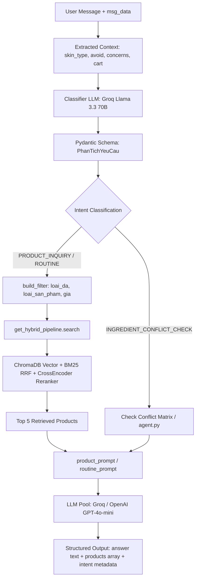

# Comprehensive Audit: LangChain Chatbot & Shared Core Architecture

**Ngày thực hiện:** 24/08/2026  
**Trạng thái:** Hoàn thành Audit Kiến Trúc & Trace Code (Chưa thực hiện sửa đổi logic hay migration cho đến khi được duyệt).

---

## 1. Các Implementation Chatbot / AI Hiện Có Trong Project

Bảng tổng hợp tất cả các module AI/Chatbot/Recommendation đang tồn tại trong codebase:

| STT | File / Module | Công nghệ / Framework | Vai trò / Chức năng chính | Service / Endpoint |
|---|---|---|---|---|
| 1 | `ai-service-flask/pipeline.py` | **LangChain** (Chains, Prompts, RAG, Hybrid Search) | Orchestrator chính cho RAG chatbot: Phân tích intent (`PhanTichYeuCau`), tìm sản phẩm hybrid, tổng hợp câu trả lời qua LLM Pool (Groq 70B, GPT-4o-mini). | Được import bởi `eval_trulens.py` & `agent_stream.py` |
| 2 | `ai-service-flask/chatbot_flask.py` | **LangChain** + Flask Web App | Server Flask chạy trên Port 5001. Chứa bản duplicate inline của `xu_ly_cau_hoi()` và điều hướng API chatbot. | `POST /api/chat`, `POST /api/recommend/profile` |
| 3 | `ai-service-flask/agent.py` | **LangChain Agent** (`create_tool_calling_agent`) | Tool-calling agent xử lý câu hỏi phức tạp đa bước với các tools: `tim_san_pham`, `kiem_tra_xung_dot`, `tra_cuu_kien_thuc`. | Được gọi từ `router.py` khi `should_use_agent = True` |
| 4 | `ai-service-flask/rcm_flask.py` & `services/llamaindex_recommend_service.py` | **LlamaIndex** + Flask | Server Flask chạy trên Port 5002. Xây dựng index sản phẩm riêng (`recommendation_index`), chạy vector + BM25 rerank và dùng LLM viết câu trả lời. | `POST /api/recommend/llamaindex`, `/api/recommend/guest` |
| 5 | `ai-service-flask/recommendation/` | **LlamaIndex** Engine & Mongo Fallback | Chứa `indexer.py` (build LlamaIndex từ MongoDB), `mongo_source.py`, `service.py` (`MongoFallbackSearch`). | Độc lập với LangChain core |
| 6 | `backend/app/models/GoiYContentBased.php` | **Pure PHP** (Deterministic Weighted Matrix) | Thuật toán chấm điểm theo trọng số (Skin 35, Concerns 28, Budget 18, Rating 10, Intent 42) chạy thuần PHP khi Python offline. | Thuộc PHP Backend (`HomeController`) |

---

## 2. Implementation Nào Là LangChain

Các file thuộc hệ sinh thái **LangChain Core**:
- **`pipeline.py`**: 100% LangChain-based orchestrator (dùng `langchain_core`, `langchain_chroma`, `langchain_huggingface`, `langchain_groq`, `langchain_openai`).
- **`agent.py`**: 100% LangChain Tool-Calling Agent (`create_tool_calling_agent`, `AgentExecutor`, `@tool`).
- **`retrieval.py`**: Quản lý ChromaDB vectorstore (`langchain_chroma`) và HuggingFace Embeddings (`langchain_huggingface`).
- **`hybrid_search.py`**: Tích hợp LangChain `CrossEncoderReranker` & `HuggingFaceCrossEncoder` để rerank tài liệu.
- **`chatbot_flask.py`**: Sử dụng các component của LangChain để xử lý API Flask trên port 5001.

---

## 3. Implementation Nào Tương Ứng Với Phiên Bản Đã Evaluation

- **File thực hiện evaluation**: `ai-service-flask/eval_trulens.py`
- **Mã nguồn được kiểm thử**: Dòng 180 của `eval_trulens.py` ghi rõ:
  ```python
  from pipeline import xu_ly_cau_hoi
  ```
  -> **Phiên bản được evaluation chính là `pipeline.py` (LangChain Main RAG Orchestrator)**.

### Kết quả Evaluation Đã Ghi Nhận:
- **Intent Accuracy**: **100.0%** (trên tập 5 câu hỏi mẫu thuộc nhóm `PRODUCT_INQUIRY`).
- **Answer Relevance**: **1.000** (được chấm bởi TruLens LLM-as-a-judge).
- **Average Latency**: **~19.5 giây** (cho luồng full RAG qua LLM 70B).
- **Groundedness & Context Relevance**: Chưa có số liệu hợp lệ do các hook theo dõi context của TruLens chưa gắn đủ telemetry trong lượt chạy cũ.

---

## 4. Data Flow Của Chatbot LangChain (`pipeline.py`)

Luồng xử lý chi tiết của hàm `xu_ly_cau_hoi(message, msg_data)` trong `pipeline.py`:



---

## 5. Product Retrieval Flow (Chi Tiết Luồng Truy Xuất Sản Phẩm)

### Data Sources & Indexing:
1. **Source Data**: Collection `san_pham` trong MongoDB.
2. **Vector Database**: ChromaDB tại đường dẫn `database/chroma_db` (collection name: `"products"`).
3. **Embeddings Model**: `sentence-transformers/static-similarity-mrl-multilingual-v1` (384 dimensions, tối ưu cho tiếng Việt và truy vấn đa ngữ).
4. **Keyword Index**: `BM25Search` được populate toàn bộ văn bản từ ChromaDB vào RAM ngay khi khởi động.
5. **Reranker Model**: `cross-encoder/mmarco-mMiniLMv2-L12-H384-v1` (Cross-Encoder chuyên dụng cho sắp xếp lại thứ tự văn bản tiếng Việt).

### Luồng Hybrid Search:
- **Bước 1 (Dense Search)**: ChromaDB trả về top `k_total=12` sản phẩm tương đồng về ngữ nghĩa.
- **Bước 2 (Sparse Search)**: BM25Index trả về top `k_total=12` sản phẩm chứa đúng từ khóa.
- **Bước 3 (Fusion)**: Reciprocal Rank Fusion (RRF) kết hợp 2 danh sách với hệ số `alpha=0.6` (ưu tiên semantic search).
- **Bước 4 (Cross-Encoder Rerank)**: Đưa candidate qua `HuggingFaceCrossEncoder` để chấm điểm chính xác câu hỏi với từng sản phẩm, chọn ra Top `top_n=5`.

---

## 6. Recommendation Flow Hiện Tại

Hiện tại dự án đang có 2 luồng recommendation riêng biệt:

1. **Luồng qua Chatbot Flask Port 5001 (`chatbot_flask.py`)**:
   - Ép profile người dùng thành chuỗi văn bản tự nhiên (ví dụ: *"Gợi ý chu trình chăm sóc da..."*).
   - Truyền qua RAG chatbot `xu_ly_cau_hoi()`.
   - **Lỗi hiện tại**: Tự sinh score ảo `98 - idx * 3` (98%, 95%, 92%...) cho mảng sản phẩm trả về.

2. **Luồng qua Standalone LlamaIndex Port 5002 (`services/llamaindex_recommend_service.py`)**:
   - Đọc index sản phẩm riêng `database/recommendation_index`.
   - Kết hợp `VectorIndexRetriever` + `BM25Retriever`.
   - Chấm điểm rerank theo công thức: `0.58 * semantic + 0.32 * lexical + quality_score`.
   - Gọi OpenAI/Gemini sinh đoạn văn `answer_text`.

---

## 7. Vector Store / Index Hiện Dùng

- **LangChain Core**: ChromaDB (`database/chroma_db`) + Embedding `sentence-transformers/static-similarity-mrl-multilingual-v1`.
- **LlamaIndex Engine**: LlamaIndex Native Storage (`database/recommendation_index`) + Embedding `sentence-transformers/all-MiniLM-L6-v2`.

---

## 8. So Sánh Chi Tiết: LangChain Core vs LlamaIndex Recommendation

| Tiêu chí | LangChain Chatbot Core (`pipeline.py`) | LlamaIndex (`llamaindex_recommend_service.py`) |
|---|---|---|
| **Nguồn dữ liệu** | ChromaDB (`database/chroma_db`) đồng bộ từ MongoDB `san_pham` | LlamaIndex Directory (`database/recommendation_index`) |
| **Embedding Model** | `static-similarity-mrl-multilingual-v1` (Tối ưu tiếng Việt) | `all-MiniLM-L6-v2` (Tiếng Anh/Đa ngữ chung) |
| **Phương pháp Retrieval** | Hybrid (Vector Semantic + BM25 Sparse + RRF Fusion) | Hybrid (Vector + BM25) |
| **Reranking** | Cross-Encoder (`mmarco-mMiniLMv2-L12-H384-v1`) chuyên dụng | Công thức đại số: `0.58*sem + 0.32*bm25 + quality` |
| **Lọc sản phẩm (Filter)** | Metadata Filter chuẩn hoá theo Pydantic `PhanTichYeuCau` | Python memory filter (`_filter_product`) |
| **Khả năng xử lý Profile** | Nhận `skin_type`, `concerns`, `avoid_ingredients`, `budget` qua Prompt & Filter | Tự đọc MongoDB `khach_hang` / `ho_so_da` |
| **Xử lý thành phần (Ingredient)** | Kiểm tra qua Conflict Table & Tool trong `agent.py` | Lọc theo chuỗi từ khóa đơn giản |
| **Explainability (Lý do)** | Sinh câu trả lời qua RAG LLM | LLM sinh `answer_text` + Rule ngắn cho từng card |
| **Đánh giá (Evaluated Status)** | **ĐÃ ĐƯỢC EVALUATION** (`eval_trulens.py`: 100% Intent Acc, 1.000 Answer Rel) | CHƯA ĐƯỢC EVALUATION |
| **Độ trễ (Latency)** | ~19.5s (kèm LLM 70B) / **< 2s (nếu chỉ lấy retrieval + rule matching)** | ~3-8s (LlamaIndex + LLM answer) |
| **Khả năng trả Structured Output** | **Rất Cao** (Đã có sẵn Pydantic schemas & `docs_to_products`) | Trung bình (Mảng Dictionary Python) |

### Kết Luận Về Lý Do Kỹ Thuật:
**KHÔNG CÓ LÝ DO KỸ THUẬT NÀO** bắt buộc trang `/goiy` phải tiếp tục dùng LlamaIndex độc lập.
Ngược lại, việc dùng **LangChain Shared Core** mang lại 3 lợi thế vượt trội:
1. Model embedding và reranker của LangChain Core tối ưu hơn hẳn cho tiếng Việt.
2. Đây là pipeline DUY NHẤT đã được thiết lập bộ kiểm thử tự động `eval_trulens.py`.
3. Loại bỏ hoàn toàn chi phí bảo trì 2 bộ vector store song song (`chroma_db` vs `recommendation_index`).

---

## 9. Các Thành Phần Có Thể Dùng Chung (Shared Core)

Các module trong `ai-service-flask` có thể dùng chung 100% giữa Chatbot và Recommendation:

1. **Vector Database & Embeddings**: Duy nhất 1 instance ChromaDB (`database/chroma_db`) với embedding `multilingual-v1`.
2. **Retrieval & Reranking Engine**: `HybridSearchPipeline` (`retrieval.py` + `hybrid_search.py`).
3. **Tra cứu & Chuẩn hóa dữ liệu sản phẩm**: `docs_to_products()` và hàm hydrate dữ liệu gốc từ MongoDB.
4. **Hồ sơ da & Bộ lọc (Profile & Constraints)**: Pydantic `PhanTichYeuCau` (`schemas.py`) để lọc cứng loại da, khoảng giá, danh mục.
5. **Ma trận an toàn & Xung đột thành phần**: Bảng quy tắc `_CONFLICT_TABLE` và hàm đối soát thành phần (`agent.py`).

---

## 10. Các Thành Phần Không Nên Dùng Chung (Separate Presentation Layers)

Để không lặp lại lỗi *"gọi chatbot sinh văn bản rồi parse thành card"*, 2 giao diện sẽ tách biệt ở tầng Presentation:

1. **Endpoint `/api/chat` (Conversational Chatbot)**:
   - Mục đích: Trả lời câu hỏi tư vấn tự do, hội thoại qua lại.
   - Output: JSON chứa `answer` (đoạn văn natural language từ LLM) + danh sách sản phẩm gợi ý đính kèm.
2. **Endpoint `/api/recommend` (Structured Recommendation Engine)**:
   - Mục đích: Phục vụ trực tiếp cho trang `/goiy`.
   - Output: **Pure Structured JSON** (Zero Chat Text Parsing).
   - Sử dụng **Deterministic Rule-based Matching & Scoring** cho từng sản phẩm thay vì bắt LLM viết đoạn chat.

---

## 11. Đề Xuất Kiến Trúc Cuối Cùng (Target Architecture)

```
                                  ┌──────────────────────────────────────────┐
                                  │           PHP Web Application            │
                                  └─────┬──────────────────────────────┬─────┘
                                        │                              │
                         UI Chat Assistant                             UI Recommendation Page
                        (index.php?r=ai_chat_api)                       (index.php?r=goiy)
                                        │                              │
                                        ▼                              ▼
                                 POST /api/chat               POST /api/recommend
                                        │                              │
                                        └──────────────┬───────────────┘
                                                       │
                                  ┌────────────────────┴────────────────────┐
                                  │       Flask AI API Gateway (Port 5001)  │
                                  └────────────────────┬────────────────────┘
                                                       │
               ┌───────────────────────────────────────┴───────────────────────────────────────┐
               │                     SHARED LANGCHAIN INTELLIGENCE CORE                        │
               ├───────────────────────────────────────────────────────────────────────────────┤
               │  • Single ChromaDB VectorStore (`database/chroma_db`)                         │
               │  • Multilingual Embedding (`sentence-transformers/multilingual-v1`)           │
               │  • Hybrid Search Pipeline (Chroma Vector + BM25 RRF Fusion)                   │
               │  • CrossEncoder Reranker (`mmarco-mMiniLMv2-L12-H384-v1`)                      │
               │  • Product Data Hydrator (MongoDB `san_pham`)                                 │
               │  • Ingredient Conflict Matrix & Safety Checker (`_CONFLICT_TABLE`)            │
               │  • Skin Profile Normalizer & Constraint Filter (`PhanTichYeuCau`)             │
               └───────────────────────────────┬───────────────┬───────────────────────────────┘
                                               │               │
                      ┌────────────────────────┘               └────────────────────────┐
                      ▼                                                                 ▼
           Conversational Handler                                          Structured Rec Handler
   • Intent Routing (Product / Knowledge / Routine)                 • Deterministic Product Matcher
   • Multi-LLM Pool (Groq Llama 70B / GPT-4o-mini)                  • Fit Status Evaluator (phu_hop/can_nhac)
   • Rich Context Synthesis                                         • Reasons & Warnings Generator
   • Output: { answer: "...", products: [...] }                     • Output: Structured JSON (No Chat Parsing)
```

---

## 12. Format Output Chuẩn Cho `/api/recommend`

Endpoint `/api/recommend` sẽ trả về dữ liệu chuẩn hóa như sau:

```json
{
  "ok": true,
  "source": "langchain_shared_core",
  "profile_summary": {
    "skin_type": "Da hỗn hợp thiên dầu",
    "concerns": ["Mụn ẩn", "Thâm mụn"],
    "avoid_ingredients": ["Cồn khô", "Hương liệu"],
    "budget": 500000
  },
  "recommendations": [
    {
      "product_id": "SP_00123",
      "ten_san_pham": "Serum La Roche-Posay Effaclar Serum",
      "thuong_hieu": "La Roche-Posay",
      "gia_ban": 395000,
      "link_hinh_anh": "http://example.com/image.jpg",
      "fit_status": "phu_hop",
      "score": null,
      "reasons": [
        "Phù hợp với loại da hỗn hợp thiên dầu",
        "Hỗ trợ giảm mụn ẩn và thâm mụn với BHA & Niacinamide",
        "Nằm trong khoảng ngân sách dưới 500.000đ"
      ],
      "warnings": [
        "Có chứa Salicylic Acid (BHA), nên sử dụng kẽ ngày nếu da mới bắt đầu"
      ],
      "matched_concerns": ["Mụn ẩn", "Thâm mụn"],
      "matched_ingredients": ["Salicylic Acid", "Niacinamide", "LHA"],
      "data_confidence": "high"
    },
    {
      "product_id": "SP_00456",
      "ten_san_pham": "Kem Dưỡng Ẩm Dermacos Anti-Acne Matting Cream",
      "thuong_hieu": "Dermacos",
      "gia_ban": 280000,
      "link_hinh_anh": "http://example.com/image2.jpg",
      "fit_status": "chua_du_du_lieu",
      "score": null,
      "reasons": [
        "Loại sản phẩm kiềm dầu phù hợp với da mụn"
      ],
      "warnings": [
        "Chưa có đủ dữ liệu thành phần chi tiết để đánh giá mức độ kích ứng"
      ],
      "matched_concerns": ["Mụn ẩn"],
      "matched_ingredients": [],
      "data_confidence": "low"
    }
  ]
}
```

---

## 13. Kế Hoạch Migration Từng Bước (`/goiy` → Shared LangChain Core)

### Bước 1: Xử Lý Ngay Các Lỗi Dữ Liệu & Hard-code Hiện Tại (Non-Breaking)
1. **PHP Controller (`HomeController.php`)**:
   - Loại bỏ `?? 92` fallback tại dòng 2338.
   - Thay bằng trạng thái không có con số: `$p['match_percent'] = null; $p['fit_status'] = 'chua_tinh';`.
2. **Python Chatbot (`chatbot_flask.py`)**:
   - Loại bỏ đoạn code tự sinh score ảo `98 - idx * 3` tại dòng 2216–2219.
3. **Product Card View (`goiy_product_card.php`)**:
   - Xóa bỏ dòng chữ safety hard-code: *"Không phát hiện thành phần cồn khô hay kích ứng theo hồ sơ da của bạn."*.
   - Nếu chưa thực hiện check thành phần thực tế, hiển thị: *"Chưa đủ dữ liệu để đánh giá thành phần cần lưu ý"*.
   - Xóa bỏ việc lấy `mo_ta` làm lý do giải thích phù hợp.

### Bước 2: Xây Dựng Handler Structured Recommendation Trong LangChain Core
1. Tạo module `structured_recommendation.py` trong `ai-service-flask`.
2. Tái sử dụng `retrieval.py` (`get_hybrid_pipeline()`) để tìm candidate sản phẩm từ ChromaDB + BM25.
3. Thực hiện quy trình Chấm Điểm Trạng Thái & Sinh Cảnh Báo (Deterministic):
   - Đọc `avoid_ingredients` của user -> quét chuỗi `thanh_phan_day_du`. Nếu phát hiện thành phần cấm -> đẩy vào `warnings[]` và hạ `fit_status = "co_the_can_nhac"`.
   - Đọc `concerns` của user -> quét `thanh_phan_chinh`. Nếu khớp -> đẩy vào `matched_concerns[]` và `reasons[]`.
   - Nếu thiếu dữ liệu `thanh_phan_day_du` -> đặt `data_confidence = "low"`, thêm warning *"Chưa có đủ dữ liệu thành phần"*, đặt `fit_status = "chua_du_du_lieu"`.

### Bước 3: Đấu Nối PHP `HomeController.php` Với Structured API Mới
1. Sửa `fetchLlamaIndexRecommendations()` trong `HomeController.php` để gửi POST request sang `/api/recommend` (port 5001).
2. Cập nhật view `goiy_product_card.php` để render:
   - Badge trạng thái (`"Phù hợp"`, `"Có thể cân nhắc"`, `"Chưa đủ dữ liệu"`) thay cho badge % ảo.
   - Render tối đa 2–3 reasons và 1 warning trong Modal "Vì sao phù hợp?".

---

## 14. Danh Sách Các File Dự Kiến Thay Đổi

1. **`backend/app/controllers/HomeController.php`**:
   - Loại bỏ fallback `?? 92`.
   - Đấu nối endpoint sang `/api/recommend` của LangChain Core.
2. **`frontend/views/partials/goiy_product_card.php`**:
   - Thay thế % badge bằng Badge trạng thái trung thực.
   - Loại bỏ safety text hard-code và `mo_ta` fallback.
   - Cập nhật Bootstrap Modal hiển thị progressive disclosure (reasons, warnings, matched ingredients).
3. **`ai-service-flask/chatbot_flask.py`**:
   - Loại bỏ mock score loop `98 - idx * 3`.
   - Khai báo endpoint `POST /api/recommend` trỏ đến Structured Recommendation Handler.
4. **`ai-service-flask/structured_recommendation.py`** *(File mới)*:
   - Module chứa logic sinh structured JSON recommendation dựa trên LangChain Shared Core.

---

## 15. Các Rủi Ro & Biện Pháp Kiểm Soát

| Rủi ro | Mức độ | Biện pháp kiểm soát |
|---|---|---|
| **1. Độ trễ (Latency) khi recommendation** | Thấp | Không gọi LLM 70B để viết văn bản cho từng sản phẩm. Luồng recommendation sử dụng 100% deterministic matching & search retrieval, giữ độ trễ ở mức **< 1.5 giây**. |
| **2. Ảnh hưởng đến Chatbot UI hiện tại** | Không | Endpoint `/api/chat` giữ nguyên 100% cho khung Chatbot hỗ trợ. Hai API độc lập ở tầng Presentation. |
| **3. Dữ liệu thành phần bị thiếu trên sản phẩm gốc** | Trung bình | Khi `thanh_phan_day_du` rỗng, hệ thống chuyển trạng thái thành `"chua_du_du_lieu"`, phát tín hiệu minh bạch cho người dùng, **tuyệt đối không hallucinate hoặc suy đoán thành phần**. |
| **4. Sai lệch khi đánh giá RAG** | Thấp | Đã có sẵn bộ khung `eval_trulens.py`. Sau khi migrate có thể chạy ngay `python eval_trulens.py` để đánh giá lại độ chính xác độc lập cho Chatbot và Recommendation. |
