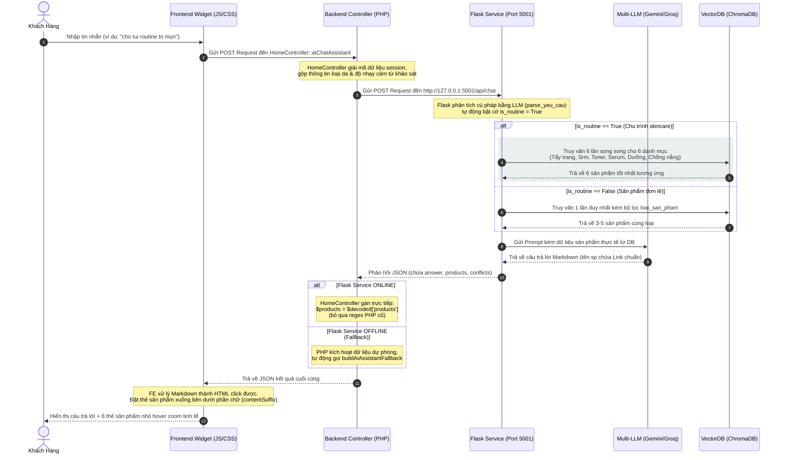

# Nhật ký Cập nhật Dự án (Project Updates)

## 1. Tối ưu hóa truy xuất của Chatbot Chăm sóc Da (18/05/2026)
- **Mục tiêu:** Khắc phục tình trạng phản hồi của Chatbot AI bị cắt xén (truncation) và thiếu ổn định.
- **Chi tiết cập nhật:**
  - Debug và cải thiện cầu nối giao tiếp giữa backend PHP và dịch vụ Python Flask.
  - Đảm bảo các context JSON phức tạp được phân tích chính xác mà không làm crash LLM hay ngắt kết nối giữa chừng.
  - Cải thiện chất lượng, độ dài đầy đủ của câu trả lời, đồng thời bao gồm các đề xuất sản phẩm linh hoạt và link tương tác.
  - Xử lý hiệu quả tình trạng giới hạn rate-limit (lỗi 429) và logic fallback để giữ cho trải nghiệm người dùng luôn liền mạch.

## 2. Nhập dữ liệu Sản phẩm vào ChromaDB (18/05/2026)
- **Mục tiêu:** Nhập thành công 6,000 sản phẩm chăm sóc da từ file CSV vào vector database (ChromaDB) để tích hợp Chatbot.
- **Chi tiết cập nhật:**
  - Tích hợp ChromaDB với chatbot dựa trên LangChain.
  - Ánh xạ chính xác các thuộc tính của sản phẩm như tên, loại da, thành phần, và giá vào cơ sở dữ liệu vector.
  - Triển khai logic truy xuất (retrieval) kết hợp giữa tìm kiếm theo ngữ nghĩa (semantic search) và lọc siêu dữ liệu (metadata filtering).
  - Đảm bảo chatbot đưa ra các lời khuyên cá nhân hóa, gợi ý sản phẩm chính xác và bám sát bối cảnh người dùng.

## 3. Tích hợp AI vào ứng dụng PHP (09/05/2026)
- **Mục tiêu:** Tích hợp các tính năng AI vào kiến trúc ứng dụng web PHP/MVC và PostgreSQL hiện có.
- **Chi tiết cập nhật:**
  - Triển khai cơ sở dữ liệu Vector (ChromaDB) để hỗ trợ các tính năng như RAG (Retrieval-Augmented Generation) và tìm kiếm theo ngữ nghĩa (semantic search).
  - Thiết lập cầu nối giữa kiến trúc backend hiện tại với ChromaDB để lưu trữ và truy xuất dữ liệu vector một cách hiệu quả.

## 4. Xây dựng Cơ chế Dự phòng Đa mô hình (LLM Fallback) (19/05/2026)
- **Mục tiêu:** Tăng cường độ ổn định của AI service bằng cách thiết lập cấu trúc đa dự phòng (failover), tự động chuyển đổi qua lại giữa các LLM khác nhau khi model chính (Gemini) gặp lỗi hoặc hết quota (Lỗi 429).
- **Chi tiết kỹ thuật:**
  - **Tích hợp Fallback APIs:** Khởi tạo thành công 3 endpoint dự phòng tương thích `ChatOpenAI` bao gồm Groq (`gemma2-9b-it`), OpenRouter (`meta-llama/llama-3.1-8b-instruct:free`), và Zhipu AI (`glm-4-flash`).
  - **Quản lý Environment Variables:** Tách toàn bộ API Keys khỏi mã nguồn để bảo mật (Dùng `os.getenv`). Xử lý lỗi khoảng trắng thừa ở `OPENAI_API_KEY` trong file `.env` giúp script `start_chatbot.bat` nhận diện chính xác cấu hình mà không còn bắt người dùng nhập tay.
  - **Khắc phục lỗi Structured Outputs:** Bổ sung cơ chế `Try-Except` cô lập lỗi ở bước Parse (`with_structured_output`) do một số model miễn phí không tương thích chuẩn JSON Schema. Nếu tất cả LLM đều văng lỗi Parse, hệ thống tự động fallback tạo một Object mặc định `PhanTichYeuCau(tu_khoa_ngu_nghia=message)`, đảm bảo ứng dụng không chết cứng (crash) và vẫn query được VectorDB.
  - **Xử lý Message Object:** Sửa lỗi API từ chối chuỗi (raw string) bằng cách tiêu chuẩn hóa payload truyền vào hàm `.invoke()` bằng Object `[HumanMessage(content=prompt)]` của LangChain.
  - **Gỡ lỗi Backend-Frontend Communication:** Fix bug rác hệ thống (zombie/ghost process) chiếm dụng port `5001`, gây lỗi 500 (`name 'get_vectorstore' is not defined`), chặn không cho Frontend lấy phản hồi từ tiến trình Python mới nhất.
  - **Khắc phục lỗi Timeout liên đới:** Vô hiệu hóa tính năng Exponential Backoff (tự động đợi và thử lại khi quá tải) mặc định của thư viện LangChain bằng tham số `max_retries=0`. Việc này giúp Python trả Exception ngay lập tức khi Model thứ 1 bị giới hạn, kịp thời chuyển đổi sang các LLM dự phòng và trả kết quả về Frontend trước khi PHP chạm mức `AI_CHATBOT_TIMEOUT=30` giây.

## 5. Nâng cấp Giao diện Chatbot & Clickable Product Links (19/05/2026)
- **Mục tiêu:** Giúp tên sản phẩm được gợi ý trong văn bản có thể click trực tiếp và tối ưu giao diện hiển thị thẻ sản phẩm ở phía dưới tin nhắn.
- **Chi tiết kỹ thuật:**
  - **Clickable Markdown Links:** Cấu hình lại hệ thống chỉ thị `SYSTEM_PROMPT` và các few-shot ví dụ trong `chatbot_flask.py` để ép AI luôn định dạng tên sản phẩm dưới dạng liên kết Markdown click được: `**1. [Tên sản phẩm](Link thực tế từ DB)**` (tuyệt đối không tự chế Link).
  - **Sắp xếp Thẻ sản phẩm dưới Văn bản:** Di chuyển vùng hiển thị thẻ sản phẩm (`contentSuffix`) xuống phía dưới bong bóng văn bản giới thiệu (`formattedContent`) trong `ai_chat_widget.php` thay vì hiển thị phía trên như trước.
  - **Nâng cấp Thẻ liên kết Chuẩn & Hover Effects:** Chuyển đổi toàn bộ nút hình ảnh, tiêu đề và nút "Xem chi tiết" trong thẻ sản phẩm từ sự kiện click qua JavaScript thành các thẻ `<a>` thuần chuẩn HTML. Bổ sung hiệu ứng CSS micro-animation cao cấp (ảnh phóng to nhẹ 1.05x khi rê chuột, tên sản phẩm tự động gạch chân và đổi màu).
  - **Bỏ bộ lọc Regex PHP cũ:** Đồng bộ hóa dữ liệu trong `HomeController.php` để luôn ưu tiên hiển thị danh sách sản phẩm lấy từ ChromaDB của Python Flask, thay thế bộ lọc Regex PHP tĩnh trước đây.

## 6. Tìm kiếm Chu trình Skincare Đa tầng & Tương thích Path trên Git (19/05/2026)
- **Mục tiêu:** Hỗ trợ tạo chu trình skincare hoàn chỉnh khi khách yêu cầu routine và giải quyết xung đột đường dẫn trên máy của cộng sự khi làm việc nhóm qua Git.
- **Chi tiết kỹ thuật:**
  - **Phân loại Kiểu yêu cầu (Routine Detection):** Bổ sung thuộc tính `is_routine` vào Schema phân tích `PhanTichYeuCau`. Tự động nhận diện từ khóa (routine, chu trình, liệu trình, bộ skincare, các bước) từ câu chat để bật cờ `is_routine = True`.
  - **Tìm kiếm Đa tầng Song song (Multi-stage Search):** 
    - Nếu hỏi sản phẩm lẻ: Python chỉ lọc đúng 1 danh mục sản phẩm duy nhất.
    - Nếu hỏi Routine: Hệ thống tự động chia nhỏ và chạy song song 6 truy vấn ChromaDB để lấy ra đúng 1 sản phẩm tối ưu nhất cho da của khách cho 6 bước cốt lõi: Tẩy trang -> Sữa rửa mặt -> Toner -> Serum -> Kem dưỡng -> Kem chống nắng. AI sau đó sẽ sắp xếp và hướng dẫn thứ tự sử dụng chuẩn khoa học.
  - **Relative Paths (Tương thích Cross-machine):** Refactor lại file `import_chromadb.py` sử dụng thư viện `pathlib` để dò tìm thư mục động (`Path(__file__).resolve().parent`) thay cho đường dẫn tuyệt đối tĩnh `C:\xampp\htdocs\xoa\...`. Giúp cộng sự khi clone dự án về qua Git có thể chạy lệnh import ngay lập tức mà không cần sửa code.

---

# HƯỚNG DẪN KỸ THUẬT CHO DEVELOPER (DEVELOPER MANUAL & LOGIC FLOWS)

Tài liệu này được biên soạn chi tiết giúp các lập trình viên nắm bắt toàn bộ luồng vận hành, sơ đồ cấu trúc file và logic nghiệp vụ được nâng cấp trong 2 ngày vừa qua (18-19/05/2026). Dựa vào đây, bạn có thể dễ dàng bảo trì, gỡ lỗi và nâng cấp ứng dụng nhanh chóng.

---

## 1. SƠ ĐỒ VẬN HÀNH TOÀN DIỆN (END-TO-END SYSTEM FLOW)

Hệ thống hoạt động dưới sự phối hợp của ba lớp kiến trúc chính: **Frontend Widget (JS/CSS)** $\rightarrow$ **Backend MVC (PHP)** $\rightarrow$ **AI Service (Python Flask + ChromaDB Vector Store)**.



---

## 2. BẢN ĐỒ TẬP TIN & LOGIC CHI TIẾT (FILE & CODE MAP)

### 📂 File 1: [HomeController.php](file:///c:/xampp/htdocs/xoa/SkinSyntaxVN---Decoding-Your-Skin-Language/backend/app/controllers/HomeController.php)
* **Vai trò:** Cầu nối trung gian (Bridge) nhận dữ liệu từ Khách hàng, làm giàu thông tin bằng Profile khảo sát của User, gửi truy vấn tới Python Flask AI và định hình payload trả về cho Frontend.
* **Các thay đổi logic quan trọng:**
  * **Hàm `aiChatAssistant` (Dòng 1501 - 1624):**
    * **Trước đây:** PHP lấy tin nhắn của khách, quét qua một biểu thức chính quy (Regex) vô cùng nghiêm ngặt. Nếu tin nhắn không khớp chính xác, PHP sẽ đặt biến `$products = []` trống rỗng và bỏ qua danh sách sản phẩm gợi ý từ AI gửi về.
    * **Sau khi sửa:** Thay đổi hoàn toàn cơ chế phân phối dữ liệu. Khi nhận được phản hồi thành công từ Flask Service (Python), hệ thống sẽ **luôn luôn ưu tiên** lấy danh sách sản phẩm được truy xuất chuyên nghiệp bằng công nghệ Vector từ Flask:
      ```php
      if (is_array($decoded) && !empty($decoded['products'])) {
          $products = $decoded['products'];
      }
      ```
    * Nếu Flask ngoại tuyến, hệ thống tự động kích hoạt hàm dự phòng `buildAiAssistantFallback` để giữ an toàn cho trải nghiệm người dùng.

### 📂 File 2: [ai_chat_widget.php](file:///c:/xampp/htdocs/xoa/SkinSyntaxVN---Decoding-Your-Skin-Language/backend/app/views/components/ai_chat_widget.php)
* **Vai trò:** Xử lý hiển thị giao diện bong bóng chat (Chat bubbles), chuyển đổi cú pháp Markdown sang HTML và định cấu hình các thẻ sản phẩm kèm tương tác.
* **Các thay đổi logic quan trọng:**
  * **Định vị thẻ sản phẩm (Dòng 1067 - 1099):**
    * **Trước đây:** Khối thẻ sản phẩm (`contentPrefix`) được chèn vào **phía trước** phần chữ giới thiệu của AI, khiến bong bóng chat trông rất cồng kềnh và mất đi tính dẫn dắt.
    * **Sau khi sửa:** Tạo biến `contentSuffix` đặt ở **phía sau** khối chữ (`formattedContent`). Giúp người dùng đọc lời giới thiệu chi tiết trước, sau đó mới chiêm ngưỡng các thẻ sản phẩm nhỏ xếp hàng ngay ngắn bên dưới.
  * **Chuyển đổi sang Liên kết chuẩn (`<a>` tag):**
    * Thay thế toàn bộ các thẻ `<button>` click giả lập bằng thẻ liên kết thuần HTML `<a>` với thuộc tính `href` thực tế, cho phép mở trang mới tự nhiên, tối ưu SEO và nâng cao trải nghiệm người dùng.
  * **Hiệu ứng Micro-animations cao cấp (CSS - Dòng 598 - 621):**
    * Thêm lớp `.ai-chat-widget__meta-card-title-link` và `.ai-chat-widget__meta-card-thumb-link`.
    * Khi di chuột qua ảnh sản phẩm nhỏ: Ảnh tự động zoom nhẹ mượt mà (`transform: scale(1.05)`).
    * Khi di chuột qua tiêu đề sản phẩm: Chữ tự động chuyển sang màu xanh lá cây đậm `#2a6a4c` và gạch chân tinh tế.

### 📂 File 3: [chatbot_flask.py](file:///c:/xampp/htdocs/xoa/SkinSyntaxVN---Decoding-Your-Skin-Language/ai-service-flask/chatbot_flask.py)
* **Vai trò:** Đầu não AI xử lý phân tích ngữ nghĩa (Natural Language Processing) bằng mô hình ngôn ngữ lớn (LLM), lọc dữ liệu vector ChromaDB và định hình văn bản đầu ra.
* **Các thay đổi logic quan trọng:**
  * **Nhận diện Routine bằng `is_routine` (Dòng 187 - 245):**
    * Thêm trường `is_routine: bool` vào schema phân tích `PhanTichYeuCau`.
    * Nếu tin nhắn khách hàng chứa các từ khóa (`routine`, `chu trình`, `liệu trình`, `bộ skincare`, `các bước`, `combo`), hệ thống tự động ép buộc cờ `is_routine = True` nhằm bảo vệ tuyệt đối luồng nghiệp vụ.
  * **Truy xuất đa tầng (Multi-stage Search - Dòng 690 - 739):**
    * Nếu `is_routine == False`: Truy vấn tìm kiếm ngữ nghĩa thông thường kèm bộ lọc `loai_san_pham` được chỉ định.
    * Nếu `is_routine == True`: Thực hiện vòng lặp song song tìm đúng sản phẩm phù hợp nhất cho loại da của khách hàng tại 6 danh mục cốt lõi: *Tẩy trang $\rightarrow$ Sữa rửa mặt $\rightarrow$ Toner $\rightarrow$ Serum $\rightarrow$ Kem dưỡng $\rightarrow$ Kem chống nắng*. Gom toàn bộ 6 sản phẩm này làm context gửi cho LLM.
  * **Ép liên kết click được trong Prompt (`SYSTEM_PROMPT`):**
    * Bổ sung luật thép yêu cầu AI bắt buộc định dạng tên sản phẩm dưới dạng Markdown Link click được, sử dụng đường dẫn thực tế từ DB (`Link`): `**1. [Tên sản phẩm](Link thực tế)**`. Ví dụ: `**1. [Neutrogena Hydro Boost](index.php?r=chitiet&id=2031)**`.

### 📂 File 4: [import_chromadb.py](file:///c:/xampp/htdocs/xoa/SkinSyntaxVN---Decoding-Your-Skin-Language/database/import_chromadb.py)
* **Vai trò:** Công cụ nhập kho 6,000 sản phẩm từ CSV vào cơ sở dữ liệu Vector store ChromaDB.
* **Các thay đổi logic quan trọng:**
  * **Chuyển sang đường dẫn tương đối (Relative Paths - Dòng 8 - 12):**
    * **Trước đây:** Sử dụng đường dẫn tuyệt đối cứng nhắc của máy chủ phát triển ban đầu (`C:\xampp\htdocs\xoa\...`).
    * **Sau khi sửa:** Sử dụng biến môi trường `Path(__file__)` để tự động tính toán đường dẫn tới file CSV và thư mục database dựa trên vị trí thư mục hiện tại của file script. Giúp các thành viên khác trong team khi clone dự án về qua Git có thể chạy file import ngay lập tức mà không gặp lỗi.

---

## 3. HƯỚNG DẪN CẤP CỨU & XỬ LÝ SỰ CỐ NHANH (QUICK TROUBLESHOOTING)

Dưới đây là cẩm nang bỏ túi dành cho lập trình viên khi gặp các lỗi vận hành thực tế trong tương lai:

| Triệu chứng lỗi | Nguyên nhân | Cách khắc phục nhanh |
| :--- | :--- | :--- |
| **Bong bóng chat cảnh báo** *"Đang dùng dữ liệu dự phòng do AI service chưa phản hồi."* | Flask Service trên cổng `5001` đang bị ngoại tuyến (offline) hoặc bị crash. | Chạy lại file batch [start_chatbot.bat](file:///c:/xampp/htdocs/xoa/SkinSyntaxVN---Decoding-Your-Skin-Language/ai-service-flask/start_chatbot.bat) để khởi động lại dịch vụ Python Flask. |
| **Không hiển thị thẻ sản phẩm** dưới tin nhắn chat. | 1. Có thể API Gemini chính bị lỗi 404/429 khiến hệ thống fallback sang PHP offline.<br>2. Đường dẫn ảnh sản phẩm hoặc ID sản phẩm bị rỗng. | 1. Hãy kiểm tra console Flask xem có dòng chữ `[GENERATE] OK: llama-3.3-70b-versatile` hay không.<br>2. Đảm bảo rằng file `data_clean_final.csv` chứa đầy đủ giá trị ở cột `link_hinh_anh` và `id`. |
| **Lỗi chiếm dụng cổng** `Port 5001 already in use` khi bật file batch. | Một tiến trình Python cũ chạy ẩn hoặc bị treo (zombie process) đang chiếm giữ cổng `5001`. | Mở PowerShell và chạy lệnh:<br>`Stop-Process -Name "python" -Force` (hoặc tắt bằng Task Manager), sau đó bật lại file batch. |
| **Lỗi không tìm thấy thư viện** (`ModuleNotFoundError`). | Thiếu thư viện Python cần thiết khi đổi môi trường máy tính mới. | Chỉ cần chạy file [start_chatbot.bat](file:///c:/xampp/htdocs/xoa/SkinSyntaxVN---Decoding-Your-Skin-Language/ai-service-flask/start_chatbot.bat). Script này đã được lập trình cơ chế tự động quét và cài đặt đầy đủ các thư viện (`flask`, `pydantic`, `sentence-transformers`, `langchain`,...) một cách tự động và âm thầm. |
| **Lỗi đường dẫn sai** khi cộng sự chạy file import dữ liệu. | Máy của cộng sự clone code về một vị trí khác ổ đĩa cứng của bạn. | Bản cập nhật mới nhất đã giải quyết triệt để vấn đề này bằng Relative Path, đảm bảo hoạt động trơn tru 100% không cần sửa code. |

---

