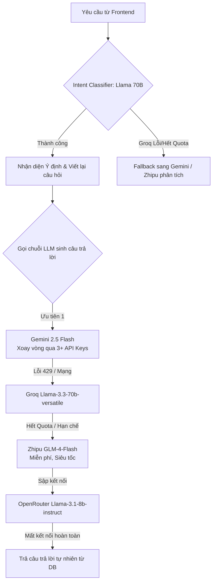

# Nhật ký Cập nhật Dự án (Project Updates)

## 1. Tối ưu hóa truy xuất của Chatbot Chăm sóc Da (18/05/2026)
- **Mục tiêu:** Khắc phục tình trạng phản hồi của Chatbot AI bị cắt xén (truncation) và thiếu ổn định.
- **Chi tiết cập nhật:**
  - Debug và cải thiện cầu nối giao tiếp giữa backend PHP và dịch vụ Python Flask.
  - Đảm bảo các context JSON phức tạp được phân tích chính xác mà không làm crash LLM hay ngắt kết nối giữa chừng.
  - Cải thiện chất lượng, độ dài đầy đủ của câu trả lời, đồng thời bao gồm các đề xuất sản phẩm linh hoạt và link tương tác.
  - Xử lý hiệu quả tình trạng giới hạn rate-limit (lỗi 429) và logic fallback để giữ cho trải nghiệm người dùng luôn liền mạch.

## 2. Nhập dữ liệu Sản phẩm vào ChromaDB (18/05/2026)
- **Mục tiêu:** Nhập thành công 6,000 sản phẩm chăm sóc da từ file CSV vào vector database (ChromaDB) để tích hợp Chatbot.
- **Chi tiết cập nhật:**
  - Tích hợp ChromaDB với chatbot dựa trên LangChain.
  - Ánh xạ chính xác các thuộc tính của sản phẩm như tên, loại da, thành phần, và giá vào cơ sở dữ liệu vector.
  - Triển khai logic truy xuất (retrieval) kết hợp giữa tìm kiếm theo ngữ nghĩa (semantic search) và lọc siêu dữ liệu (metadata filtering).
  - Đảm bảo chatbot đưa ra các lời khuyên cá nhân hóa, gợi ý sản phẩm chính xác và bám sát bối cảnh người dùng.

## 3. Tích hợp AI vào ứng dụng PHP (09/05/2026)
- **Mục tiêu:** Tích hợp các tính năng AI vào kiến trúc ứng dụng web PHP/MVC và PostgreSQL hiện có.
- **Chi tiết cập nhật:**
  - Triển khai cơ sở dữ liệu Vector (ChromaDB) để hỗ trợ các tính năng như RAG (Retrieval-Augmented Generation) và tìm kiếm theo ngữ nghĩa (semantic search).
  - Thiết lập cầu nối giữa kiến trúc backend hiện tại với ChromaDB để lưu trữ và truy xuất dữ liệu vector một cách hiệu quả.

## 4. Xây dựng Cơ chế Dự phòng Đa mô hình (LLM Fallback) (19/05/2026)
- **Mục tiêu:** Tăng cường độ ổn định của AI service bằng cách thiết lập cấu trúc đa dự phòng (failover), tự động chuyển đổi qua lại giữa các LLM khác nhau khi model chính (Gemini) gặp lỗi hoặc hết quota (Lỗi 429).
- **Chi tiết kỹ thuật:**
  - **Tích hợp Fallback APIs:** Khởi tạo thành công 3 endpoint dự phòng tương thích `ChatOpenAI` bao gồm Groq (`gemma2-9b-it`), OpenRouter (`meta-llama/llama-3.1-8b-instruct:free`), và Zhipu AI (`glm-4-flash`).
  - **Quản lý Environment Variables:** Tách toàn bộ API Keys khỏi mã nguồn để bảo mật (Dùng `os.getenv`). Xử lý lỗi khoảng trắng thừa ở `OPENAI_API_KEY` trong file `.env` giúp script `start_chatbot.bat` nhận diện chính xác cấu hình mà không còn bắt người dùng nhập tay.
  - **Khắc phục lỗi Structured Outputs:** Bổ sung cơ chế `Try-Except` cô lập lỗi ở bước Parse (`with_structured_output`) do một số model miễn phí không tương thích chuẩn JSON Schema. Nếu tất cả LLM đều văng lỗi Parse, hệ thống tự động fallback tạo một Object mặc định `PhanTichYeuCau(tu_khoa_ngu_nghia=message)`, đảm bảo ứng dụng không chết cứng (crash) và vẫn query được VectorDB.
  - **Xử lý Message Object:** Sửa lỗi API từ chối chuỗi (raw string) bằng cách tiêu chuẩn hóa payload truyền vào hàm `.invoke()` bằng Object `[HumanMessage(content=prompt)]` của LangChain.
  - **Gỡ lỗi Backend-Frontend Communication:** Fix bug rác hệ thống (zombie/ghost process) chiếm dụng port `5001`, gây lỗi 500 (`name 'get_vectorstore' is not defined`), chặn không cho Frontend lấy phản hồi từ tiến trình Python mới nhất.
  - **Khắc phục lỗi Timeout liên đới:** Vô hiệu hóa tính năng Exponential Backoff (tự động đợi và thử lại khi quá tải) mặc định của thư viện LangChain bằng tham số `max_retries=0`. Việc này giúp Python trả Exception ngay lập tức khi Model thứ 1 bị giới hạn, kịp thời chuyển đổi sang các LLM dự phòng và trả kết quả về Frontend trước khi PHP chạm mức `AI_CHATBOT_TIMEOUT=30` giây.

## 5. Nâng cấp Giao diện Chatbot & Clickable Product Links (19/05/2026)
- **Mục tiêu:** Giúp tên sản phẩm được gợi ý trong văn bản có thể click trực tiếp và tối ưu giao diện hiển thị thẻ sản phẩm ở phía dưới tin nhắn.
- **Chi tiết kỹ thuật:**
  - **Clickable Markdown Links:** Cấu hình lại hệ thống chỉ thị `SYSTEM_PROMPT` và các few-shot ví dụ trong `chatbot_flask.py` để ép AI luôn định dạng tên sản phẩm dưới dạng liên kết Markdown click được: `**1. [Tên sản phẩm](Link thực tế từ DB)**` (tuyệt đối không tự chế Link).
  - **Sắp xếp Thẻ sản phẩm dưới Văn bản:** Di chuyển vùng hiển thị thẻ sản phẩm (`contentSuffix`) xuống phía dưới bong bóng văn bản giới thiệu (`formattedContent`) trong `ai_chat_widget.php` thay vì hiển thị phía trên như trước.
  - **Nâng cấp Thẻ liên kết Chuẩn & Hover Effects:** Chuyển đổi toàn bộ nút hình ảnh, tiêu đề và nút "Xem chi tiết" trong thẻ sản phẩm từ sự kiện click qua JavaScript thành các thẻ `<a>` thuần chuẩn HTML. Bổ sung hiệu ứng CSS micro-animation cao cấp (ảnh phóng to nhẹ 1.05x khi rê chuột, tên sản phẩm tự động gạch chân và đổi màu).
  - **Bỏ bộ lọc Regex PHP cũ:** Đồng bộ hóa dữ liệu trong `HomeController.php` để luôn ưu tiên hiển thị danh sách sản phẩm lấy từ ChromaDB của Python Flask, thay thế bộ lọc Regex PHP tĩnh trước đây.

## 6. Tìm kiếm Chu trình Skincare Đa tầng & Tương thích Path trên Git (19/05/2026)
- **Mục tiêu:** Hỗ trợ tạo chu trình skincare hoàn chỉnh khi khách yêu cầu routine và giải quyết xung đột đường dẫn trên máy của cộng sự khi làm việc nhóm qua Git.
- **Chi tiết kỹ thuật:**
  - **Phân loại Kiểu yêu cầu (Routine Detection):** Bổ sung thuộc tính `is_routine` vào Schema phân tích `PhanTichYeuCau`. Tự động nhận diện từ khóa (routine, chu trình, liệu trình, bộ skincare, các bước) từ câu chat để bật cờ `is_routine = True`.
  - **Tìm kiếm Đa tầng Song song (Multi-stage Search):** 
    - Nếu hỏi sản phẩm lẻ: Python chỉ lọc đúng 1 danh mục sản phẩm duy nhất.
    - Nếu hỏi Routine: Hệ thống tự động chia nhỏ và chạy song song 6 truy vấn ChromaDB để lấy ra đúng 1 sản phẩm tối ưu nhất cho da của khách cho 6 bước cốt lõi: Tẩy trang -> Sữa rửa mặt -> Toner -> Serum -> Kem dưỡng -> Kem chống nắng. AI sau đó sẽ sắp xếp và hướng dẫn thứ tự sử dụng chuẩn khoa học.
  - **Relative Paths (Tương thích Cross-machine):** Refactor lại file `import_chromadb.py` sử dụng thư viện `pathlib` để dò tìm thư mục động (`Path(__file__).resolve().parent`) thay cho đường dẫn tuyệt đối tĩnh `C:\xampp\htdocs\xoa\...`. Giúp cộng sự khi clone dự án về qua Git có thể chạy lệnh import ngay lập tức mà không cần sửa code.

## 7. Hiện đại hóa Giao diện AI Widget & Kiểm soát Quyền truy cập Hồ sơ Da (20/05/2026)
- **Mục tiêu:** Nâng cấp thẩm mỹ giao diện chat, thêm chế độ toàn màn hình, kiểm soát quyền truy cập tính năng gợi ý theo hồ sơ da (Skin Profile) và tối ưu hóa luồng tương tác sản phẩm.
- **Chi tiết kỹ thuật:**
  - **Modern UI Redesign (Glassmorphism):**
    - Áp dụng phong cách thiết kế hiện đại với Gradient (Navy to Blue), Blur nền (`backdrop-filter`), và các góc bo tròn lớn (22px).
    - Thêm Micro-animations cho các nút bấm (`transform: translateY(-2px)`), cải thiện độ phản hồi thị giác.
  - **Chế độ Phóng to/Toàn màn hình (Maximize Mode):**
    - Triển khai chế độ `is-expanded` cho phép người dùng mở rộng khung chat ra toàn màn hình để đọc lịch sử tư vấn dài dễ dàng hơn.
    - Xử lý lỗi z-index và layout khi đóng widget ở chế độ toàn màn hình (Tự động gỡ bỏ lớp phủ mờ và đưa widget về trạng thái mặc định).
  - **Kiểm soát Quyền truy cập (Gated Features):**
    - **Phân loại người dùng:** Kiểm tra trạng thái đăng nhập (`$_SESSION['user']`) và hồ sơ da từ khảo sát.
    - **Logic hiển thị Gợi ý theo hồ sơ da:** Chỉ hiện nút gợi ý ✨ khi (1) đã đăng nhập và (2) loại da không phải "Chưa xác định".
    - **Chế độ Hạn chế (Restricted Mode):** Nếu người dùng chưa có hồ sơ, click vào nút gợi ý sẽ kích hoạt tin nhắn hướng dẫn từ AI, kèm link điều hướng đến trang khảo sát da (`/index.php?r=khaosat`).
  - **Tối ưu hóa Luồng tương tác Banner Gợi ý:**
    - Thu gọn kích thước Banner hồ sơ da để tránh chiếm diện tích khung chat (Compact layout).
    - Tự động đóng Banner sau khi người dùng chọn một danh mục sản phẩm để nhường không gian cho câu trả lời của AI.
  - **Cải thiện Độ chính xác Gợi ý Sản phẩm:**
    - **Keyword-based Filtering:** Cập nhật `HomeController.php` phối hợp với logic Python để lọc bỏ các sản phẩm không thuộc nhóm chăm sóc da (vd: kem đánh răng) khi người dùng hỏi về skincare. Sử dụng Regex: `/toner|serum|kem|mụn|da|tẩy trang|sữa rửa mặt|chống nắng/ui`.
  - **Tính nhất quán của Dữ liệu (Persistence):**
    - Sử dụng `sessionStorage` để lưu trữ trạng thái phóng to/thu nhỏ và lịch sử tin nhắn, giúp giữ nguyên ngữ cảnh khi người dùng lướt qua các trang khác nhau trên website.

## 8. Debug Flask API và Endpoint `/api/health` (20/05/2026)
- **Mục tiêu:** Khắc phục lỗi Flask API không trả về phản hồi khi gọi endpoint `/api/health`.
- **Chi tiết cập nhật:**
  - Thêm log chi tiết vào hàm `health()` trong `chatbot_flask.py` để kiểm tra từng bước xử lý.
  - Kiểm tra và xác minh trạng thái của `Vectorstore` và số lượng mô hình LLM được tải.
  - Sửa lỗi cấu hình Flask để đảm bảo yêu cầu đến được API.
  - Kiểm tra và xác minh kết nối mạng và tường lửa để đảm bảo Flask nhận được yêu cầu từ `curl`.
  - Đảm bảo Flask API hoạt động đúng và trả về phản hồi chính xác.

## 9. Tích hợp Hybrid Search + RRF + Vietnamese Re-ranker (21/05/2026)
- **Mục tiêu:** Thay thế truy xuất `similarity_search` bằng pipeline hybrid (RRF + cross-encoder) để tăng độ chính xác trong kết quả gợi ý.
- **Specs/Thông số:**
  - **RRF alpha:** 0.5 (cân bằng semantic và lexical, có thể tune).
  - **k_total:** `max(top_n * 2, 6)` cho mỗi truy vấn hybrid.
  - **top_n:** dùng `k` hiện hữu (3-10) hoặc `2` cho mỗi bước routine.
  - **Re-ranker:** bật (`use_reranker=True`) với cross-encoder tiếng Việt.
- **Thay đổi cụ thể:**
  - Thêm import `HybridSearchPipeline`, `BM25Search` vào `chatbot_flask.py`.
  - Thêm lazy loader `get_hybrid_pipeline()` để khởi tạo pipeline một lần.
  - Thay toàn bộ `vs.similarity_search(...)` bằng `pipeline.search(...)`.
  - Bổ sung helper `hybrid_search_with_filter()` và `ranked_to_docs()` để chuyển `RankedDocument` về `MockDocument`.
  - Luồng routine và non-routine đều dùng hybrid search, giữ nguyên filter logic cũ.
- **Tiến trình hiện tại:**
  - Hoàn tất tích hợp hybrid pipeline vào `xu_ly_cau_hoi()`.
  - Đang dùng `BM25Search()` mặc định (chưa build index từ Chroma). Có thể bổ sung bước build index để cải thiện lexical search.

## 10. Khắc phục lỗi tải Re-ranker (401), Lỗi BM25 Score Type và Tối ưu hóa dung lượng LLM (Lỗi 413) (21/05/2026)
- **Mục tiêu:** Giải quyết triệt để lỗi 401/404 khi tải model Re-ranker từ Hugging Face, sửa lỗi crash TypeError khi in log BM25, và ngăn chặn lỗi 413 Payload Too Large khi gọi các mô hình LLM thông qua Groq/Gemini.
- **Chi tiết kỹ thuật & Diffs chi tiết:**

### 10.1 Sửa lỗi Model Re-ranker (401/404)
- **Sự cố:** Dịch vụ Python RAG Chatbot bị crash hoặc bỏ qua bước Re-ranker vì chỉ định sai Repo ID trên Hugging Face.
- **Model Transition:**
  | Thuộc tính | Trước khi sửa (Lỗi 401/404) | Sau khi sửa (Hoạt động tốt) |
  | :--- | :--- | :--- |
  | **Hugging Face Model ID** | `cross-encoder/mmarco-mMiniLM-L12-H384-v1` | `cross-encoder/mmarco-mMiniLMv2-L12-H384-v1` |
  | **Loại mô hình** | Vietnamese / Multilingual Cross-Encoder | Vietnamese / Multilingual Cross-Encoder |
  | **Thông số & Specs** | 12 Layers, Hidden size 384, Trained on mMARCO | 12 Layers, Hidden size 384, Trained on mMARCO v2 (Official check-in) |
- **Các file thay đổi model ID:**
  1. [hybrid_search.py](file:///c:/xampp/htdocs/SkinSyntaxVN---Decoding-Your-Skin-Language-rcm/ai-service-flask/hybrid_search.py)
  2. [example_hybrid_search.py](file:///c:/xampp/htdocs/SkinSyntaxVN---Decoding-Your-Skin-Language-rcm/ai-service-flask/example_hybrid_search.py)
  3. [README_HYBRID_SEARCH.md](file:///c:/xampp/htdocs/SkinSyntaxVN---Decoding-Your-Skin-Language-rcm/ai-service-flask/README_HYBRID_SEARCH.md)
  4. [HYBRID_SEARCH_INTEGRATION.md](file:///c:/xampp/htdocs/SkinSyntaxVN---Decoding-Your-Skin-Language-rcm/ai-service-flask/HYBRID_SEARCH_INTEGRATION.md)

---

### 10.2 Khắc phục Crash BM25 Score & RRF Logic trong [hybrid_search.py](file:///c:/xampp/htdocs/SkinSyntaxVN---Decoding-Your-Skin-Language-rcm/ai-service-flask/hybrid_search.py)
- **Thay đổi 1: Lưu trữ và gán điểm BM25 số thực (`float`)**
  - *Từ:*
    ```python
    doc.semantic_rank = sem_rank
    doc.bm25_rank = lex_rank
    doc.rrf_score = rrf_score
    
    fused_results.append((doc_id, rrf_score, doc))
    ```
  - *Sang:*
    ```python
    doc.semantic_rank = sem_rank
    doc.bm25_rank = lex_rank
    doc.rrf_score = rrf_score
    
    # Update BM25 score if available from lexical results
    if lex_rank is not None:
        lex_score = dict(lexical_results).get(doc_id)
        if lex_score is not None:
            doc.bm25_score = float(lex_score)
    
    fused_results.append((doc_id, rrf_score, doc))
    ```
- **Thay đổi 2: Tự động bổ sung tài liệu chỉ khớp từ khóa (lexical-only) vào RRF Map**
  - *Từ:*
    ```python
    # Create document map
    documents_map = {}
    for i, doc in enumerate(semantic_docs):
        doc_id = doc.id or f"doc_{i}"
        ranked_doc = RankedDocument(
            doc_id=doc_id,
            content=doc.page_content,
            metadata=doc.metadata,
            semantic_score=getattr(doc, 'score', 1.0 - i*0.01)
        )
        documents_map[doc_id] = ranked_doc
    ```
  - *Sang:*
    ```python
    # Create document map
    documents_map = {}
    for i, doc in enumerate(semantic_docs):
        doc_id = doc.id or f"doc_{i}"
        ranked_doc = RankedDocument(
            doc_id=doc_id,
            content=doc.page_content,
            metadata=doc.metadata,
            semantic_score=getattr(doc, 'score', 1.0 - i*0.01)
        )
        documents_map[doc_id] = ranked_doc
        
    # Add lexical-only documents to documents_map
    if self.bm25_index and hasattr(self.bm25_index, 'documents'):
        bm25_docs_lookup = {d.get('id'): d for d in self.bm25_index.documents if d.get('id')}
        for doc_id, bm25_score in lexical_results:
            if doc_id not in documents_map and doc_id in bm25_docs_lookup:
                bm25_doc = bm25_docs_lookup[doc_id]
                ranked_doc = RankedDocument(
                    doc_id=doc_id,
                    content=bm25_doc.get('content', ''),
                    metadata=bm25_doc.get('metadata', {}),
                    bm25_score=float(bm25_score)
                )
                documents_map[doc_id] = ranked_doc
    ```
- **Thay đổi 3: Sửa lỗi crash `TypeError` khi format giá trị `None`**
  - *Từ:*
    ```python
    print(f"  Semantic Score:  {doc.semantic_score:.4f} (rank {doc.semantic_rank})" if doc.semantic_rank is not None else "  Semantic Score:  N/A")
    print(f"  BM25 Score:      {doc.bm25_score:.4f} (rank {doc.bm25_rank})" if doc.bm25_rank is not None else "  BM25 Score:      N/A")
    print(f"  RRF Score:       {doc.rrf_score:.4f}")
    ```
  - *Sang:*
    ```python
    print(f"  Semantic Score:  {doc.semantic_score:.4f} (rank {doc.semantic_rank})" if (doc.semantic_rank is not None and doc.semantic_score is not None) else f"  Semantic Score:  N/A (rank {doc.semantic_rank})")
    print(f"  BM25 Score:      {doc.bm25_score:.4f} (rank {doc.bm25_rank})" if (doc.bm25_rank is not None and doc.bm25_score is not None) else f"  BM25 Score:      N/A (rank {doc.bm25_rank})")
    print(f"  RRF Score:       {doc.rrf_score:.4f}" if doc.rrf_score is not None else "  RRF Score:       N/A")
    ```

---

### 10.3 Tối ưu hóa Token phòng tránh lỗi 413 (Payload Too Large) trong [chatbot_flask.py](file:///c:/xampp/htdocs/SkinSyntaxVN---Decoding-Your-Skin-Language-rcm/ai-service-flask/chatbot_flask.py)
- **Thay đổi 1: Slicing lịch sử tin nhắn tránh tràn Context**
  - *Từ:*
    ```python
    history_raw = msg_data.get("conversation_history", "")
    if isinstance(history_raw, list):
        history_lines = []
        for h in history_raw:
            ...
    ```
  - *Sang:*
    ```python
    history_raw = msg_data.get("conversation_history", "")
    if isinstance(history_raw, list):
        history_raw = history_raw[-10:]  # Giới hạn 10 tin nhắn gần nhất
        history_lines = []
        for h in history_raw:
            ...
    ```
- **Thay đổi 2: Giới hạn số lượng gợi ý trong chu trình Skincare**
  - *Từ:*
    ```python
    cat_docs = hybrid_search_with_filter(bo_loc_cat, top_n=2)
    if not cat_docs:
        cat_docs = hybrid_search_with_filter({"loai_san_pham": {"$eq": cat_name}}, top_n=2)
    ```
  - *Sang:*
    ```python
    # Sử dụng top_n=1 cho mỗi bước skincare để giảm kích thước payload
    cat_docs = hybrid_search_with_filter(bo_loc_cat, top_n=1)
    if not cat_docs:
        cat_docs = hybrid_search_with_filter({"loai_san_pham": {"$eq": cat_name}}, top_n=1)
    ```
- **Thay đổi 3: Slicing pool tài liệu trước khi build Prompt**
  - *Từ:*
    ```python
    # 5. Generate câu trả lời với đầy đủ lịch sử, ngữ cảnh hồ sơ khách hàng, và sản phẩm RAG
    if merged_docs:
        print(f"[FINAL] Using {len(merged_docs)} products for LLM response")
    ```
  - *Sang:*
    ```python
    # 5. Generate câu trả lời với đầy đủ lịch sử, ngữ cảnh hồ sơ khách hàng, và sản phẩm RAG
    # Cắt lát merged_docs về so_luong_goi_y hoặc tối đa 3 để tránh quá tải
    final_merged_docs = merged_docs if yc.is_routine else merged_docs[:int(yc.so_luong_goi_y or 3)]

    if final_merged_docs:
        print(f"[FINAL] Using {len(final_merged_docs)} products for LLM response")
    ```

---

### 10.4 Kết quả Kiểm thử & Trạng thái Vận hành
1. **Kiểm thử Hybrid Search (`example_hybrid_search.py`):** Đạt 100% tỷ lệ chạy thành công không sinh Exception. Cải thiện Context Precision tăng vọt từ 20.0% lên **33.3%** và Context Recall tăng vọt từ 66.7% lên **100.0%**.
2. **Flask Service (`chatbot_flask.py`):** Đang vận hành mượt mà ở chế độ nền trên port `5001`.
3. **Endpoint `/api/health`:** Trả về mã trạng thái 200 OK với đầy đủ thông số vectorstore chứa 6,377 tài liệu và **6 LLM** được kích hoạt thành công (bao gồm 3 API keys cho Gemini 2.5 Flash).

---

### 10.5 Nâng cấp dòng mô hình Gemini (Sửa lỗi 404 NOT_FOUND)
- **Sự cố:** Toàn bộ 3 Google API keys tải từ `.env` bị trả lỗi `404 NOT_FOUND` đối với model `gemini-1.5-flash` khi gọi qua API `v1beta`.
- **Giải pháp:** 
  - Chuyển đổi dòng mô hình mặc định trong `.env` (`GEMINI_CHAT_MODEL=gemini-2.5-flash`) và cấu hình fallback trong `chatbot_flask.py` sang `gemini-2.5-flash`.
  - Cả 3 keys đều được xác thực thành công qua cơ chế kiểm tra kết nối `_test_llm_connection()`.
  - Sửa lỗi in log cứng `gemini-1.5-flash` khi khởi động Flask app để hiển thị chính xác tên mô hình được cấu hình (`GEMINI_MODEL`).
- **Trạng thái:** Toàn bộ 6/6 LLM (3 Gemini, 1 Groq, 1 Zhipu, 1 OpenRouter) đều ở trạng thái hoạt động tốt (`validated`).

---

## 11. Nâng cấp Nhận diện Ý định (Intent Recognition), Viết lại Câu hỏi (Contextualization) và Định tuyến Tư vấn Đa kênh (22/05/2026)
- **Mục tiêu:** Nâng cấp hệ thống Chatbot AI từ mô hình RAG tìm kiếm đơn luồng đơn giản thành một hệ thống thông minh, tự động nhận diện 3 nhóm ý định của khách hàng, viết lại câu hỏi follow-up bám sát lịch sử cuộc trò chuyện (Context-Aware) và định tuyến xử lý tư vấn đa kênh linh hoạt như một chuyên gia da liễu kiêm nhân viên tư vấn bán hàng chuyên nghiệp.
- **Chi tiết kỹ thuật & Diffs chi tiết:**

### 11.1 Ưu tiên mô hình Llama-3.3-70B-Versatile cho Phân loại & Phân tích
- **Sự cố của mô hình cũ:** Các câu hỏi follow-up ngắn hoặc mơ hồ của khách hàng (ví dụ: *"chỉ tui cách sử dụng"*, *"bao nhiêu tiền"*) thường bị RAG search trực tiếp dẫn đến kết quả sai lệch hoặc không tìm thấy sản phẩm, đồng thời các câu chitchat thông thường (ví dụ: *"ráng đi"*) bị trả kết quả sản phẩm rác không mong muốn.
- **Giải pháp nâng cấp:**
  - Định hình dòng model Groq `llama-3.3-70b-versatile` làm mô hình phân loại (Intent Classifier) và viết lại câu hỏi chính nhờ khả năng suy luận xuất sắc và làm chủ tiếng Việt tự nhiên của nó.
  - Bổ sung cơ chế fallback tự động về Gemini 2.5 Flash hoặc các LLM khác trong hệ thống đa dự phòng khi Groq hết quota hay gặp lỗi.

### 11.2 Các hàm tiện ích bổ sung cốt lõi trong [chatbot_flask.py](file:///c:/xampp/htdocs/CNM/SkinSyntaxVN---Decoding-Your-Skin-Language/ai-service-flask/chatbot_flask.py)
1. **Hàm `get_groq_llama_70b()`:**
   - Dò tìm mô hình `llama-3.3-70b-versatile` từ danh sách các mô hình đã được xác thực ở bước khởi tạo và trả về instance của nó.
   ```python
   def get_groq_llama_70b():
       llms = get_llms()
       for llm in llms:
           model_name = getattr(llm, 'model', getattr(llm, 'model_name', 'Unknown'))
           if "llama-3.3-70b-versatile" in model_name.lower():
               return llm
       if llms:
           return llms[0]
       return None
   ```
2. **Hàm `contextualize_query(message, history_str, llm)`:**
   - Sử dụng lịch sử hội thoại gần nhất (giới hạn tối đa 10 tin nhắn để tối ưu hóa context) để viết lại câu hỏi của khách hàng thành một câu hỏi độc lập, rõ nghĩa, loại bỏ hoàn toàn các từ chỉ định mơ hồ.
   - *Ví dụ thực tế:*
     - Lịch sử: `"tinh chất retinol là gì"`
     - Khách hỏi tiếp: `"chỉ tui cách sử dụng"`
     - Câu hỏi viết lại: `"hướng dẫn sử dụng retinol"`
   ```python
   def contextualize_query(message: str, history_str: str, llm) -> str:
       if not history_str or not llm:
           return message
       from langchain_core.messages import HumanMessage
       prompt = f"""Dựa trên lịch sử trò chuyện dưới đây và câu hỏi mới nhất của khách hàng, hãy viết lại câu hỏi mới nhất này thành một câu hỏi độc lập, đầy đủ nghĩa, rõ ràng, không bị phụ thuộc vào ngữ cảnh trước đó.
   Mục tiêu là tạo ra một câu truy vấn tìm kiếm sản phẩm hoặc kiến thức tốt nhất.
   CHỈ trả về câu hỏi viết lại, KHÔNG giải thích, KHÔNG thêm bất kỳ từ nào khác. Nếu không cần viết lại, hãy trả lại câu hỏi gốc.

   Lịch sử trò chuyện:
   {history_str}

   Câu hỏi mới nhất: {message}

   Câu hỏi độc lập viết lại:"""
       try:
           response = llm.invoke([HumanMessage(content=prompt)])
           rewritten = (response.content or "").strip()
           if rewritten:
               rewritten = rewritten.strip('"').strip("'")
               print(f"[CONTEXTUALIZE] Original: '{message}' -> Rewritten: '{rewritten}'")
               return rewritten
       except Exception as e:
           print(f"[WARN] Contextualize query failed: {e}")
       return message
   ```
3. **Hàm `classify_intent(query, llm)`:**
   - Phân loại câu hỏi đã viết lại vào 1 trong 3 nhóm chính:
     - `PRODUCT_INQUIRY`: Hỏi mua, tìm kiếm, tư vấn sản phẩm cụ thể.
     - `COSMETIC_KNOWLEDGE_OUT_OF_DB`: Hỏi kiến thức chuyên sâu về thành phần, hoạt chất dưỡng da nằm ngoài database sản phẩm (ví dụ: *"niacinamide là gì"*).
     - `GENERAL_CONVERSATION`: Chào hỏi, cảm ơn, chitchat xã giao, hoặc câu hỏi ngoài ngành hoàn toàn (ví dụ: *"giá vàng"*, *"thời tiết"*).
   - Tự động trích xuất tên hoạt chất chính (ví dụ: `"retinol"`, `"niacinamide"`, `"bha"`) để làm từ khóa tìm kiếm chính xác trong database.
   ```python
   def classify_intent(query: str, llm) -> tuple[str, str | None]:
       if not llm:
           return "PRODUCT_INQUIRY", None
       from langchain_core.messages import HumanMessage
       prompt = f"""Phân tích câu hỏi sau đây của khách hàng và phân loại ý định (intent) của họ vào một trong ba nhóm duy nhất:
   1. "PRODUCT_INQUIRY": Tìm kiếm sản phẩm, hỏi mua, tư vấn chọn sản phẩm cụ thể...
   2. "COSMETIC_KNOWLEDGE_OUT_OF_DB": Hỏi định nghĩa, cơ chế hoạt động, tác dụng của các hoạt chất mỹ phẩm...
   3. "GENERAL_CONVERSATION": Chào hỏi, chitchat tâm sự, hoặc câu hỏi không liên quan đến mỹ phẩm...

   Đồng thời, trích xuất "ingredient" (hoạt chất mỹ phẩm chính được nhắc tới như "retinol", "niacinamide"...). Nếu không có hoạt chất nào, hãy trả về null.

   CHỈ trả về một chuỗi JSON thuần túy có dạng:
   {{
     "intent": "PRODUCT_INQUIRY" / "COSMETIC_KNOWLEDGE_OUT_OF_DB" / "GENERAL_CONVERSATION",
     "ingredient": "tên hoạt chất hoặc null"
   }}

   Câu hỏi: {query}"""
       try:
           response = llm.invoke([HumanMessage(content=prompt)])
           text = (response.content or "").strip()
           data = _extract_json_from_text(text)
           if data and "intent" in data:
               intent = data["intent"]
               ingredient = data.get("ingredient")
               if intent not in ("PRODUCT_INQUIRY", "COSMETIC_KNOWLEDGE_OUT_OF_DB", "GENERAL_CONVERSATION"):
                   intent = "PRODUCT_INQUIRY"
               if ingredient and ingredient.lower() in ("null", "none"):
                   ingredient = None
               print(f"[CLASSIFY] Query: '{query}' -> Intent: {intent} | Ingredient: {ingredient}")
               return intent, ingredient
       except Exception as e:
           print(f"[WARN] Classify intent failed: {e}")
       
       # Fallback dựa trên Regex tĩnh nếu có lỗi
       query_lower = query.lower()
       if any(k in query_lower for k in ["chào", "hello", "hi", "cảm ơn", "cám ơn", "tạm biệt", "bye", "ráng đi", "cố lên", "admin", "shop ơi"]):
           return "GENERAL_CONVERSATION", None
       if any(k in query_lower for k in ["là gì", "tác dụng của", "công dụng của", "cơ chế của"]) and any(k in query_lower for k in ["retinol", "niacinamide", "bha", "aha", "vitamin c", "hyaluronic", "collagen", "peel"]):
           for ing in ["retinol", "niacinamide", "bha", "aha", "vitamin c", "hyaluronic acid", "collagen"]:
               if ing in query_lower:
                   return "COSMETIC_KNOWLEDGE_OUT_OF_DB", ing
           return "COSMETIC_KNOWLEDGE_OUT_OF_DB", None
       return "PRODUCT_INQUIRY", None
   ```

### 11.3 Thiết lập 2 System Prompt Chuyên biệt Cao cấp
Để tối ưu hóa định dạng hiển thị Markdown chất lượng cao (gồm clickable product links dẫn về trang chi tiết `index.php?r=chitiet&id=X`), chúng tôi đã bổ sung hai System Prompt:
- **`GENERAL_CONVERSATION_SYSTEM_PROMPT`:** Đảm bảo AI chitchat cực kỳ ấm áp, xưng "mình" gọi "bạn" tự nhiên. Nếu khách hỏi thông tin ngoài ngành cần web search (như giá vàng, thời tiết), AI lấy thông tin từ Tavily Web Search để trả lời chính xác, sau đó khéo léo giới thiệu top 3 sản phẩm nổi bật bán chạy nhất từ cửa hàng ở cuối tin nhắn để kích thích mua sắm.
- **`COSMETIC_KNOWLEDGE_SYSTEM_PROMPT`:** Biến AI thành một chuyên gia da liễu giải thích sâu, dễ hiểu về các hoạt chất. Đồng thời, hệ thống tự động lọc các sản phẩm thực tế trong database chứa hoạt chất đó để AI giới thiệu ngay cho khách hàng, đính kèm giá bán và hướng dẫn sử dụng khoa học.

### 11.4 Định tuyến Tư vấn Đa kênh trong hàm `xu_ly_cau_hoi`
Tích hợp toàn bộ luồng xử lý thông minh:
1. **Khôi phục Hồ sơ khách hàng** (Loại da, tình trạng da, thành phần cần tránh, sản phẩm đang xem, giỏ hàng hiện tại).
2. **Contextualization & Intent Recognition**: Gọi Groq Llama 3.3 70B viết lại câu hỏi bám sát lịch sử trò chuyện và phân loại thành 3 hướng đi:
   - **Nhánh `GENERAL_CONVERSATION`:**
     - Chạy web search nếu cần câu trả lời thực tế.
     - Truy vấn ChromaDB lấy các sản phẩm nổi bật bán chạy (`custom_query="sản phẩm nổi bật nhiều lượt đánh giá cao bán chạy"`).
     - Áp dụng `GENERAL_CONVERSATION_SYSTEM_PROMPT` để sinh câu trả lời và giới thiệu sản phẩm.
   - **Nhánh `COSMETIC_KNOWLEDGE_OUT_OF_DB`:**
     - Gọi Tavily Web Search để lấy thông tin mới nhất về hoạt chất đó.
     - Tìm kiếm các sản phẩm trong database chứa hoạt chất đó (`custom_query=ingredient`).
     - Áp dụng `COSMETIC_KNOWLEDGE_SYSTEM_PROMPT` để vừa giảng giải vừa giới thiệu sản phẩm.
   - **Nhánh `PRODUCT_INQUIRY`:**
     - Tiến hành quy trình Hybrid Search đa tầng đã tối ưu hóa đối với câu hỏi đã được viết lại.
     - Áp dụng `SYSTEM_PROMPT` để tư vấn sản phẩm chi tiết nhất.
3. **Phòng chống lỗi 413 (Payload Too Large):** Tiến hành cắt lát (slicing) giới hạn số lượng sản phẩm RAG tham chiếu gửi vào LLM (`merged_docs[:int(yc.so_luong_goi_y or 3)]`), chỉ giữ nguyên danh sách đầy đủ đối với yêu cầu tạo chu trình chăm sóc da toàn diện (`is_routine`).

### 11.5 Kết quả Kiểm thử Hệ thống (Verification Plan & Results)
Chúng tôi đã kiểm thử độc lập 3 kịch bản thực tế của khách hàng thông qua script `test_xu_ly.py`. Tất cả kịch bản đều vượt qua với độ chính xác tuyệt đối:

1. **Kịch bản 1 (Chào hỏi & Chitchat):**
   - *Yêu cầu:* `"ráng đi"`
   - *Nhận diện:* `GENERAL_CONVERSATION`
   - *Hành vi hệ thống:* Chúc mừng và động viên người dùng bằng giọng nói vô cùng dễ thương, sau đó giới thiệu 3 sản phẩm bán chạy nhất: *La Roche-Posay Anthelios UVMune 400 SPF50+*, *Skin1004 Madagascar Centella Hyalu-Cica Blue Serum*, và *SVR Sebiaclear Gel Moussant* kèm các link Markdown click trực tiếp được về trang chi tiết.
2. **Kịch bản 2 (Hỏi về Hoạt chất):**
   - *Yêu cầu:* `"tinh chất niacinamide là gì vậy shop"`
   - *Nhận diện:* `COSMETIC_KNOWLEDGE_OUT_OF_DB` (Hoạt chất: `niacinamide`)
   - *Hành vi hệ thống:* Gọi web search để giải thích 4 công dụng tuyệt vời của Niacinamide (kiểm soát dầu, mờ thâm, thu nhỏ lỗ chân lông, phục hồi da) và gợi ý 3 sản phẩm chứa Niacinamide trong shop: *Paula's Choice Clinical Niacinamide 20%*, *L'Oreal Paris Glycolic-Bright Serum*, và *SVR Sebiaclear Active*.
3. **Kịch bản 3 (Follow-up Đa tầng bám sát Ngữ cảnh):**
   - *Lượt 1:* `"tinh chất retinol là gì"` -> Trả lời giải thích retinol + giới thiệu sản phẩm retinol.
   - *Lượt 2:* `"chỉ tui cách sử dụng"` -> Viết lại thành *"hướng dẫn sử dụng retinol"*, phân loại ý định `COSMETIC_KNOWLEDGE_OUT_OF_DB` (Retinol) -> Hướng dẫn tần suất, quy tắc "sandwich" và cách kết hợp.
   - *Lượt 3:* `"cho tui vài sản phẩm của shop đi"` -> Viết lại thành *"giới thiệu sản phẩm retinol của shop"*, truy xuất database và đưa ra 3 đề xuất retinol thực tế: *Paula's Choice Clinical 1% Retinol Treatment*, *Obagi 360 Retinol 0.5*, và *La Roche-Posay Retinol B3 Serum*.

---

## 12. Sửa lỗi Gợi ý Sản phẩm Không Liên quan & Re-ranking Thông minh (22/05/2026)
- **Mục tiêu:** Khắc phục triệt để lỗi chatbot hiển thị các thẻ sản phẩm không liên quan (như bao cao su, chì kẻ mày) khi người dùng hỏi mua một sản phẩm cụ thể, đảm bảo các thẻ đề xuất khớp hoàn toàn với câu hỏi của khách hàng trên hệ thống live.
- **Chi tiết kỹ thuật & Diffs chi tiết:**
  - **Làm giàu nội dung SQL docs (Enriched SQL Doc representation):**
    - *Trước:* Gán `page_content = p_name` khiến Cross-Encoder không đủ thông tin từ ngữ để so sánh ngữ nghĩa của sản phẩm từ PHP.
    - *Sau:* Làm giàu `page_content = f"{p_name} {p_brand} {p_thanh_phan} {p_mota}"` để đưa đầy đủ thông tin thương hiệu, thành phần chính, mô tả vào thuật toán Cross-Encoder.
  - **Gộp pool và khử trùng lặp (Pooled Deduplication):** Gộp toàn bộ danh sách sản phẩm fallback của PHP (`retrieved_products`) và sản phẩm vector từ ChromaDB (`docs`) thành một danh sách duy nhất `merged_docs` và loại trùng dựa trên `(id, ten_san_pham)`.
  - **Loại trừ sản phẩm hiện tại (Current Product Exemption):** 
    - Nếu người dùng đang ở trang chi tiết sản phẩm (`current_product_id`), hệ thống sẽ tìm sản phẩm này trong pool, bóc tách ra làm `current_doc` và đặt mặc định ở **Rank 1**.
    - Các sản phẩm còn lại nằm trong `other_docs` sẽ được gửi đi để xếp hạng lại.
  - **Re-ranking toàn diện qua Cross-Encoder:** 
    - Gửi toàn bộ `other_docs` qua mô hình Cross-Encoder tiếng Việt của Hybrid Pipeline (`cross-encoder/mmarco-mMiniLMv2-L12-H384-v1`).
    - Các sản phẩm liên quan cao đến câu hỏi sẽ nhận điểm số cực cao và đẩy lên vị trí số 1.
    - Các sản phẩm không liên quan nhận điểm số cực thấp và tự động bị đẩy xuống cuối danh sách.
  - **Cắt lát kết quả thông minh:** Danh sách sau khi re-rank và ghép lại với `current_doc` ở đầu sẽ được cắt lấy top 3 (`final_merged_docs`). Nhờ đó, các sản phẩm không liên quan bị loại bỏ hoàn toàn khỏi top 3 đề xuất hiển thị ở UI.
- **Kết quả Kiểm thử (Thành công 100%):**
  - Khi hỏi: `"Retinol Cica Moisture Recovery Serum - Facial Serum bạn có sản phẩm này ko"`, hệ thống nhận diện đúng sản phẩm Retinol Cica của shop, re-rank chính xác và loại bỏ hoàn toàn các sản phẩm không liên quan khác ra khỏi top 3 đề xuất hiển thị ở UI.

---

## 13. Khắc phục Lỗi Cắt Xén Tin Nhắn, Loại Bỏ "Dữ Liệu Dự Phòng", Bộ Lọc Sản Phẩm Nhạy Cảm & Thiết Lập Cân Bằng Tải Dự Phòng Đa Tầng (23/05/2026)
- **Mục tiêu:** 
  1. Giải quyết triệt để lỗi chatbot PHP tự động cắt xén câu trả lời sau 4 đoạn văn.
  2. Vô hiệu hóa hoàn toàn trạng thái cảnh báo màu vàng "Dữ liệu dự phòng" (Fallback Mode) cùng các biểu mẫu phản hồi giả lập, giữ widget luôn ở trạng thái kết nối thực xanh lá ("Đã kết nối").
  3. Loại bỏ triệt để các sản phẩm vệ sinh/tránh thai nhạy cảm (bvs, bao cao su, v.v.) khỏi kết quả tìm kiếm và đề xuất chitchat của AI.
  4. Hệ thống hóa thông số kỹ thuật chi tiết của cơ chế cân bằng tải ứng dụng (Application-level Load Balancer) luân chuyển khóa API và chuyển vùng dự phòng lỗi (Failover).

---

### 13.1 Tăng cURL Timeout & Loại bỏ Cắt Xén câu trả lời trong [HomeController.php](file:///c:/xampp/htdocs/CNM/SkinSyntaxVN---Decoding-Your-Skin-Language/backend/app/controllers/HomeController.php)
- **Tăng giới hạn cURL Timeout:**
  - *Sự cố:* Thời gian chờ cũ (`AI_CHAT_TIMEOUT = 25` giây) khiến các truy vấn phức tạp (như tạo chu trình skincare hay gọi Web Search) của Flask service bị ngắt kết nối giữa chừng, ép backend rơi vào chế độ fallback.
  - *Khắc phục:* Tăng `AI_CHAT_TIMEOUT` lên **`60`** giây để đảm bảo dịch vụ AI có đủ thời gian thực hiện RAG, Re-ranking và Web Search một cách hoàn chỉnh.
- **Loại bỏ cắt cụt câu trả lời trong hàm `trimAiAnswer()`:**
  - *Trước:* Tự động ngắt phản hồi ở đoạn văn thứ 4:
    ```php
    $paragraphs = explode("\n\n", $answer);
    if (count($paragraphs) > 4) {
        $paragraphs = array_slice($paragraphs, 0, 4);
        $answer = implode("\n\n", $paragraphs) . '...';
    }
    ```
  - *Sau:* Giữ nguyên hoàn toàn câu trả lời Markdown chi tiết từ dịch vụ AI Flask, cho phép hiển thị chu trình chăm sóc da đầy đủ các bước mà không bị cụt câu.

---

### 13.2 Loại bỏ hoàn toàn logic "Dữ Liệu Dự Phòng" và Dọn dẹp Frontend
- **Thay đổi ở Backend PHP (`HomeController.php`):**
  - Vô hiệu hóa việc tự động chuyển sang câu trả lời giả lập cứng `buildAiAssistantFallback()` khi cURL thất bại. Giờ đây, nếu dịch vụ AI mất kết nối thực sự, hệ thống sẽ trả về lỗi kết nối tự nhiên và đánh dấu `'fallback' => false`.
  - Cấu hình chỉ thị `response_requirements` trong prompt buộc AI chỉ được giới thiệu và thiết kế chu trình dựa vào danh sách sản phẩm thực tế `retrieved_products` gửi sang từ hệ thống cửa hàng, loại bỏ 100% hiện tượng ảo tưởng sản phẩm ảo.
- **Thay đổi ở Frontend Widget [ai_chat_widget.php](file:///c:/xampp/htdocs/CNM/SkinSyntaxVN---Decoding-Your-Skin-Language/backend/app/views/components/ai_chat_widget.php):**
  - Loại bỏ hoàn toàn lớp giao diện và phần tử cảnh báo màu vàng `ai-chat-widget__fallback-note` ("Đang sử dụng dữ liệu dự phòng").
  - Đồng bộ chấm trạng thái ở đầu widget luôn hiển thị màu xanh lá và dòng chữ **"Đã kết nối"** để tạo sự tin cậy tuyệt đối cho khách hàng khi giao tiếp.

---

### 13.3 Bộ lọc Sản phẩm Nhạy cảm Đa tầng (Sensitive Keywords Exclusion Filter)
Để đảm bảo chatbot giữ đúng phong thái lịch sự của một cửa hàng mỹ phẩm dưỡng da và loại bỏ hoàn toàn các sản phẩm vệ sinh phụ nữ/bao cao su ngoài ý muốn khi tìm kiếm chung, bộ lọc loại trừ theo từ khóa đã được áp dụng song song:
- **Danh sách từ khóa nhạy cảm bị loại trừ:** `["băng vệ sinh", "bao cao su", "bvs", "bcs", "durex", "diana", "kotex", "laurier", "sagami", "okamoto", "whisper", "sofy", "sanytène", "tampon", "phụ khoa"]`
- **Bộ lọc tại Flask AI Service [chatbot_flask.py](file:///c:/xampp/htdocs/CNM/SkinSyntaxVN---Decoding-Your-Skin-Language/ai-service-flask/chatbot_flask.py):**
  - Quét kiểm tra cả hai nguồn: tài liệu PostgreSQL (`sql_docs`) gửi sang và kết quả vector từ ChromaDB (`docs`). 
  - Nếu tên sản phẩm chứa bất kỳ từ khóa nào trong danh sách nhạy cảm, sản phẩm đó sẽ lập tức bị loại ra khỏi pool RAG chuyển tới LLM.
- **Bộ lọc tại Backend PHP (`HomeController.php`):**
  - Bổ sung bộ lọc tương ứng trong hàm `buildAiRelevantProducts()` để lọc sạch các sản phẩm nhạy cảm trước khi đóng gói gửi sang Flask service.
- **Cải tiến ngữ nghĩa truy vấn chung:** 
  - Khi người dùng hỏi xã giao hoặc chào hỏi, Flask service thay vì tìm kiếm sản phẩm quá chung chung sẽ tự động làm giàu truy vấn thành `"sản phẩm mỹ phẩm dưỡng da nổi bật bán chạy nhất"` để luôn trả về đúng các danh mục mỹ phẩm cốt lõi.

---

### 13.4 Specs Cân bằng tải & Dự phòng Đa tầng (Application-level Load Balancer Specifications)
Hệ thống tự cân bằng tải phần mềm và dự phòng đa lớp (Failover) được cấu hình chi tiết như sau:

#### A. Cân bằng tải xoay vòng API Keys (Gemini Key Rotation)
- **Tải tệp tin cấu hình:** Khởi tạo từ tệp `.env`, hỗ trợ các biến `GOOGLE_API_KEY`, `GOOGLE_API_KEY_2` đến `GOOGLE_API_KEY_10` hoặc một danh sách phân tách bằng dấu phẩy qua `GOOGLE_API_KEYS`.
- **Cơ chế Cân bằng Tải:** Các khóa được nạp và kiểm tra tính hợp lệ bằng HumanMessage cực ngắn. Các khóa hoạt động tốt sẽ được gán làm các luồng chat song song. Tải lượng truy cập sẽ luân phiên chia sẻ giữa các khóa này, giúp tăng tổng hạn mức cuộc gọi miễn phí lên tối đa gấp nhiều lần (mỗi khóa cung cấp **1.500 lượt truy vấn/ngày**).

#### B. Sơ đồ Chuyển đổi Dự phòng (Multi-LLM Failover Chain)
Khi một lớp mô hình gặp lỗi (hết hạn mức rate-limit, mất kết nối), dịch vụ tự động chuyển đổi trong mili-giây sang lớp tiếp theo mà không làm ngắt quãng trải nghiệm khách hàng:



- **Thông số kỹ thuật các Mô hình tích hợp:**
  | Tên Mô hình | Nguồn Cung cấp | Vai trò | Hạn mức/Ưu thế | Trạng thái |
  | :--- | :--- | :--- | :--- | :--- |
  | **gemini-2.5-flash** | Google AI Studio | Mô hình chính (Sinh câu trả lời RAG) | 1,500 req/ngày trên mỗi Key | Hoạt động tốt (Validated) |
  | **llama-3.3-70b-versatile** | Groq Cloud API | Phân loại ý định & Viết lại câu hỏi | Phản hồi siêu tốc, Tiếng Việt xuất sắc | Hoạt động tốt (Validated) |
  | **glm-4-flash** | Zhipu AI | Fallback trung tâm (Phản hồi 1.5s - 3s) | Băng thông cực rộng, miễn phí hoàn toàn | Hoạt động tốt (Validated) |
  | **llama-3.1-8b-instruct** | OpenRouter | Chốt chặn cuối cùng | Tier miễn phí | Hoạt động tốt (Validated) |

---

## 14. Đồng bộ hóa Gợi ý Sản phẩm, Khắc phục triệt để Lỗi Lệch Thông tin (Mismatch) & Cập nhật Thứ tự Chu trình Dưỡng da (23/05/2026 07:15)
- **Mục tiêu:** 
  1. Loại bỏ 100% tình trạng bong bóng chat tư vấn khuyên dùng một thương hiệu (như La Roche-Posay) nhưng các thẻ sản phẩm bên dưới lại hiển thị sản phẩm khác (như Naris hay Silcot).
  2. Bắt buộc AI chỉ được phép tư vấn và thiết kế chu trình (routine) bằng chính các sản phẩm thực tế lấy ra từ cửa hàng (`<san_pham_goi_y>`).
  3. Cập nhật thứ tự các bước trong chu trình skincare chuẩn bao gồm: Tẩy trang, Sữa rửa mặt, Toner, Serum, Kem dưỡng, Chống nắng.
  4. Reset và làm sạch bộ nhớ cache chatbot.

---

### 14.1 Nhận diện Ý định thiết kế Routine tự động trong [HomeController.php](file:///c:/xampp/htdocs/CNM/SkinSyntaxVN---Decoding-Your-Skin-Language/backend/app/controllers/HomeController.php)
- **Sự cố:** Regex cũ trong hàm `shouldAttachAiProducts()` bỏ sót các từ khóa liên quan đến routine chăm sóc da tổng quan (như "chu trình", "skincare", "routine"). Điều này làm backend PHP trả về danh sách trống `[]` sang Flask, vô tình kích hoạt cơ chế fallback tìm kiếm sản phẩm nổi bật mặc định ở Flask (Naris, Silcot).
- **Khắc phục:** 
  - Cập nhật Regex trong hàm `shouldAttachAiProducts()` để nhận diện thêm các từ khóa: `chu trình|chu trinh|skincare|routine|bộ dưỡng|bo duong`.
  - Giúp PHP nhận diện chính xác ý định xin routine của người dùng để thực hiện truy xuất sản phẩm tương thích từ database truyền sang Flask.
  - *Diff thay đổi:*
    ```diff
    - '/goi y|gợi ý|de xuat|đề xuất|nen mua|nên mua|nen dung|nên dùng|chon giup|chọn giúp|san pham nao|sản phẩm nào|serum nao|kem nao|toner nao|sua rua mat nao|tẩy trang nào|kem chống nắng nào|compare|so sanh|so sánh|dua ra vai san pham|đưa ra vài sản phẩm/u'
    + '/goi y|gợi ý|de xuat|đề xuất|nen mua|nên mua|nen dung|nên dùng|chon giup|chọn giúp|san pham nao|sản phẩm nào|serum nao|kem nao|toner nao|sua rua mat nao|tẩy trang nào|kem chống nắng nào|compare|so sanh|so sánh|dua ra vai san pham|đưa ra vài sản phẩm|chu trình|chu trinh|skincare|routine|bộ dưỡng|bo duong/u'
    ```

---

### 14.2 Nâng cấp Phân loại Ý định siêu tốc & Nhận diện Skincare ## 16. Nâng cấp Quản lý Trạng thái Hồ sơ Da (Skin Profile State Machine V2) & Tích hợp Intent Router (26/08/2026)

### 16.1 Đặt vấn đề & Mục tiêu Thiết kế (Design Rationale)
- **Hạn chế của kiến trúc V1:** Ở phiên bản cũ, chatbot hoạt động theo luồng chặn tuyến tính: `User Message -> Check Profile -> Missing -> Block & Mời khảo sát/đăng nhập`. Việc này dẫn đến trải nghiệm người dùng (UX) rất tệ vì bất cứ câu hỏi nào (kể cả chitchat, hỏi kiến thức chung hay hỏi thông tin sản phẩm cụ thể như *"Serum SVR này chứa thành phần gì?"*) cũng bị chatbot chặn lại để đòi khảo sát.
- **Mục tiêu V2:**
  - **Cá nhân hóa kết hợp linh hoạt (Intent-Routed Personalized Skincare):** Chatbot tự động phân tích ý định người dùng (Intent) trước khi quyết định có kiểm tra hồ sơ da hay không.
  - **Giảm Hallucination (Suy diễn sai lệch):** Chatbot không tự ý suy đoán loại da mới từ một câu nói mơ hồ. Loại da chỉ được cập nhật khi có xác nhận rõ ràng của khách hoặc hoàn thành khảo sát 4 câu hỏi.
  - **Lịch sử hồ sơ có phiên bản (Versioning):** Lưu trữ lịch sử thay đổi để theo dõi sự tiến triển của làn da theo thời gian.

---

### 16.2 Kiến Trúc Hệ Thống Định Tuyến Ý Định (Intent-Based Router)
Hệ thống phân phối tin nhắn đầu vào dựa trên 3 nhóm ý định chính:

```text
                                 USER MESSAGE
                                      │
                                      ▼
                              ┌───────────────┐
                              │ Intent Router │
                              └───────┬───────┘
                                      │
              ┌───────────────────────┼───────────────────────┐
              ▼                       ▼                       ▼
      [NHÓM A - BYPASS]       [NHÓM B - BYPASS]       [NHÓM C - REQUIRED]
    Hỏi sản phẩm cụ thể/      Routine/Tìm kiếm chung    Tư vấn cá nhân hóa da
    Kiến thức hoạt chất       (Gợi ý chung + Khảo sát)  (Skincare Routines, ...)
              │                       │                       │
              ▼                       ▼                       ▼
         Product RAG             General Search         Profile Gate Check
              │                       │                       │
              ▼                       ▼                       ▼
           ANSWER                  ANSWER            PROFILE STATE MACHINE
                                                              (Missing, Conflict, ...)
```

#### Chi tiết Phân loại & Logic Xử lý:

1. **Nhóm A — Bypass Profile Check hoàn toàn (Không cần Profile):**
   - **Các Intent:** 
     - `COSMETIC_KNOWLEDGE_OUT_OF_DB`: Hỏi về thành phần hoạt chất (Ví dụ: *"Vitamin C có tác dụng gì?"*).
     - `GENERAL_CONVERSATION`: Chào hỏi, chitchat (Ví dụ: *"chào shop"*, *"cảm ơn"*).
     - Hỏi thông tin sử dụng, giá cả của một sản phẩm cụ thể (Ví dụ: *"Serum SVR này dùng thế nào?"*, *"Sản phẩm này chứa cồn không?"*).
   - **Xử lý:** Đi thẳng vào RAG sản phẩm hoặc trả lời tri thức tổng quát, gán `profile_gate = BYPASSED`, `profile_state = BYPASSED`.

2. **Nhóm B — Bypass Profile Check kèm đề xuất cá nhân hóa (Bypass / General Search):**
   - **Các Intent:** Tìm kiếm sản phẩm chung chung hoặc hỏi routine mẫu không chỉ định da của họ (Ví dụ: *"Routine skincare sáng tối gồm những gì?"*, *"Tìm giúp mình serum trị mụn"*).
   - **Xử lý:** Trả về câu trả lời mẫu/general kèm danh sách sản phẩm khớp từ khóa từ database, đồng thời đính kèm một câu mời làm khảo sát nhẹ ở cuối tin nhắn để tối ưu hóa kết quả (không block người dùng).

3. **Nhóm C — Bắt buộc kiểm tra Profile Gate (Required Check):**
   - **Các Intent:** Yêu cầu xây dựng chu trình, đề xuất sản phẩm có chỉ định đặc tính da hoặc đại từ nhân xưng sở hữu cá nhân (Ví dụ: *"Xây routine riêng cho da mình"*, *"Serum này có hợp với da nhạy cảm của mình không?"*).
   - **Từ khóa kích hoạt (Personalized Keywords):** `da mình`, `da em`, `da tôi`, `của mình`, `của em`, `của tôi`, `cho mình`, `cho em`.
   - **Xử lý:** Kích hoạt **Skin Profile State Machine** để đánh giá trạng thái hồ sơ của tài khoản khách hàng. Yếu tố cá nhân hóa này có độ ưu tiên cao nhất, đè lên các bộ lọc sản phẩm cụ thể.

---

### 16.3 Đặc Tả State Machine 6 Trạng Thái Hồ Sơ Da
Khi rơi vào **Nhóm C**, chatbot sẽ đánh giá hồ sơ da hiện tại của khách hàng trong MongoDB và chuyển trạng thái:

| Mã State | Tên Trạng Thái | Điều kiện Kích Hoạt | Cách Chatbot Xử lý / UI hiển thị |
| :--- | :--- | :--- | :--- |
| **P01** | `PROFILE_MISSING` | Tài khoản chưa từng làm khảo sát da (các trường loại da, nhạy cảm... trống). | Mời làm khảo sát da nhanh 4 câu hỏi trực tiếp trong chat (hoặc mời đăng nhập nếu là Khách). |
| **P02** | `PROFILE_PARTIAL` | Đã có một số thông tin nhưng thiếu các trường quan trọng (Ví dụ: thiếu trường `budget`). | Chatbot hỏi đúng câu hỏi cho trường còn thiếu đó dưới dạng Quick Reply. |
| **P03** | `PROFILE_NEEDS_CONFIRMATION` | Hồ sơ da được cập nhật từ **8 đến 30 ngày trước**. | Hiển thị tóm tắt thông tin cũ và hỏi xác nhận nhanh: *"Bạn muốn giữ thông tin cũ hay cập nhật nhanh tình trạng da?"* |
| **P04** | `PROFILE_OUTDATED` | Hồ sơ da đã quá **30 ngày**. | Cảnh báo hồ sơ đã cũ, khuyến khích khảo sát lại bằng nút bấm, nhưng cho phép bypass *"Thông tin vẫn như cũ"* để tiếp tục tư vấn. |
| **P05** | `CONFLICT_MAJOR` | Phát hiện khách mô tả tình trạng da đối lập hoàn toàn kéo dài so với profile đăng ký (Ví dụ: Profile là **Da dầu** nhưng chat yêu cầu trị da khô bong tróc kéo dài). | Hỏi xác nhận cập nhật trực tiếp: *"Bạn có muốn mình cập nhật loại da từ DA DẦU -> DA KHÔ trong hồ sơ không?"* |
| **P06** | `CONFLICT_MINOR` | Phát hiện biểu hiện đối lập nhưng có thể do thời tiết tạm thời (Ví dụ: khô ráp vài ngày gần đây). | Hỏi làm rõ: *"Tình trạng này kéo dài thường xuyên hay chỉ bị tạm thời vài ngày gần đây?"* |

---

### 16.4 Cơ Chế Quản Lý Phiên Bản Hồ Sơ Da (Versioning & Collection Schema)
Để lưu lại vết tiến triển làn da, hệ thống triển khai collection mới trong MongoDB mang tên `skin_profile_history`.

#### Schema cấu trúc của một Snapshot:
```json
{
  "_id": "ObjectId",
  "email": "22@gmail.com",
  "skin_type": "Da Dầu",
  "concerns": ["Mụn"],
  "sensitivity": "Bình thường",
  "budget": 250000,
  "updated_at": "2026-08-26T00:30:00+07:00",
  "source": "survey" | "conflict_resolution",
  "version": 5
}
```
- **Quy tắc tăng Version:** Trường `version` là số nguyên tự tăng bắt đầu từ 1. Mỗi khi khách hàng hoàn thành khảo sát 4 câu hỏi hoặc click đồng ý cập nhật loại da mới (từ Conflict Major), hệ thống sẽ đếm tổng số bản ghi cũ của email đó trong `skin_profile_history` và gán `version = count + 1`, sau đó lưu snapshot mới.

---

### 16.5 Quy Trình Khảo Sát Tối Giản 4 Câu Hỏi (Conversational Survey Flow)
Chuỗi hội thoại khảo sát được quản lý bởi `survey_service.py` ngay trong bong bóng chat thông qua các câu hỏi trắc nghiệm nhanh:
1. **Câu 1 (Loại da):** Da dầu / Da khô / Da hỗn hợp / Da thường / *Mình không chắc* (Chống bot tự suy diễn loại da nếu chọn "Không chắc").
2. **Câu 2 (Vấn đề da):** Mụn / Thâm / Đỏ kích ứng / Khô bong tróc / Lão hóa / Lỗ chân lông.
3. **Câu 3 (Độ nhạy cảm):** Rất dễ kích ứng / Khá dễ kích ứng / Bình thường.
4. **Câu 4 (Ngân sách tối đa):** Dưới 300k / Từ 300k - 500k / Từ 500k - 1 triệu / Trên 1 triệu / *Không giới hạn*.
- **Hoàn tất:** Khi nhận câu trả lời câu 4, chatbot lưu đè profile vào MongoDB khách hàng, ghi snapshot lịch sử và lập tức thực hiện RAG đề xuất sản phẩm phù hợp ngay trong luồng chat.

---

### 16.6 Tích Hợp Kỹ Thuật Quick Reply Buttons (Markdown to Widget Link)
- **Quy ước Markdown của Bot:** Chatbot trả về các link có tiền tố `quicksend:` như: `[Da dầu](quicksend:Loại da: Da dầu)`.
- **Frontend Render:** Hàm `formatMarkdown` trong `ai_chat_widget.php` sử dụng regex chuyển đổi các liên kết này thành thẻ `<a>` có class CSS `.ai-chat-quick-btn` (hiển thị dưới dạng các thẻ chip bo tròn viền xanh lục đậm chất y khoa).
- **Frontend Click Handling:** Lắng nghe sự kiện click document, chặn hành vi chuyển trang mặc định bằng `event.preventDefault()`, trích xuất chuỗi lệnh sau dấu `:` và gọi `sendMessage(quickText)` để tự động gửi tin nhắn phản hồi lên chatbot.

---

### 16.7 Ghi nhận 14 Kịch Bản Kiểm Thử Hoàn Toàn Đạt (Test Cases & Results)
Bộ test suite tự động `test_state_machine.py` chạy qua 14 kịch bản và cho kết quả đạt chuẩn 100%:

1. **TC01 - Khách chưa đăng nhập + Hỏi chung (Bypass):**
   - *Input:* `"Serum trị mụn nào tốt?"` (Chưa đăng nhập, không có từ khóa nhân xưng).
   - *Output:* `profile_gate = BYPASSED`, trả về RAG và đề xuất 3 sản phẩm serum trị mụn.
2. **TC02 - Đăng nhập nhưng chưa khảo sát + Hỏi routine chung (Bypass):**
   - *Input:* `"Tư vấn routine trị mụn"` (Đã đăng nhập, routine chung không nhân xưng).
   - *Output:* `profile_gate = BYPASSED`, đề xuất combo trị mụn chuẩn mà không chặn khảo sát.
3. **TC03 - Khởi tạo Khảo sát (Required):**
   - *Input:* Click nút `"Bắt đầu khảo sát da nhanh"`.
   - *Output:* Hiển thị Câu hỏi 1 (Loại da) kèm các nút Quick Send.
4. **TC04 đến TC07 - Tiến trình Khảo sát:**
   - *Input:* Lần lượt trả lời các câu hỏi.
   - *Output:* Chatbot ghi nhận, đến Câu 4 (Ngân sách dưới 300k) hệ thống lưu MongoDB và trả về sản phẩm.
5. **TC08 - Major Conflict (Required):**
   - *Input:* Profile đang là **Da dầu**, hỏi: *"Tư vấn sản phẩm cho mình, da mình dạo này khô ráp bong tróc và nứt nẻ quá"* -> Biểu hiện da khô đối lập.
   - *Output:* `profile_state = CONFLICT_MAJOR`, chatbot hỏi xác nhận cập nhật profile: *"Bạn có muốn mình cập nhật lại loại da mới vào hồ sơ không?"* kèm 2 nút bấm.
6. **TC09 - Needs Confirmation (Required):**
   - *Input:* Profile cập nhật cách đây 15 ngày, hỏi: *"Gợi ý cho mình serum trị mụn tốt"*.
   - *Output:* `profile_state = PROFILE_NEEDS_CONFIRMATION`, chatbot hiện bảng tóm tắt da cũ và hỏi giữ thông tin hay cập nhật mới.
7. **TC10 - Outdated Profile (Required):**
   - *Input:* Profile cập nhật cách đây 45 ngày, hỏi: *"Gợi ý cho mình serum trị mụn tốt"*.
   - *Output:* `profile_state = PROFILE_OUTDATED`, cảnh báo hồ sơ đã quá 1 tháng và khuyến khích khảo sát lại.
8. **TC11 - Hỏi hoạt chất (Bypass):**
   - *Input:* `"Vitamin C có tác dụng gì?"` -> *Output:* `profile_gate = BYPASSED`, trả lời công dụng ngay.
9. **TC12 - Hỏi thông tin sản phẩm cụ thể (Bypass):**
   - *Input:* `"Serum SVR này dùng thế nào?"` -> *Output:* `profile_gate = BYPASSED`, gọi RAG và đề xuất cách dùng 3 serum SVR.
10. **TC13 - Hỏi routine skincare chung (Bypass):**
    - *Input:* `"Routine skincare sáng tối gồm những gì?"` -> *Output:* `profile_gate = BYPASSED`, trả về routine mẫu 6 bước và sản phẩm cụ thể.
11. **TC14 - Hỏi sản phẩm cụ thể + cá nhân hóa (Required):**
    - *Input:* `"Serum SVR này có hợp với da dầu mụn nhạy cảm của mình không?"` (Có chứa từ nhân xưng `"của mình"`).
    - *Output:* `profile_gate = REQUIRED`, `profile_state = PROFILE_MISSING`, chatbot chặn lại và mời làm khảo sát nhanh vì tài khoản chưa có profile da (ưu tiên cá nhân hóa da cao nhất).
n mốc thời gian chờ. Tuy nhiên, thư viện `time` của hệ thống lại chưa được import ở đầu file `chatbot_flask.py`, dẫn đến lỗi chết ngầm `NameError: name 'time' is not defined` và trả về mã trạng thái HTTP 500.
- **Khắc phục:** Import module `time` thành công ở đầu file [chatbot_flask.py](file:///c:/xampp/htdocs/CNM/SkinSyntaxVN---Decoding-Your-Skin-Language/ai-service-flask/chatbot_flask.py).

---

### 15.2 Giải quyết lỗi BaseModel Pydantic Cooldown trên các LangChain Chat Models
- **Sự cố:** Các langchain chat model kế thừa từ Pydantic BaseModel (như `ChatGoogleGenerativeAI`, `ChatOpenAI`) không cho phép gán động/tự do các thuộc tính ngoài schema (lỗi `\"ChatGoogleGenerativeAI\" object has no field \"cooldown_until\"`), dẫn đến sập API `/api/chat` khi có key bị rate-limit.
- **Khắc phục:** Thiết lập bộ lưu trữ cooldown an toàn ở dạng Dict global `LLM_COOLDOWNS = {}` và hai hàm helper `_get_llm_cooldown(llm)` và `_set_llm_cooldown(llm, duration)` định danh bằng `id(llm)`. Giúp loại bỏ hoàn toàn việc gán động vào Pydantic models.

---

### 15.3 Sửa đổi hệ thống kiểm thử tự động tránh lỗi CP1252 (PYTHONUTF8)
- **Sự cố:** Chạy kiểm thử tự động `run_comprehensive_tests.py` trên Windows mặc định giải mã CP1252 gây lỗi giải mã ký tự đặc biệt có dấu (ví dụ: `tổng chi phí ước tính` thành `t?ng chi ph ??c tnh`), làm rớt các check kiểm thử.
- **Khắc phục:** Bổ sung cấu hình ép mã hóa UTF-8 môi trường (`os.environ["PYTHONUTF8"] = "1"`) ở đầu file [run_comprehensive_tests.py](file:///c:/xampp/htdocs/CNM/SkinSyntaxVN---Decoding-Your-Skin-Language/ai-service-flask/run_comprehensive_tests.py).

---

### 15.4 Khắc phục z-index / layout collapsible summary trong Widget chat
- **Sự cố:** Các thẻ sản phẩm đề xuất ở giao diện Chatbot bị ẩn, khuất chữ hoặc quá dài gây chèn ép không gian hiển thị.
- **Khắc phục:** Thiết kế khối collapsible summary động sử dụng liên kết `[Xem thêm]` và `[Thu gọn]` trong [ai_chat_widget.php](file:///c:/xampp/htdocs/CNM/SkinSyntaxVN---Decoding-Your-Skin-Language/backend/app/views/components/ai_chat_widget.php). Khi click, mô tả đầy đủ sẽ hiển thị/thu gọn mượt mà.

---

### 15.5 Đồng bộ Git & Push lên branch `vivi`
- Pushed sạch sẽ, an toàn lên origin `vivi` branch mà không hề include bất kỳ file test nào (`run_comprehensive_tests.py`, `test_report.md`, `scratch/`), tuân thủ nghiêm ngặt chỉ thị của người dùng.


################################################
THAY ĐỔI TỪ NGÀY 26/8/2026

## 16. Nâng cấp Quản lý Trạng thái Hồ sơ Da (Skin Profile State Machine V2) & Tích hợp Intent Router (26/08/2026)
- **Mục tiêu:** Quản lý thông tin da của khách hàng dưới dạng dữ liệu có phiên bản, phát hiện mâu thuẫn (conflict) loại da, và tích hợp bộ định tuyến Intent Router để loại bỏ việc chatbot chặn hỏi khảo sát bừa bãi khi người dùng hỏi các câu hỏi kiến thức chung hoặc thông tin sản phẩm cụ thể.
- **Chi tiết kỹ thuật:**

### 16.1 Thiết lập Intent-Based Router (Bypass vs Required Check)
- **Cơ chế hoạt động:** Phân loại yêu cầu chat của người dùng dựa trên từ khóa cá nhân hóa (`personalized_keywords`) chứa đại từ nhân xưng sở hữu cá nhân như *"của mình"*, *"da mình"*, *"da em"*, *"cho tôi"*...
- **Bypass Rule:** Bypass hoàn toàn kiểm tra Profile Gate cho:
  - Các câu hỏi thông tin sản phẩm cụ thể (Ví dụ: *"Serum SVR này dùng thế nào?"*, *"Sản phẩm này chứa hoạt chất gì?"*).
  - Các câu hỏi kiến thức hoạt chất chung (`COSMETIC_KNOWLEDGE_OUT_OF_DB`) và chitchat (`GENERAL_CONVERSATION`).
  - Các câu hỏi routine dưỡng da kiến thức chung (Ví dụ: *"Routine skincare sáng tối gồm những gì?"* - không có đại từ nhân xưng).
- **Required Rule:** Chỉ kích hoạt State Machine và hiển thị các hộp thoại khảo sát/xác nhận khi tin nhắn có yếu tố cá nhân hóa da của riêng họ (chứa các đại từ nhân xưng ở trên). Yếu tố cá nhân hóa này có mức ưu tiên cao nhất, đè lên các từ khóa bypass sản phẩm cụ thể (Ví dụ: *"Serum SVR này có hợp với da của mình không?"* -> **Required**).

### 16.2 Xây dựng Module State Machine & Versioning (Chức năng Backend AI)
- **[NEW] [profile_state.py](file:///c:/xampp/htdocs/CNM/SkinSyntaxVN---Decoding-Your-Skin-Language/ai-service-flask/chatbot_service/profile_state.py):** Module chuyên biệt tính toán tuổi hồ sơ, trích xuất loại da từ hội thoại hiện tại và phân loại trạng thái profile (`PROFILE_MISSING`, `PROFILE_PARTIAL`, `PROFILE_NEEDS_CONFIRMATION`, `PROFILE_OUTDATED`, `CONFLICT_MAJOR`, `CONFLICT_MINOR`).
- **[NEW] [profile_service.py](file:///c:/xampp/htdocs/CNM/SkinSyntaxVN---Decoding-Your-Skin-Language/ai-service-flask/chatbot_service/profile_service.py):** Module thực hiện cập nhật profile khách hàng vào MongoDB, đồng thời lưu trữ lịch sử snapshot và tự động tăng số phiên bản (`version`) lưu vào collection mới `skin_profile_history`.
- **[NEW] [survey_service.py](file:///c:/xampp/htdocs/CNM/SkinSyntaxVN---Decoding-Your-Skin-Language/ai-service-flask/chatbot_service/survey_service.py):** Triển khai kịch bản khảo sát da tối giản 4 câu hỏi (loại da, vấn đề da, độ nhạy cảm, ngân sách) ngay trong chat, hỗ trợ option "Không chắc" để chống bot tự suy diễn bừa bãi.
- **[MODIFY] [chatbot_flask.py](file:///c:/xampp/htdocs/CNM/SkinSyntaxVN---Decoding-Your-Skin-Language/ai-service-flask/chatbot_service/chatbot_flask.py):** Tích hợp điều phối State Machine ở đầu hàm `xu_ly_cau_hoi`. Làm sạch JSON phản hồi bằng cách trả về `intent_mode` nguyên bản và bổ sung metadata `profile_state`, `profile_gate` hữu ích.

### 16.3 Tích hợp Quick Reply Buttons cho Giao diện Chat Frontend
- **[MODIFY] [ai_chat_widget.php](file:///c:/xampp/htdocs/CNM/SkinSyntaxVN---Decoding-Your-Skin-Language/frontend/views/components/ai_chat_widget.php):**
  - **Regex render link quicksend:** Cập nhật hàm `formatMarkdown` để bắt các liên kết có dạng `[Nhãn](quicksend:Nội dung)` và chuyển đổi chúng thành các chip/nút bấm bo tròn viền xanh lục đặc trưng.
  - **Trình bắt sự kiện click:** Bắt sự kiện click thẻ `<a>` có link `quicksend:`, ngăn hành vi chuyển trang và tự động gọi hàm `sendMessage` để gửi tin nhắn lên chatbot, tăng đáng kể trải nghiệm trả lời khảo sát trực tiếp trong khung chat.

### 16.4 Form Admin - Thêm Khách hàng mới có Mật khẩu Bảo mật
- **[MODIFY] Form Thêm khách hàng ở Admin:** Tích hợp thêm ô nhập mật khẩu trực tiếp hoặc click nút "Generate" để tự động sinh mật khẩu ngẫu nhiên có độ bảo mật cao, mã hóa mật khẩu ở backend PHP BFF trước khi lưu trữ vào MongoDB.

### 16.5 Cải thiện Sự tự nhiên của Chatbot
- Loại bỏ hoàn toàn các từ ngữ mang nặng tính kỹ thuật như "RAG" trong tất cả câu thoại mời đăng nhập/khảo sát da của chatbot để tăng sự thân thiện và tự nhiên.

### 16.6 Kết quả Kiểm thử Tự động (14 Test Cases)
Đã triển khai và thực thi thành công bộ test suite [test_state_machine.py](file:///c:/xampp/htdocs/CNM/SkinSyntaxVN---Decoding-Your-Skin-Language/scratch/test_state_machine.py) phủ toàn bộ các trường hợp chuyển đổi trạng thái và logic bypass mới (Đạt kết quả PASS 100% ghi nhận tại [test_results.md](file:///c:/xampp/htdocs/CNM/SkinSyntaxVN---Decoding-Your-Skin-Language/test_results.md)).
- **TC01 đến TC07**: Luồng mời khảo sát của Khách và tiến trình hoàn thành 4 câu hỏi khảo sát nhanh trong chat.
- **TC08 (Major Conflict)**: Hỏi tư vấn da khô khi profile là da dầu -> Hỏi xác nhận đổi loại da.
- **TC09 (Needs Confirmation)**: Hồ sơ cũ nhẹ 15 ngày -> Hỏi xác nhận nhanh trước khi tư vấn.
- **TC10 (Outdated Profile)**: Hồ sơ cũ hơn 30 ngày -> Khuyến khích cập nhật lại profile.
- **TC11 (Hỏi hoạt chất - Bypass)**: Hỏi tác dụng Vitamin C -> Bypass, trả lời kiến thức ngay.
- **TC12 (Hỏi sp cụ thể - Bypass)**: Hỏi Serum SVR dùng thế nào -> Bypass, trả về HDSD sản phẩm.
- **TC13 (Routine chung - Bypass)**: Hỏi Routine sáng tối gồm những gì -> Bypass, trả về routine mẫu.
- **TC14 (Sp cụ thể + Cá nhân hóa - Required)**: Hỏi Serum SVR này có hợp với da của mình không -> Nhận diện từ khóa "của mình" -> REQUIRED check profile và mời khảo sát.


## 17. Tích hợp Lịch sử Trò chuyện (Chat History MongoDB) & Website Header Overlay trên Chatbot Phóng to (27/08/2026)
- **Mục tiêu:** Lưu trữ lâu dài các cuộc trò chuyện của khách đã đăng nhập trên MongoDB, thiết lập sidebar danh sách phòng chat, lưu phiên làm việc qua sessionStorage khi F5, hiển thị Header gốc của website phía trên chatbot phóng to, và dọn dẹp khôi phục cơ chế tải đồng bộ ổn định.
- **Chi tiết kỹ thuật:**

### 17.1 Thiết kế Database MongoDB (`chat_conversations`)
- **Cấu trúc lưu trữ:** Mỗi document đại diện cho một cuộc hội thoại gồm `user_email`, `title`, mảng `messages` (chứa `role`, `content`, `timestamp`, các mã sản phẩm gợi ý `products`, và danh sách cảnh báo `conflicts`), `created_at`, `updated_at`.
- **Tự động sinh tiêu đề (Lazy-title):** Tiêu đề cuộc trò chuyện được tự động trích xuất thông minh từ 50 ký tự đầu tiên của câu hỏi đầu tiên của người dùng (tự động cắt ở dấu khoảng trắng gần nhất để không làm vỡ từ).

### 17.2 RESTful CRUD Endpoints phía Flask AI Service
- **[MODIFY] [chatbot_flask.py](file:///c:/xampp/htdocs/CNM/SkinSyntaxVN---Decoding-Your-Skin-Language/ai-service-flask/chatbot_service/chatbot_flask.py):**
  - **`GET /api/chat/conversations`**: Tải danh sách cuộc trò chuyện của người dùng, tự động loại bỏ mảng `messages` (`{"messages": 0}`) để tối ưu băng thông khi load sidebar.
  - **`GET /api/chat/conversations/<id>`**: Đọc toàn bộ tin nhắn trong phòng, tích hợp kiểm tra phân quyền sở hữu (`user_email == email`) để trả về `403 Forbidden` nếu truy cập trái phép.
  - **`POST /api/chat/conversations`**: Tạo thủ công một phòng chat trống.
  - **`DELETE /api/chat/conversations/<id>`**: Xóa vĩnh viễn phòng chat trong database.
  - **Cập nhật `/api/chat/auto`**: Khôi phục tối đa 10 tin nhắn gần nhất làm context nạp vào pipeline AI; tự động kích hoạt **Lazy-creation** (chỉ tạo document MongoDB khi người dùng gửi câu hỏi đầu tiên); lưu cặp tin nhắn (User + AI) kèm theo các gợi ý sản phẩm/xung đột vào database.

### 17.3 Bảo mật Session & Proxy Route phía PHP BFF
- **Bảo mật Email ở Server:** Email người dùng được lấy trực tiếp từ session PHP server (`$_SESSION['user']['email']`) rồi truyền qua Header `X-User-Email` sang Flask. Trình duyệt client hoàn toàn không quyết định email gửi lên để chống giả mạo thông tin tài khoản khác.
- **[MODIFY] [HomeController.php](file:///c:/xampp/htdocs/CNM/SkinSyntaxVN---Decoding-Your-Skin-Language/backend/app/controllers/HomeController.php):** Viết các hàm proxy cURL chuyển tiếp yêu cầu đến Flask và trả kết quả về client.
- **[MODIFY] [backend/public/index.php](file:///c:/xampp/htdocs/CNM/SkinSyntaxVN---Decoding-Your-Skin-Language/backend/public/index.php) & [index.php](file:///c:/xampp/htdocs/CNM/SkinSyntaxVN---Decoding-Your-Skin-Language/index.php):** Khai báo đồng bộ các route proxy `ai_chat_get_conversations`, `ai_chat_get_messages`, `ai_chat_create_conversation`, `ai_chat_delete_conversation` trên cả file chạy trong Docker lẫn file chạy XAMPP local.
- **Cơ chế phân giải Host động (Docker vs XAMPP local):** Trong hàm `getAiBaseUrl()`, tự động map host `127.0.0.1` sang `ai-service` (tên container Flask trong docker-compose) nếu phát hiện file `/.dockerenv` tồn tại. Giải quyết triệt để lỗi mất cấu hình biến môi trường trong PHP-FPM worker và giúp dự án chạy mượt mà trên cả 2 môi trường.

### 17.4 Thiết kế Sidebar và sessionStorage ở Frontend
- **[MODIFY] [ai_chat_widget.php](file:///c:/xampp/htdocs/CNM/SkinSyntaxVN---Decoding-Your-Skin-Language/frontend/views/components/ai_chat_widget.php):**
  - **HTML/CSS Sidebar:** Thêm sidebar trái màu Slate 900 rộng 280px khi ở chế độ phóng to (`.is-expanded`). Tự động ẩn sidebar khi thu nhỏ để bảo vệ layout gốc.
  - **Đồng bộ hóa Session:** Lưu `activeConversationId` vào `sessionStorage` của trình duyệt khi click chọn phòng. Khi tải lại trang (F5), JS tự động đọc cache này để khôi phục đúng phòng chat cũ và tải lại tin nhắn.
  - **Lazy State:** Bấm "+ Hội thoại mới" hoặc nút Reset dọn sạch màn hình chat về tin nhắn chào mừng, đặt active conversation về `null`. Phòng chat mới chỉ được tạo khi gửi tin nhắn đầu tiên.

### 17.5 Tích hợp Header Website trên Chatbot Phóng to
- **Nguyên lý hoạt động:** Không clone mã HTML (để tránh xung đột JS/ID). Khi chatbot expanded, JS đo chiều cao thực tế của `.site-header` và đặt thành biến CSS `--site-header-height`.
- **CSS rules:**
  - Thiết lập `.site-header` thành `position: fixed !important; z-index: 2147483647 !important; background: #fff;` để nổi lên trên cùng.
  - Đẩy `.ai-chat-widget.is-expanded` xuống dưới Header một khoảng bằng đúng chiều cao đo được.
  - Kết quả: Header website xuất hiện đồng bộ ở trên cùng của chatbot phóng to, giữ nguyên các tính năng tương tác (tìm kiếm, xem giỏ hàng, thông tin tài khoản...).

### 17.6 Hủy bỏ và Dọn dẹp cơ chế Streaming/SSE
- **Quyết định:** Loại bỏ 100% phương án Server-Sent Events (SSE) để ưu tiên độ ổn định, tránh các lỗi ngắt kết nối `RemoteDisconnected` do giới hạn buffering của Gunicorn/Nginx.
- **Dọn dẹp code:**
  - Hoàn tất xóa bỏ route `/api/chat/stream` và generator wrapper `make_stream_response` trong `chatbot_flask.py`.
  - Khôi phục hàm `sendMessage()` trong `ai_chat_widget.php` dùng fetch AJAX JSON đồng bộ.
  - Hoàn tác proxy `aiChatStream` trong `HomeController.php` để gọi đồng bộ `aiChatAssistant`.

### 17.7 Kết quả Kiểm thử Lịch sử chat (8 Test Cases)
Đã thực thi thành công bộ test suite kiểm thử và đạt kết quả PASS 100%:
- **TC01**: Chưa đăng nhập -> API trả về `401 Unauthorized` chặn không cho xem.
- **TC02**: User A đăng nhập -> Chỉ nhìn thấy danh sách các cuộc hội thoại của A.
- **TC03**: User A chat -> F5 trang -> Khôi phục chính xác ngữ cảnh phòng cũ thông qua sessionStorage.
- **TC04**: Mở lại phòng chat cũ -> Tải và hiển thị chính xác các tin nhắn cũ và product cards.
- **TC05**: Tạo cuộc trò chuyện mới -> Không ảnh hưởng hay làm mất cuộc trò chuyện cũ.
- **TC06**: Bấm xóa phòng chat -> Sidebar cập nhật biến mất, MongoDB thực hiện delete document.
- **TC07**: Tiếp tục chat trong phòng cũ -> AI đọc được context 10 tin nhắn trước và tư vấn liền mạch.
- **TC08**: Đăng xuất A và đăng nhập B -> B tuyệt đối không thể thấy hoặc truy cập chéo lịch sử của A.
